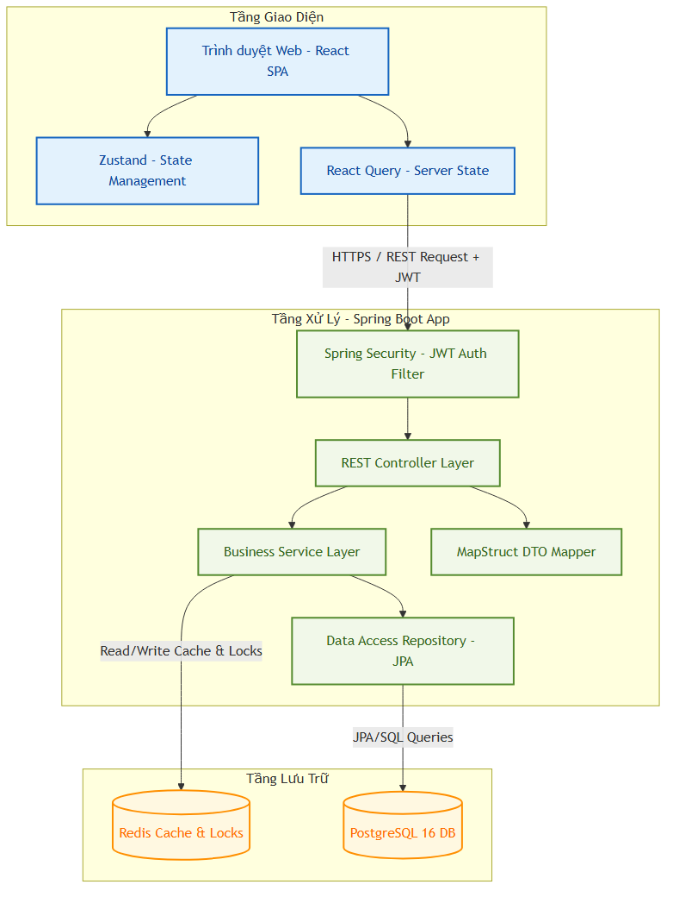
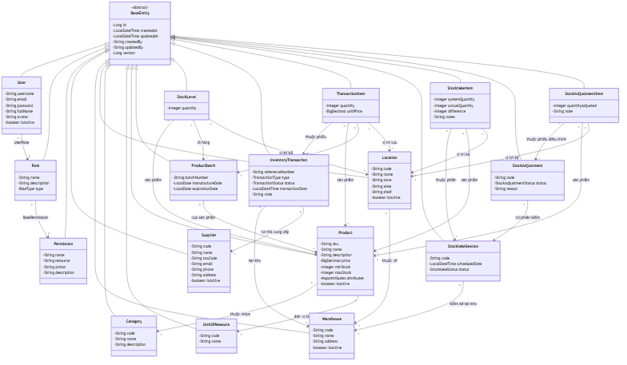
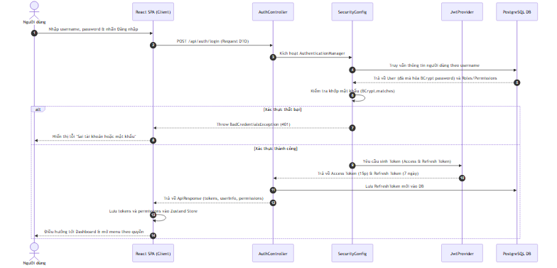
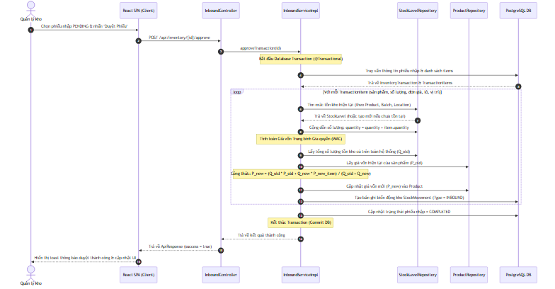
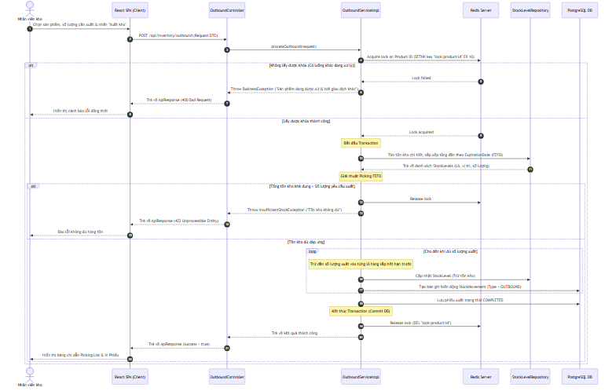
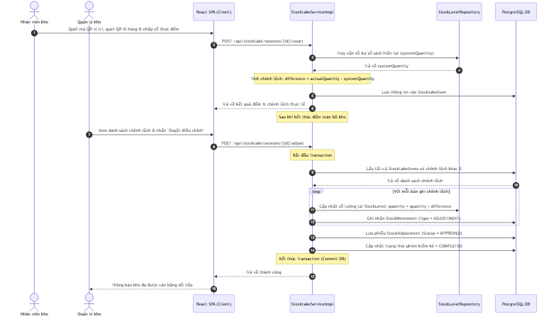
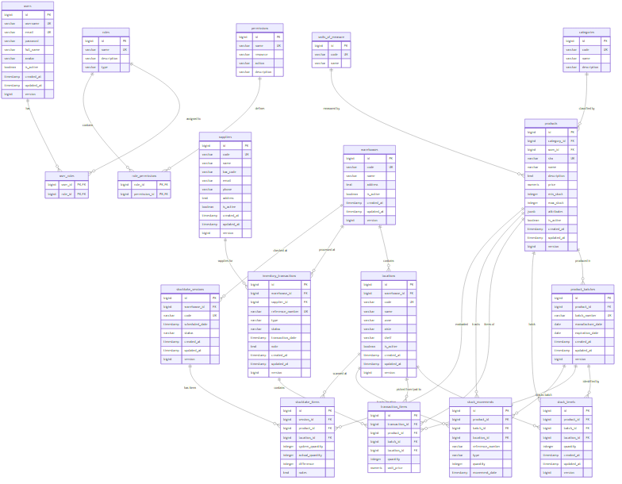

# CHƯƠNG 1: TỔNG QUAN VỀ ĐỀ TÀI

## 1.1 Lý do chọn đề tài

Trong bối cảnh nền kinh tế toàn cầu hóa và sự phát triển mạnh mẽ của thương mại điện tử, quản trị chuỗi cung ứng (Supply Chain Management - SCM) đã trở thành một trong những yếu tố cốt lõi quyết định năng lực cạnh tranh của doanh nghiệp. Quản lý kho hàng (Inventory Management) là một mắt xích cực kỳ quan trọng trong chuỗi cung ứng đó. Kho hàng không đơn thuần là nơi lưu trữ nguyên vật liệu, bán thành phẩm hay thành phẩm, mà còn là trung điểm điều hòa dòng luân chuyển hàng hóa từ nhà cung ứng đến nhà sản xuất và tới tay người tiêu dùng cuối cùng.

Tuy nhiên, việc quản lý kho hàng tại nhiều doanh nghiệp vừa và nhỏ (SMEs) hiện nay vẫn đang đối mặt với nhiều thách thức lớn:
- **Phương pháp quản lý thủ công:** Sử dụng sổ sách hoặc bảng tính Excel rời rạc dẫn đến rủi ro sai sót dữ liệu cao, tốc độ cập nhật thông tin chậm trễ.
- **Thất thoát và lãng phí:** Việc thiếu kiểm soát vị trí lưu kho chi tiết (Khu - Dãy - Kệ) khiến nhân viên mất nhiều thời gian tìm kiếm hàng hóa, gây giảm năng suất lao động và tăng tỷ lệ hàng hóa bị hỏng hóc hoặc hết hạn sử dụng (đặc biệt với các ngành hàng thực phẩm, dược phẩm, hóa chất).
- **Thiếu kiểm soát luồng nghiệp vụ phức tạp:** Việc luân chuyển hàng hóa giữa các kho (Inter-warehouse transfer), kiểm kê định kỳ (Stocktaking) thường xuyên xảy ra tình trạng lệch số liệu giữa sổ sách và thực tế mà không tìm ra nguyên nhân do thiếu vết nhật ký thay đổi (Audit Trail).
- **Rủi ro về dòng tiền:** Việc không nắm bắt chính xác mức tồn kho tối ưu (tồn kho an toàn) dẫn đến hiện tượng đọng vốn do nhập quá nhiều hàng, hoặc mất cơ hội bán hàng do thiếu hụt hàng hóa (out-of-stock).

Để giải quyết triệt để các vấn đề trên, việc xây dựng một hệ thống công nghệ thông tin tích hợp và tự động hóa quy trình là vô cùng cấp thiết. Hệ thống **SCIM (Supply Chain & Inventory Management System)** được đề xuất thiết kế và phát triển nhằm cung cấp một giải pháp quản trị kho thông minh, hỗ trợ quản lý chi tiết vị trí lưu trữ, theo dõi lô hàng hạn sử dụng theo chiến lược FEFO/FIFO, tích hợp công nghệ mã QR trong hoạt động kiểm kê, tự động hóa tính toán giá vốn trung bình và báo cáo phân tích thời gian thực. Hệ thống giúp doanh nghiệp số hóa toàn diện quy trình, giảm thiểu sai sót, nâng cao năng suất vận hành và tối ưu hóa chi phí tồn kho.

---

## 1.2 Mục tiêu của đề tài

Mục tiêu tổng quát của đề tài là nghiên cứu, thiết kế và phát triển một hệ thống phần mềm quản lý chuỗi cung ứng và tồn kho (SCIM) toàn diện, ứng dụng các công nghệ hiện đại nhằm giải quyết các bài toán nghiệp vụ kho phức tạp.

Cụ thể, hệ thống hướng tới các mục tiêu chi tiết sau:
1. **Quản lý danh mục cốt lõi (Master Data):** Quản lý tập trung thông tin nhà cung cấp, sản phẩm (với thuộc tính động dạng JSONB), đơn vị tính, và cấu trúc cây vị trí kho phân cấp trực quan (Warehouse -> Location: Khu - Dãy - Ô kệ).
2. **Tự động hóa luồng nghiệp vụ Nhập/Xuất kho (Core Operations):**
   - Thiết lập quy trình phê duyệt phiếu nhập/xuất kho nhiều bước từ dự thảo đến hoàn thành.
   - Tự động hóa việc phân bổ và cập nhật mức tồn kho chi tiết (`StockLevel`) theo lô sản phẩm (`ProductBatch`) và vị trí lưu trữ (`Location`).
   - Tự động tính toán giá vốn hàng bán dựa trên phương pháp **Weighted Average Cost (Giá vốn trung bình gia quyền)** ngay tại thời điểm hoàn thành phiếu nhập.
3. **Tối ưu hóa quy trình lấy hàng (Picking Optimization):** Tích hợp thuật toán đề xuất vị trí lấy hàng ưu tiên theo chiến lược **FEFO (First Expired, First Out - Hạn dùng trước xuất trước)** và **FIFO (First In, First Out - Nhập trước xuất trước)**.
4. **Kiểm soát đồng thời và An toàn giao dịch:** Áp dụng cơ chế khóa lạc quan (Optimistic Locking) và Khóa phân tán (Redis Distributed Lock) tại tầng cơ sở dữ liệu để ngăn chặn tình trạng xung đột dữ liệu và xuất âm kho khi có nhiều nhân viên thao tác đồng thời.
5. **Số hóa hoạt động kiểm kê và định danh:** 
   - Hỗ trợ sinh mã QR cho lô hàng và vị trí kho hàng loạt.
   - Cho phép quét mã QR thông qua camera thiết bị để kiểm kê và định vị hàng hóa nhanh chóng, tự động ghi nhận số lượng thực tế và đối chiếu chênh lệch thừa/thiếu.
6. **Báo cáo và phân tích thông minh (Dashboard & Analytics):**
   - Xây dựng dashboard theo dõi các chỉ số KPI kho cốt lõi thời gian thực (Real-time Stock Counter).
   - Báo cáo phân loại hàng tồn kho theo mô hình ABC (phân tích Pareto).
   - Dự báo thời gian hết hàng dựa trên tốc độ tiêu thụ trung bình.
   - Báo cáo hàng tồn lâu ngày không biến động (dead stock).
7. **Kiểm soát vết hệ thống (Audit Trail & Activity Log):** Ghi nhận chi tiết mọi hoạt động thay đổi cấu trúc dữ liệu, so sánh dữ liệu trước và sau khi thay đổi (JSON Diff) để phục vụ công tác đối soát.

---

## 1.3 Đối tượng và Phạm vi nghiên cứu

### 1.3.1 Đối tượng nghiên cứu
- **Đối tượng lý thuyết:** Quy trình nghiệp vụ kho bãi (Inbound, Outbound, Transfer, Stocktaking), các mô hình quản lý hàng tồn kho (FIFO, FEFO, ABC Analysis), thuật toán tính giá vốn hàng bán, các giải pháp công nghệ lập trình backend (Spring Boot, Redis), frontend (React, Zustand, React Query) và cơ sở dữ liệu quan hệ (Postgres).
- **Đối tượng khảo sát ứng dụng:** Quy trình vận hành kho tại các doanh nghiệp phân phối, sản xuất và bán lẻ vừa và nhỏ, nơi có yêu cầu quản lý sản phẩm theo lô hàng và hạn sử dụng nghiêm ngặt.

### 1.3.2 Phạm vi nghiên cứu
- **Phạm vi chức năng:** Tập trung vào các phân hệ:
  - Xác thực & Phân quyền động dựa trên vai trò (RBAC).
  - Quản lý danh mục (Nhà cung cấp, Kho bãi & Sơ đồ vị trí, Hàng hóa & Đơn vị tính).
  - Nghiệp vụ Nhập kho & Xuất kho (kèm theo các thuật toán tối ưu vị trí FEFO/FIFO, tính giá vốn và kiểm soát khóa đồng thời).
  - Nghiệp vụ Kiểm kê & Điều chỉnh kho tự động.
  - Quét mã QR code lô hàng phục vụ nghiệp vụ kho.
  - Hệ thống Tiện ích (Thông báo đẩy, Audit Logs chi tiết, Cấu hình hệ thống).
  - Phân tích báo cáo thông minh (Dashboard, Pareto ABC, Dự báo hết hàng).
- **Phạm vi công nghệ:** Phát triển hệ thống web app chạy trên môi trường Web Browser (Chrome, Edge, Safari...) tương thích đa thiết bị (Desktop, Tablet, Mobile) sử dụng các công nghệ đã phê duyệt: Spring Boot 3.5 + React 18 + PostgreSQL 16 + Redis 7.

---

## 1.4 Phương pháp nghiên cứu

Để thực hiện thành công đề tài, phương pháp nghiên cứu được áp dụng kết hợp giữa lý thuyết và thực tiễn phát triển phần mềm theo quy trình chuẩn mực:

1. **Phương pháp nghiên cứu tài liệu (Lý thuyết):**
   - Nghiên cứu các giáo trình, tài liệu chuyên ngành về quản lý chuỗi cung ứng, quản trị logistics để hiểu sâu các quy trình nghiệp vụ kho tiêu chuẩn.
   - Đọc hiểu tài liệu kỹ thuật về kiến trúc Spring Boot, Spring Security (JWT), Hibernate/JPA, cơ chế caching của Redis, React, Ant Design.
2. **Phương pháp phân tích và thiết kế hệ thống (OOAD):**
   - Sử dụng phương pháp phân tích thiết kế hướng đối tượng (Object-Oriented Analysis and Design).
   - Sử dụng ngôn ngữ mô hình hóa thống nhất (UML) để xây dựng các biểu đồ: Use Case Diagram để làm rõ yêu cầu chức năng, Sequence Diagram để mô tả luồng nghiệp vụ động, Class Diagram để thiết kế cấu trúc dữ liệu tĩnh, ERD để thiết kế cơ sở dữ liệu quan hệ vật lý.
3. **Phương pháp thực nghiệm phát triển phần mềm (Software Engineering):**
   - Áp dụng mô hình **Agile/Scrum** chia dự án thành các giai đoạn (Phases) tăng trưởng để thực hiện tuần tự và kiểm thử liên tục.
   - Áp dụng kiến trúc phân lớp (**Layered Architecture**) ở Backend nhằm tách biệt rõ ràng trách nhiệm giữa API Controller, Business Service, và Data Access Repository.
   - Áp dụng cấu trúc dựa trên chức năng (**Feature-based Architecture**) ở Frontend nhằm tăng khả năng tái sử dụng component và bảo trì mã nguồn lâu dài.
   - Sử dụng Flyway để kiểm soát phiên bản database schema (Database Migration) đảm bảo đồng bộ môi trường phát triển.
4. **Phương pháp kiểm thử và đánh giá (Testing & Evaluation):**
   - Kiểm thử đơn vị (Unit Test) sử dụng JUnit 5 & Mockito để kiểm chứng các thuật toán tính giá vốn, logic khóa đồng thời, gợi ý FEFO ở backend.
   - Kiểm thử tích hợp và chấp nhận người dùng (UAT) theo các kịch bản kiểm thử mẫu (Test Cases) phủ khắp các chức năng nghiệp vụ để đánh giá tính đúng đắn và độ ổn định của hệ thống trước khi nghiệm thu.
# CHƯƠNG 2 (PHẦN 1): PHÂN TÍCH YÊU CẦU CHỨC NĂNG & PHI CHỨC NĂNG

## 2.1 Xác định các tác nhân (Actors) của hệ thống

Hệ thống SCIM được thiết kế để phục vụ nhiều phòng ban và đối tác tham gia vào chuỗi cung ứng của doanh nghiệp. Các tác nhân chính bao gồm:

1. **Admin (Quản trị hệ thống):**
   - Người chịu trách nhiệm vận hành kỹ thuật toàn bộ hệ thống.
   - Quản lý danh sách người dùng, thiết lập mật khẩu, phân chia vai trò (Roles) và cấu hình các quyền hạn động (Permissions) trên hệ thống.
   - Quản lý cấu hình tham số hệ thống chung (System Settings), giám sát nhật ký thay đổi dữ liệu (Audit Trail) để xử lý các sự cố dữ liệu.
2. **Warehouse Manager (Quản lý kho):**
   - Người chịu trách nhiệm cao nhất về hoạt động của một hoặc nhiều kho hàng.
   - Quản lý sơ đồ vị trí kho hàng (Warehouses & Locations).
   - Phê duyệt hoặc từ chối các phiếu nhập kho (Inbound), xuất kho (Outbound), điều chuyển nội bộ (Transfer) và điều chỉnh tồn kho (Stock Adjustment) sau khi kiểm kê.
   - Theo dõi dashboard phân tích, biểu đồ ABC, dự báo thời gian hết hàng để lên kế hoạch đặt hàng hoặc xả hàng tồn.
3. **Warehouse Staff (Nhân viên kho):**
   - Người thực thi trực tiếp các tác vụ vật lý tại kho hàng.
   - Lập các phiếu yêu cầu nhập kho, xuất kho (dạng dự thảo - Draft).
   - Quét mã QR code để nhận diện nhanh lô sản phẩm, thực hiện nhặt hàng (picking) theo gợi ý FEFO/FIFO của hệ thống.
   - Thực hiện kiểm đếm thực tế và cập nhật số lượng trong các phiên kiểm kê (Stocktaking Sessions).
4. **Viewer (Người xem báo cáo):**
   - Thường là các cấp quản lý cấp cao (Ban Giám đốc) hoặc phòng Tài chính - Kế toán.
   - Chỉ có quyền truy cập đọc (Read-only) để giám sát tồn kho, xem báo cáo biến động (Stock card), kiểm tra giá trị vốn tồn kho mà không có quyền tạo mới hay sửa đổi dữ liệu tác nghiệp.

---

## 2.2 Phân rã yêu cầu chức năng (Functional Requirements)

Yêu cầu chức năng của hệ thống SCIM được phân chia thành 8 phân hệ cốt lõi:

| Phân hệ | Yêu cầu chức năng |
| :--- | :--- |
| **1. Xác thực & Phân quyền (RBAC)** | - Đăng nhập bằng tên tài khoản/mật khẩu.<br>- Quản lý phiên bằng Access Token (15 phút) và Refresh Token (7 ngày).<br>- CRUD người dùng, reset mật khẩu.<br>- Phân quyền động dựa trên quyền hạn (Permissions) gán cho vai trò (Roles).<br>- Tự động ẩn/hiện chức năng trên giao diện dựa trên quyền của tài khoản. |
| **2. Quản lý Danh mục (Master Data)** | - CRUD Nhà cung cấp (Tên, địa chỉ, MST, thông tin liên lạc).<br>- CRUD Kho hàng & cấu trúc vị trí phân tầng (Warehouse -> Khu -> Dãy -> Kệ).<br>- CRUD Đơn vị tính (UOM) và Danh mục sản phẩm (Category).<br>- CRUD Sản phẩm (Mã SKU, tên, định mức tồn kho tối thiểu/tối đa, hỗ trợ lưu thuộc tính JSONB cho sản phẩm đặc thù). |
| **3. Nghiệp vụ Nhập kho (Inbound)** | - Tạo phiếu yêu cầu nhập kho (chọn Nhà cung cấp, Sản phẩm, nhập Lô hàng, Hạn sử dụng, Số lượng, Đơn giá).<br>- Chuyển trạng thái phiếu: Dự thảo (Draft) -> Chờ duyệt (Pending) -> Đã duyệt (Approved) -> Hoàn thành (Completed).<br>- Tự động cập nhật số lượng tồn kho theo lô hàng và vị trí khi phiếu hoàn thành.<br>- Tự động tính toán giá vốn trung bình gia quyền (Weighted Average Cost - WAC) cho từng sản phẩm. |
| **4. Nghiệp vụ Xuất kho (Outbound)** | - Tạo yêu cầu xuất kho (chọn khách hàng/mục đích, danh sách sản phẩm, số lượng cần xuất).<br>- Hệ thống tự động đề xuất lô hàng và vị trí lấy hàng tối ưu theo chiến lược FEFO (hạn dùng trước xuất trước) hoặc FIFO.<br>- Khóa đồng thời (Redis Distributed Lock) để bảo vệ số dư tồn kho, ngăn chặn tình trạng xuất âm kho khi nhiều yêu cầu xử lý cùng lúc.<br>- Đóng gói phiếu xuất và cập nhật trừ tồn kho thực tế. |
| **5. Kiểm kê & Điều chỉnh (Stocktaking)** | - Tạo phiên kiểm kê kho hàng (chọn khu vực kho hoặc danh mục sản phẩm kiểm kê).<br>- Ghi nhận số lượng thực tế đếm được (nhập tay hoặc quét mã QR vị trí/lô hàng).<br>- Tự động tính toán chênh lệch (Thừa/Thiếu) giữa số lượng sổ sách hệ thống và thực tế.<br>- Tạo và duyệt phiếu điều chỉnh kho (`StockAdjustment`) để đồng bộ lại số dư tồn kho vật lý. |
| **6. Quản lý Nhãn & QR Code** | - Sinh mã QR Code tự động cho từng Lô sản phẩm (`ProductBatch`) và vị trí kho (`Location`).<br>- Hỗ trợ thiết lập trang in nhãn decal hàng loạt.<br>- Tích hợp chức năng quét mã QR qua Camera của điện thoại/tablet để tra cứu thông tin nhanh trên giao diện Web. |
| **7. Nhật ký & Tiện ích hệ thống** | - Gửi thông báo tự động (Notifications) khi tồn kho dưới định mức an toàn, lô hàng sắp hết hạn, hoặc có phiếu cần duyệt.<br>- Nhật ký thay đổi dữ liệu (Audit Trail): Ghi nhận chi tiết lịch sử sửa đổi dữ liệu, lưu giá trị cũ và giá trị mới dạng JSON Diff để so sánh trực quan.<br>- Cài đặt hệ thống (System Settings): Cấu hình tiền tệ, múi giờ, định dạng ngày tháng, chiến lược xuất kho mặc định (FEFO/FIFO). |
| **8. Dashboard & Báo cáo Phân tích** | - Màn hình Dashboard tổng quan: Tổng giá trị kho, số lượng SKU, chuông cảnh báo hàng cận hạn.<br>- Biểu đồ phân tích Pareto ABC (phân loại hàng tồn nhóm A, B, C theo giá trị).<br>- Báo cáo hàng tồn kho lâu ngày không có biến động (30/60/90 ngày).<br>- Dự báo số ngày còn lại trước khi hết hàng (Days of Inventory Outstanding - DIO) dựa trên tốc độ tiêu thụ. |

---

## 2.3 Biểu đồ Use Case hệ thống

Dưới đây là các biểu đồ Use Case mô tả mối quan hệ giữa các tác nhân và các chức năng nghiệp vụ của hệ thống được vẽ bằng Mermaid.js.

### 2.3.1 Biểu đồ Use Case tổng thể hệ thống

Biểu đồ này biểu diễn sự tương tác của 4 tác nhân chính với các phân hệ lớn của hệ thống SCIM:


---

### 2.3.2 Biểu đồ Use Case phân hệ Nhập/Xuất kho

Biểu đồ chi tiết thể hiện luồng hoạt động lập phiếu, duyệt phiếu và xuất kho tối ưu:


---

### 2.3.3 Biểu đồ Use Case phân hệ Kiểm kê kho hàng

Biểu đồ mô tả hoạt động đếm kiểm vật lý và hiệu chỉnh số liệu kho hàng:


---

## 2.4 Kịch bản Use Case (Use Case Scenarios) cho các nghiệp vụ cốt lõi

### 2.4.1 Kịch bản Use Case: Duyệt phiếu nhập kho & Tính giá vốn (Inbound Approval)

| Thành phần | Chi tiết kịch bản |
| :--- | :--- |
| **Tên Use Case** | Duyệt phiếu nhập kho và tính toán giá vốn (Inbound Approval & WAC Calculation) |
| **Tác nhân chính** | Warehouse Manager |
| **Mục tiêu** | Phê duyệt phiếu nhập kho đang ở trạng thái chờ duyệt, hệ thống tự động tăng tồn kho vật lý theo lô/vị trí và tính toán lại giá vốn trung bình gia quyền (WAC) của sản phẩm. |
| **Tiền điều kiện** | - Nhân viên kho đã tạo phiếu nhập kho ở trạng thái `PENDING` (Chờ duyệt).<br>- Người dùng đăng nhập với quyền `Warehouse Manager` trở lên. |
| **Luồng sự kiện chính (Basic Flow)** | 1. Quản lý kho truy cập danh sách phiếu nhập kho, chọn phiếu nhập có trạng thái `PENDING`.<br>2. Xem xét thông tin chi tiết: Nhà cung cấp, danh mục hàng, đơn giá, số lượng, số lô, hạn sử dụng và vị trí lưu trữ đề xuất.<br>3. Quản lý kho nhấn nút **"Duyệt Phiếu"**.<br>4. Hệ thống kiểm tra tính hợp lệ của dữ liệu (kiểm tra trùng lô, ngày hạn sử dụng có hợp lệ hay không).<br>5. Hệ thống cập nhật trạng thái phiếu nhập sang `COMPLETED`.<br>6. Hệ thống cộng số dư tồn kho chi tiết (`StockLevel`) tương ứng với sản phẩm, lô hàng và vị trí lưu kho.<br>7. Hệ thống tự động kích hoạt bộ tính toán giá vốn: Lấy tổng trị giá tồn kho cũ + trị giá lô nhập mới chia cho tổng số lượng tồn kho cũ + số lượng nhập mới để ra giá vốn mới.<br>8. Hệ thống lưu lại giá vốn mới vào bảng Sản phẩm (`Product`), ghi nhận lịch sử biến động (`StockMovement`).<br>9. Giao diện hiển thị thông báo duyệt thành công. |
| **Luồng sự kiện rẽ nhánh (Alternative Flow)** | - **Nhà quản lý từ chối duyệt:** Tại bước 3, Quản lý kho nhấn nút **"Từ chối"** và nhập lý do. Hệ thống chuyển trạng thái phiếu nhập về `DRAFT` để nhân viên chỉnh sửa lại thông tin.<br>- **Lỗi lô hàng hết hạn:** Tại bước 4, nếu hạn sử dụng lô hàng nhập nhỏ hơn ngày hiện tại, hệ thống báo lỗi ngăn cản phê duyệt. |

---

### 2.4.2 Kịch bản Use Case: Xuất kho gợi ý FEFO & Tránh xuất âm (Outbound FEFO)

| Thành phần | Chi tiết kịch bản |
| :--- | :--- |
| **Tên Use Case** | Lập phiếu xuất kho gợi ý vị trí lấy hàng (FEFO Outbound Picking) |
| **Tác nhân chính** | Warehouse Staff |
| **Mục tiêu** | Tạo phiếu xuất kho cho khách hàng, hệ thống tự động tìm và gợi ý danh sách vị trí lưu kho của các lô hàng sắp hết hạn trước (FEFO) và áp dụng khóa đồng thời tránh lỗi xuất âm kho. |
| **Tiền điều kiện** | - Nhân viên kho đăng nhập vào hệ thống.<br>- Có đủ lượng tồn kho trên sổ sách cho sản phẩm yêu cầu. |
| **Luồng sự kiện chính (Basic Flow)** | 1. Nhân viên kho vào màn hình Xuất kho, nhấn **"Tạo phiếu xuất"**.<br>2. Chọn thông tin khách hàng, chọn các sản phẩm và nhập số lượng yêu cầu xuất.<br>3. Nhân viên nhấn nút **"Gợi ý vị trí lấy hàng"**.<br>4. Hệ thống truy vấn bảng tồn kho chi tiết (`StockLevel` join `ProductBatch`), sắp xếp các lô hàng của sản phẩm đó có hạn sử dụng tăng dần (lô hạn dùng gần nhất xếp đầu tiên - FEFO).<br>5. Hệ thống tự động phân bổ số lượng cần xuất vào các lô và vị trí tương ứng cho đến khi đủ số lượng yêu cầu. Giao diện trả về bảng chỉ dẫn vị trí lấy hàng (Picking List: Khu - Dãy - Kệ, số lượng cần lấy ở mỗi ô kệ).<br>6. Nhân viên kho thực tế đi lấy hàng theo bảng chỉ dẫn, quét mã QR vị trí/lô hàng để xác nhận lấy đúng hàng.<br>7. Nhấn nút **"Hoàn thành xuất kho"**.<br>8. Hệ thống kích hoạt khóa phân tán Redis trên sản phẩm để đảm bảo không có luồng xuất kho nào khác làm thay đổi tồn kho tại thời điểm này.<br>9. Hệ thống trừ tồn kho thực tế ở bảng `StockLevel`, ghi nhận lịch sử biến động `StockMovement` với loại `OUTBOUND`, chuyển phiếu xuất sang trạng thái `COMPLETED` và giải phóng khóa Redis. |
| **Luồng sự kiện rẽ nhánh (Alternative Flow)** | - **Tồn kho không đủ:** Tại bước 4, nếu tổng lượng tồn của tất cả các lô hàng nhỏ hơn số lượng yêu cầu xuất, hệ thống báo lỗi không đủ hàng tồn kho và gợi ý giảm số lượng xuất.<br>- **Xung đột luồng đồng thời (Xuất âm):** Tại bước 8, nếu có luồng khác đã thực hiện trừ tồn trước và số lượng khả dụng không còn đủ, hệ thống sẽ rollback transaction, giải phóng khóa và trả về thông báo: "Lô hàng tại vị trí X đã bị người dùng khác xuất trước đó, vui lòng tải lại trang và thực hiện lại." |

---

### 2.4.3 Kịch bản Use Case: Kiểm kê kho hàng & Tự động điều chỉnh (Stocktaking)

| Thành phần | Chi tiết kịch bản |
| :--- | :--- |
| **Tên Use Case** | Thực hiện kiểm kê kho hàng và điều chỉnh (Stocktaking & Adjustment) |
| **Tác nhân chính** | Warehouse Staff (Kiểm đếm), Warehouse Manager (Khởi tạo và Phê duyệt) |
| **Mục tiêu** | Thực hiện kiểm đếm số lượng hàng hóa thực tế tại một khu vực kho, so khớp số liệu hệ thống và tự động tạo phiếu điều chỉnh để cân bằng kho. |
| **Tiền điều kiện** | - Quản lý kho đã tạo một phiên kiểm kê mới ở trạng thái `IN_PROGRESS`. |
| **Luồng sự kiện chính (Basic Flow)** | 1. Nhân viên kho mở ứng dụng trên thiết bị di động/máy tính bảng, truy cập vào phiên kiểm kê đang diễn ra.<br>2. Nhân viên quét mã QR trên ô kệ để xác định vị trí, sau đó quét mã QR trên sản phẩm/lô hàng để định danh sản phẩm.<br>3. Hệ thống trả về thông tin sản phẩm và vị trí tương ứng. Nhân viên nhập số lượng đếm được thực tế và nhấn **"Ghi nhận"**.<br>4. Hệ thống ghi lại thông tin đếm vào bảng `StocktakeItem`, tự động tính toán chênh lệch: `Chênh lệch = Số lượng thực tế - Số lượng sổ sách`. hiển thị màu sắc cảnh báo (màu đỏ nếu thiếu, màu xanh nếu thừa).<br>5. Sau khi quét và đếm toàn bộ khu vực, Nhân viên nhấn **"Gửi báo cáo kiểm kê"**.<br>6. Quản lý kho truy cập vào phiên kiểm kê đã gửi, xem xét báo cáo tổng hợp chênh lệch.<br>7. Quản lý kho nhấn nút **"Duyệt và Điều chỉnh Kho"**.<br>8. Hệ thống tự động tạo một phiếu điều chỉnh kho (`StockAdjustment`) ở trạng thái `APPROVED`.<br>9. Hệ thống tự động cập nhật số lượng tại bảng `StockLevel` cộng thêm lượng chênh lệch (nếu thừa) hoặc trừ đi lượng chênh lệch (nếu thiếu), đồng thời ghi nhận lịch sử biến động `StockMovement` với loại `ADJUSTMENT` để làm vết.<br>10. Phiên kiểm kê chuyển sang trạng thái `COMPLETED`. |
| **Luồng sự kiện rẽ nhánh (Alternative Flow)** | - **Hủy phiên kiểm kê:** Quản lý kho có thể hủy phiên kiểm kê bất cứ lúc nào trước khi duyệt điều chỉnh. Hệ thống chuyển trạng thái phiên sang `CANCELLED` và giữ nguyên số lượng tồn kho cũ. |

---

## 2.5 Yêu cầu phi chức năng (Non-Functional Requirements)

Bên cạnh các yêu cầu nghiệp vụ, hệ thống SCIM phải đảm bảo các tiêu chuẩn kỹ thuật sau để đảm bảo vận hành ổn định trong môi trường doanh nghiệp thực tế:

1. **Hiệu năng và Tốc độ phản hồi (Performance & Response Time):**
   - Các API truy vấn danh mục cơ bản (Sản phẩm, Nhà cung cấp, Vị trí kho) phải phản hồi dưới **50ms** nhờ cơ chế Redis caching.
   - Các thao tác cập nhật giao dịch (Nhập kho, Xuất kho, Kiểm kê) phải xử lý hoàn thành dưới **500ms** trong điều kiện tải bình thường.
   - Hỗ trợ tải trang dashboard phân tích phức tạp chứa biểu đồ trong vòng dưới **2 giây**.
2. **Khả năng chịu tải và Mở rộng (Scalability):**
   - Hệ thống có khả năng chịu tải đồng thời tối thiểu **100 người dùng tác nghiệp** liên tục mà không xảy ra tình trạng nghẽn kết nối cơ sở dữ liệu nhờ cấu hình connection pool HikariCP tối ưu.
   - Thiết kế mã nguồn Spring Boot độc lập trạng thái (Stateless Service) giúp dễ dàng deploy ứng dụng dưới dạng Container (Docker/Kubernetes) để scale ngang khi cần thiết.
3. **An toàn bảo mật thông tin (Security & Privacy):**
   - Mọi kết nối truyền tải thông tin giữa Client và Server phải được mã hóa qua giao thức HTTPS (trong môi trường Production).
   - Mật khẩu người dùng bắt buộc được băm bằng thuật toán **BCrypt** độ an toàn cao trước khi lưu vào database.
   - Sử dụng cơ chế phân quyền dựa trên quyền hạn (RBAC) chặt chẽ đến từng phương thức API thông qua `@PreAuthorize` ở backend, ngăn chặn hành vi leo thang đặc quyền.
   - Token xác thực JWT phải được cấu hình thời gian hết hạn ngắn (15 phút) và lưu trữ an toàn phía Frontend.
4. **Độ tin cậy và Khôi phục dữ liệu (Reliability & Recovery):**
   - Cơ sở dữ liệu PostgreSQL phải được thiết lập cơ chế sao lưu tự động (backup) hàng ngày.
   - Áp dụng các ràng buộc toàn vẹn cơ sở dữ liệu (Foreign Keys, Unique Constraints) và cơ chế Transaction `@Transactional` để đảm bảo dữ liệu không bị sai lệch hoặc mồ côi khi xảy ra sự cố đột ngột trong quá trình ghi.
5. **Tính khả dụng và Tương thích (Usability & Compatibility):**
   - Giao diện người dùng phải thân thiện, tối giản, tuân thủ các nguyên tắc thiết kế hiện đại của Ant Design.
   - Ứng dụng Web đáp ứng (Responsive Web Design) hoạt động tốt trên cả màn hình máy tính để bàn (xử lý quản trị) và thiết bị di động (nhân viên quét mã QR tại hiện trường kho).
   - Tương thích tốt với các trình duyệt phổ biến hiện nay: Google Chrome, Mozilla Firefox, Microsoft Edge, Safari.
# CHƯƠNG 2 (PHẦN 2): THIẾT KẾ HỆ THỐNG

## 2.2.1 Thiết kế Kiến trúc hệ thống (System Architecture)

Hệ thống SCIM được xây dựng theo kiến trúc phân tách rõ rệt giữa Frontend và Backend (Decoupled Client-Server Architecture), giao tiếp thông qua giao thức RESTful APIs không trạng thái (Stateless REST APIs). Sơ đồ kiến trúc tổng thể hoạt động như sau:



---

## 2.2.2 Biểu đồ lớp (Class Diagram) cho các thực thể cốt lõi

Dưới đây là sơ đồ lớp thực thể cốt lõi (Domain Class Diagram) thể hiện các lớp dữ liệu và mối quan hệ giữa chúng trong hệ thống SCIM. Tất cả các thực thể chính đều kế thừa từ lớp `BaseEntity` để tự động thừa hưởng các trường kiểm toán (`createdAt`, `updatedAt`, `createdBy`, `updatedBy`) và trường `@Version` phục vụ khóa lạc quan (Optimistic Locking).



---

## 2.2.3 Biểu đồ tuần tự (Sequence Diagram) cho các nghiệp vụ chính

### 1. Xác thực & Đăng nhập hệ thống (JWT Auth)

Biểu đồ mô tả quy trình đăng nhập, nhận JWT Access Token và Refresh Token, đồng thời tải danh sách quyền hạn phục vụ RBAC:



---

### 2. Nghiệp vụ Nhập kho & Tính giá vốn trung bình gia quyền (WAC)

Biểu đồ mô tả chi tiết quy trình duyệt phiếu nhập kho và tính toán giá vốn WAC tức thời tại Backend:



---

### 3. Nghiệp vụ Xuất kho FEFO Picking & Khóa đồng thời (Redis Lock)

Biểu đồ mô tả quy trình đề xuất vị trí xuất kho theo hạn sử dụng và cơ chế khóa phân tán tránh lỗi xuất âm:



---

### 4. Nghiệp vụ Kiểm kê & Tự động điều chỉnh kho

Biểu đồ mô tả quy trình thực hiện đếm kiểm, đối chiếu số liệu và hiệu chỉnh tồn kho vật lý:



---

## 2.2.4 Thiết kế Cơ sở dữ liệu (ERD)

Dưới đây là Sơ đồ quan hệ thực thể (ERD) ở mức vật lý, mô tả chi tiết cấu trúc các bảng và mối liên kết khóa ngoại.



---

## 2.2.5 Từ điển dữ liệu (Data Dictionary) cho các bảng chính

### 1. Bảng `products` (Danh mục sản phẩm)
Lưu thông tin định nghĩa sản phẩm SKU, giá bán, định mức an toàn và các thuộc tính động.

| Tên cột | Kiểu dữ liệu | Ràng buộc | Mô tả |
| :--- | :--- | :--- | :--- |
| `id` | bigint | PRIMARY KEY | Khóa chính tự tăng |
| `category_id` | bigint | FOREIGN KEY | Liên kết với bảng `categories` |
| `uom_id` | bigint | FOREIGN KEY | Đơn vị tính, liên kết bảng `units_of_measure` |
| `sku` | varchar(50) | UNIQUE, NOT NULL | Mã định danh sản phẩm duy nhất (Stock Keeping Unit) |
| `name` | varchar(255) | NOT NULL | Tên sản phẩm |
| `description` | text | NULL | Mô tả chi tiết sản phẩm |
| `price` | numeric(15,2)| DEFAULT 0.00 | Giá vốn trung bình gia quyền (WAC) hiện tại |
| `min_stock` | integer | DEFAULT 0 | Định mức tồn kho tối thiểu (cảnh báo tồn thấp) |
| `max_stock` | integer | DEFAULT 1000 | Định mức tồn kho tối đa |
| `attributes` | jsonb | NULL | Lưu trữ thuộc tính động (Màu sắc, kích thước, xuất xứ...) |
| `is_active` | boolean | DEFAULT TRUE | Trạng thái sử dụng (hoạt động/ngừng) |
| `version` | bigint | NOT NULL | Số phiên bản phục vụ khóa lạc quan (Optimistic Lock) |

### 2. Bảng `stock_levels` (Tồn kho chi tiết)
Bảng cốt lõi ghi nhận số lượng tồn thực tế của từng sản phẩm, theo từng lô hàng cụ thể và đặt tại vị trí ngăn kệ chính xác.

| Tên cột | Kiểu dữ liệu | Ràng buộc | Mô tả |
| :--- | :--- | :--- | :--- |
| `id` | bigint | PRIMARY KEY | Khóa chính tự tăng |
| `product_id` | bigint | FK, NOT NULL | Sản phẩm nào, liên kết `products` (Index) |
| `batch_id` | bigint | FK, NOT NULL | Thuộc lô sản xuất nào, liên kết `product_batches` (Index) |
| `location_id` | bigint | FK, NOT NULL | Lưu trữ tại vị trí nào, liên kết `locations` (Index) |
| `quantity` | integer | NOT NULL | Số lượng tồn kho thực tế hiện tại |
| `version` | bigint | NOT NULL | Số phiên bản phục vụ khóa lạc quan (Optimistic Lock) |

### 3. Bảng `inventory_transactions` (Phiếu nhập xuất kho)
Lưu thông tin phần đầu (Header) của các giao dịch nhập kho, xuất kho hoặc điều chuyển.

| Tên cột | Kiểu dữ liệu | Ràng buộc | Mô tả |
| :--- | :--- | :--- | :--- |
| `id` | bigint | PRIMARY KEY | Khóa chính tự tăng |
| `reference_number`| varchar(50) | UNIQUE, NOT NULL | Số chứng từ tự sinh (VD: GRN-20260712-001, GIN-...) |
| `type` | varchar(20) | NOT NULL | Loại giao dịch: `INBOUND` (Nhập), `OUTBOUND` (Xuất) |
| `status` | varchar(20) | NOT NULL | Trạng thái: `DRAFT`, `PENDING`, `APPROVED`, `COMPLETED` |
| `warehouse_id` | bigint | FK, NOT NULL | Kho hàng xử lý, liên kết `warehouses` |
| `supplier_id` | bigint | FK, NULL | Nhà cung cấp cung cấp (chỉ dùng cho Inbound) |
| `transaction_date`| timestamp | NOT NULL | Ngày thực hiện giao dịch |
| `note` | text | NULL | Ghi chú từ người lập phiếu |
| `version` | bigint | NOT NULL | Số phiên bản phục vụ khóa lạc quan (Optimistic Lock) |
# CHƯƠNG 3 (PHẦN 1): CÔNG NGHỆ PHÁT TRIỂN & KHUNG DỰ ÁN

## 3.1 Công nghệ phát triển phía Backend

Hệ thống backend của dự án SCIM được xây dựng trên nền tảng **Java 21** và framework **Spring Boot 3.5.x**, áp dụng mô hình kiến trúc phân lớp (Layered Architecture). Lựa chọn này mang lại hiệu năng cao, tính an toàn kiểu dữ liệu và khả năng mở rộng tốt cho các ứng dụng doanh nghiệp.

### 3.1.1 Java 21 & Spring Boot 3.5.x
- **Java 21 (LTS):** Phiên bản hỗ trợ dài hạn mới của Java mang lại nhiều tính năng tối ưu như *Virtual Threads* giúp cải thiện hiệu năng xử lý đa luồng đồng thời, *Pattern Matching for switch*, và cấu trúc *Record* để định nghĩa các DTOs (Data Transfer Objects) bất biến một cách ngắn gọn, tối ưu bộ nhớ.
- **Spring Boot 3.5.x:** Framework hàng đầu để phát triển RESTful APIs nhanh chóng nhờ cơ chế Auto-configuration. Dự án tích hợp các module cốt lõi:
  - *Spring Web:* Cung cấp hạ tầng xây dựng REST APIs.
  - *Spring Security:* Quản lý xác thực (Authentication) và phân quyền (Authorization) dựa trên JWT.
  - *Spring Data JPA:* Đơn giản hóa tầng truy xuất dữ liệu thông qua Hibernate, hỗ trợ đắc lực trong việc quản lý giao dịch (Transactions) và mapping dữ liệu quan hệ (ORM).

### 3.1.2 Tầng lưu trữ & Caching (PostgreSQL 16 & Redis 7)
- **PostgreSQL 16:** Cơ sở dữ liệu quan hệ mạnh mẽ, hỗ trợ tốt các giao dịch ACID phức tạp của quy trình kho. PostgreSQL 16 cung cấp tính năng lưu trữ kiểu dữ liệu động `JSONB` (được dùng để lưu thuộc tính sản phẩm linh hoạt) và hỗ trợ tối ưu hóa các Materialized Views phục vụ báo cáo phân tích tổng hợp.
- **Redis 7 (In-Memory Database):** Được sử dụng với hai vai trò quan trọng:
  1. *Caching:* Lưu trữ tạm thời các danh mục ít thay đổi như Nhà cung cấp, Nhóm sản phẩm, Đơn vị tính để giảm thiểu truy vấn trực tiếp vào DB, tăng tốc độ phản hồi API dưới 10ms.
  2. *Distributed Lock (Khóa phân tán):* Sử dụng thư viện Redisson hoặc tích hợp Redis Template để tạo cơ chế khóa phân tán, ngăn chặn tình trạng xuất quá số lượng hàng hiện có khi nhiều luồng API xuất kho chạy song song.

### 3.1.3 Các thư viện hỗ trợ cốt lõi (Backend)
- **Flyway Migration:** Công cụ quản lý phiên bản cơ sở dữ liệu. Mọi thay đổi về schema (bảng, cột, chỉ mục, dữ liệu mẫu) đều được viết dưới dạng các file SQL migration tăng dần (`V1__...`, `V2__...`) giúp đồng bộ dữ liệu dễ dàng trên mọi môi trường và tránh tình trạng sai lệch schema.
- **Lombok:** Tự động sinh getter, setter, constructor, builder pattern (`@Getter`, `@Setter`, `@Data`, `@Builder`, `@NoArgsConstructor`, `@AllArgsConstructor`) giúp mã nguồn ngắn gọn, dễ đọc.
- **MapStruct 1.6.x:** Công cụ sinh mã ánh xạ (mapping) tự động giữa Entity và DTOs ở thời điểm compile-time, giúp tối ưu hóa hiệu năng so với các thư viện dùng Reflection (như ModelMapper).
- **ZXing (Zebra Crossing):** Thư viện hỗ trợ sinh mã QR code dạng ma trận hai chiều từ thông tin mã lô hàng và mã vị trí.
- **Jakarta Validation:** Thực hiện validate dữ liệu đầu vào tại Controller (`@NotBlank`, `@NotNull`, `@Min`, `@Max`, `@Size`, `@Email`...) trước khi đưa vào xử lý nghiệp vụ.

---

## 3.2 Công nghệ phát triển phía Frontend

Giao diện người dùng được phát triển dưới dạng **Single Page Application (SPA)** hiện đại, áp dụng **TypeScript** để tăng tính an toàn và minh bạch cho luồng dữ liệu.

### 3.2.1 React 18 & Vite
- **React 18:** Thư viện giao diện người dùng dựa trên thành phần (component-based). Dự án tận dụng tối đa cơ chế Hook, lập trình hàm (Functional Components), và các tối ưu hóa render để mang lại trải nghiệm mượt mà, phản hồi lập tức.
- **Vite:** Công cụ build tool thế hệ mới thay thế cho Webpack, giúp khởi động dev server cực nhanh nhờ tận dụng ES Modules gốc của trình duyệt và build mã nguồn tối ưu thông qua Rollup.

### 3.2.2 Thư viện thiết kế UI & Styling
- **Ant Design 5.x:** Thư viện UI Components cao cấp dành cho các ứng dụng doanh nghiệp. Dự án tận dụng các component mạnh mẽ như *Table* (hỗ trợ phân trang, sắp xếp, lọc), *Form* (validate Client-side), *Tree* (hiển thị sơ đồ kho phân cấp), *Modal*, và các thông báo trạng thái (*Message*, *Notification*). Hệ thống cấu hình Design Tokens của Ant Design 5 giúp tùy biến giao diện đồng bộ.
- **Tailwind CSS v4:** Framework CSS tiện ích giúp xây dựng layout nhanh chóng, linh hoạt trực tiếp trong file HTML/TSX, tạo nên giao diện hiện đại, tối giản và đáp ứng tốt mọi kích thước màn hình (Responsive Design).
- **Recharts:** Thư viện vẽ biểu đồ chuyên biệt cho React, được sử dụng trong Dashboard để trực quan hóa dữ liệu tồn kho, biểu đồ Pareto ABC, và xu hướng xuất nhập.

### 3.2.3 Quản lý State & Kết nối API
- **Zustand:** Thư viện quản lý Global State cực kỳ gọn nhẹ và hiệu năng cao. Được dùng để lưu trữ trạng thái đăng nhập, thông tin người dùng hiện tại, danh sách quyền hạn (Permissions) phục vụ phân quyền hiển thị UI.
- **TanStack Query (React Query) v5:** Giải pháp quản lý Server State (dữ liệu lấy từ API). React Query tự động quản lý việc cache dữ liệu, tự động fetch lại khi dữ liệu hết hạn (stale), xử lý trạng thái loading/error đồng bộ, giúp giảm thiểu code boilerplates.
- **Axios:** Thư viện HTTP client dùng để kết nối với REST APIs của Backend. Được cấu hình Axios Interceptors để tự động đính kèm JWT Access Token vào Header của mọi request và bắt lỗi tập trung (ví dụ: tự động gọi API Refresh Token khi gặp lỗi 401 Unauthorized, hoặc đẩy thông báo lỗi toàn cục khi gặp lỗi 500).

---

## 3.3 Kiến trúc thư mục và Tổ chức mã nguồn thực tế

Dự án tuân thủ nghiêm ngặt các quy tắc lập trình đã quy định trong `AGENTS.md` nhằm tạo ra một mã nguồn sạch, dễ đọc và dễ bảo trì.

### 3.3.1 Cấu trúc mã nguồn Backend (Layered Architecture)

Mã nguồn Java được tổ chức phân lớp rõ ràng. Cấu trúc thư mục cụ thể như sau:

```
backend/src/main/java/com/scim/
├── ScimApiApplication.java    # File chạy chính của ứng dụng Spring Boot
├── config/                   # Các lớp cấu hình hệ thống (Security, Redis, Web MVC, Swagger)
├── controller/               # Lớp tiếp nhận HTTP requests, kiểm tra đầu vào (Validation)
├── dto/                      # Các lớp truyền dữ liệu (Request/Response DTOs)
│   ├── request/              # DTOs chứa dữ liệu gửi lên từ Client
│   └── response/             # DTOs định dạng dữ liệu trả về cho Client
├── entity/                   # Các lớp mô hình hóa thực thể cơ sở dữ liệu (ORM Entities)
│   └── base/                 # Lớp thực thể cơ sở (BaseEntity chứa id, audit fields, version)
├── event/                    # Định nghĩa các Event và Listener (xử lý bất đồng bộ như gửi thông báo)
├── exception/                # Các lớp ngoại lệ tùy chỉnh (Custom Exceptions) và GlobalExceptionHandler
├── mapper/                   # Các mapper interfaces dùng MapStruct để chuyển đổi Entity <-> DTO
├── repository/               # Lớp truy xuất cơ sở dữ liệu kế thừa JpaRepository (Spring Data JPA)
├── scheduler/                # Các tiến trình chạy ngầm định kỳ (Refresh Materialized Views, dọn dẹp log)
└── service/                  # Lớp chứa toàn bộ logic nghiệp vụ (Business Logic Layer)
    └── impl/                 # Hiện thực hóa các interface Service
```

### 3.3.2 Cấu trúc mã nguồn Frontend (Feature-based Architecture)

Mã nguồn Frontend tổ chức theo từng phân hệ chức năng (features) độc lập giúp việc mở rộng dễ dàng mà không làm ảnh hưởng đến các phân hệ khác. Cấu trúc thư mục cụ thể như sau:

```
frontend/src/
├── main.tsx                  # Điểm khởi đầu của ứng dụng React
├── App.tsx                   # Component gốc định cấu hình Theme, Providers, Layout
├── routes.tsx                # Định nghĩa hệ thống định tuyến (Routing) và bảo vệ route
├── components/               # Các shared components dùng chung toàn cục (Button, Input, Layout...)
├── config/                   # Cấu hình biến môi trường, cài đặt axios client
├── services/                 # Lớp giao tiếp API dùng chung (auth service, upload service...)
├── stores/                   # Quản lý global state dùng chung (Zustand auth store)
├── styles/                   # Tệp tin cấu hình css toàn cục (global.css)
├── types/                    # Các interfaces, types dùng chung toàn cục
├── utils/                    # Các hàm tiện ích (định dạng ngày tháng, tiền tệ, xử lý chuỗi)
└── features/                 # Thư mục chứa các phân hệ chức năng
    ├── auth/                 # Phân hệ đăng nhập, thông tin tài khoản cá nhân
    ├── dashboard/            # Phân hệ màn hình biểu đồ phân tích thống kê
    ├── inventory/            # Phân hệ quản lý nhập kho, xuất kho, lịch sử tồn kho
    ├── product/              # Phân hệ quản lý sản phẩm, đơn vị tính, danh mục sản phẩm
    ├── stocktake/            # Phân hệ quản lý phiên kiểm kê và điều chỉnh kho
    ├── supplier/             # Phân hệ quản lý thông tin nhà cung cấp
    ├── warehouse/            # Phân hệ quản lý sơ đồ kho hàng và vị trí lưu kho
    └── system/               # Phân hệ quản lý cấu hình hệ thống, audit logs, notifications
        ├── components/       # Component nội bộ của phân hệ
        ├── hooks/            # Các custom hooks (React Query query/mutation) của phân hệ
        ├── pages/            # Các trang giao diện của phân hệ
        ├── types.ts          # Các định nghĩa kiểu dữ liệu nội bộ
        └── index.ts          # Điểm xuất khẩu dữ liệu dùng chung ra ngoài
```
# CHƯƠNG 3 (PHẦN 2): XÂY DỰNG CÁC MODULE CHỨC NĂNG & GIAO DIỆN

## 3.2.1 Phân hệ Đăng nhập & Quản trị người dùng (RBAC)

Phân hệ này đảm bảo an ninh cho hệ thống, kiểm soát truy cập thông qua mô hình phân quyền dựa trên vai trò (Role-Based Access Control - RBAC).

### 1. Cơ chế hoạt động của JWT & Security
Hệ thống sử dụng **Spring Security** kết hợp với bộ lọc JWT tự cấu hình (`JwtAuthenticationFilter`). Khi người dùng đăng nhập thành công, hệ thống sinh ra một cặp Access Token (lưu trong memory của Client) và Refresh Token (lưu trong PostgreSQL DB và Cookie).
- Mọi request gửi lên Backend đều phải đính kèm Header: `Authorization: Bearer <Access_Token>`.
- Phân quyền mức API được cấu hình trực tiếp trên các Controller bằng annotation `@PreAuthorize("hasAuthority('resource:action')")`.

### 2. Mô tả giao diện & Hướng dẫn chụp ảnh
- **Giao diện Đăng nhập (Login screen):** Thiết kế tối giản, hiện đại với form căn giữa, hiệu ứng kính mờ (glassmorphism), gồm trường Tên đăng nhập, Mật khẩu và nút Đăng nhập. Có kiểm tra validate Client-side.
  
  > [!TIP]
  > **Placeholder Hình ảnh:** Chụp màn hình đăng nhập lúc điền form.
  > ``

- **Giao diện Quản lý Thành viên (User Management):** Bảng hiển thị danh sách người dùng (Avatar, Username, Email, Họ tên, Trạng thái hoạt động, Vai trò). Hỗ trợ nút Thêm mới mở Modal Form, và nút Khóa/Mở khóa tài khoản.
  
  > [!TIP]
  > **Placeholder Hình ảnh:** Chụp danh sách người dùng trong hệ thống.
  > ``

- **Giao diện Quản lý Vai trò & Phân quyền (Roles & Permissions):** Màn hình hiển thị danh sách các vai trò (Admin, Manager, Staff, Viewer). Khi click vào một vai trò, hệ thống hiển thị sơ đồ checkbox phân quyền chi tiết (đọc, ghi, xóa, duyệt) cho từng tài nguyên (Sản phẩm, Kho bãi, Nhập xuất, Kiểm kê).
  
  > [!TIP]
  > **Placeholder Hình ảnh:** Chụp màn hình phân quyền checkbox của một Role.
  > ``

---

## 3.2.2 Phân hệ Quản lý Danh mục (Master Data)

Phân hệ danh mục là nền tảng quản lý toàn bộ dữ liệu cấu trúc phục vụ các giao dịch kho hàng.

### 1. Sơ đồ cây Vị trí kho (Warehouse & Locations Tree)
Hệ thống quản lý kho theo mô hình phân cấp. Một Kho hàng (`Warehouse`) chia làm nhiều Khu vực (`Zone`), mỗi khu vực chia thành các Dãy kệ (`Aisle`), mỗi dãy gồm nhiều Ô/Kệ (`Shelf`). 
Phía Frontend sử dụng component `Tree` của Ant Design để hiển thị cấu trúc kho dưới dạng sơ đồ hình cây trực quan, cho phép người quản lý click vào từng ô kệ để kiểm tra nhanh các mặt hàng đang lưu trữ tại đó.

Trường `attributes` kiểu dữ liệu `jsonb` trong thực thể `Product` của Java được ánh xạ thông qua thư viện hỗ trợ xử lý JSON (như Hypersistence Optimizer). Cấu trúc dữ liệu này được thể hiện dưới dạng một bản đồ thuộc tính (Map với các cặp Key-Value) giúp hệ thống tự động lưu trữ và truy vấn các trường động của sản phẩm mà không cần thực hiện các câu lệnh DDL thay đổi cấu trúc bảng vật lý.

### 3. Mô tả giao diện & Hướng dẫn chụp ảnh
- **Giao diện Danh sách Sản phẩm (Products List):** Bảng hiển thị thông tin sản phẩm (Mã SKU, tên sản phẩm, Đơn vị tính, Nhóm sản phẩm, Giá vốn trung bình, Định mức tồn kho). Tích hợp tabs lọc nhanh sản phẩm dưới định mức tồn an toàn và nút Import Excel hàng loạt.
  
  > [!TIP]
  > **Placeholder Hình ảnh:** Chụp danh sách sản phẩm với các cột SKU, Tên, Đơn giá.
  > ``

- **Giao diện Quản lý Cấu trúc Kho hàng (Warehouse Layout):** Bên trái là sơ đồ cây vị trí (Dãy A -> Kệ A1 -> Ô 01), bên phải là form thêm/sửa vị trí chi tiết và danh sách tồn kho hiện hữu tại vị trí được chọn.
  
  > [!TIP]
  > **Placeholder Hình ảnh:** Chụp màn hình cây cấu trúc vị trí kho hàng.
  > ``

---

## 3.2.3 Phân hệ Nhập/Xuất kho & Tính giá vốn (Core Operations)

Đây là phân hệ nghiệp vụ cốt lõi của hệ thống SCIM với các thuật toán xử lý luồng dữ liệu phức tạp.

### 1. Thuật toán tính Giá vốn trung bình gia quyền (Weighted Average Cost - WAC)
Khi một phiếu nhập kho có trạng thái `APPROVED` được chuyển sang trạng thái hoàn thành (`COMPLETED`), hệ thống sẽ thực thi tính toán lại giá vốn của sản phẩm ngay tại thời điểm đó để phục vụ định giá tồn kho chính xác.

#### Công thức toán học:
$$\text{Giá vốn mới} = \frac{(\text{Tồn kho hiện tại trước nhập} \times \text{Giá vốn hiện hành}) + (\text{Số lượng nhập mới} \times \text{Đơn giá nhập mới})}{\text{Tổng tồn kho sau khi nhập}}$$

#### Sơ đồ luồng tính toán:


#### Giải thuật chi tiết tại Backend:
Giao dịch nghiệp vụ tính toán giá vốn trung bình gia quyền (WAC) được kích hoạt tự động và thực thi thông qua các bước xử lý dữ liệu sau:
1. **Truy vấn tổng tồn kho mới:** Hệ thống truy vấn tổng số lượng tồn kho hiện hữu của sản phẩm trên tất cả các kho và vị trí sau khi đã cộng thêm số lượng của lô hàng mới nhập ($Q_{total}$).
2. **Xác định số dư trước nhập:** Lấy tổng số lượng tồn kho mới trừ đi số lượng mới nhập để xác định số lượng tồn kho cũ trước thời điểm nhập ($Q_{old} = Q_{total} - Q_{new}$).
3. **Tính toán giá vốn mới theo trường hợp:**
   - **Trường hợp đã có hàng tồn kho cũ ($Q_{old} > 0$):** Hệ thống nhân số lượng cũ với giá vốn hiện hành của sản phẩm để tính tổng giá trị tồn kho cũ ($V_{old} = Q_{old} \times P_{old}$). Sau đó, cộng với giá trị của lô hàng mới nhập ($V_{new} = Q_{new} \times P_{new\_item}$) để ra tổng giá trị kho mới. Giá vốn mới ($P_{new}$) được xác định bằng cách chia tổng giá trị mới cho tổng tồn kho mới ($Q_{total}$), kết quả làm tròn đến 4 chữ số thập phân (`RoundingMode.HALF_UP`).
   - **Trường hợp chưa có hàng tồn hoặc tồn kho cũ bằng 0 ($Q_{old} \le 0$):** Hệ thống lấy ngay đơn giá nhập của lô hàng mới làm giá vốn mới của sản phẩm ($P_{new} = P_{new\_item}$).
4. **Cập nhật dữ liệu:** Lưu lại giá trị giá vốn mới vào bảng dữ liệu Sản phẩm (`Product`), đồng thời tạo bản ghi vết biến động kho (`StockMovement`) loại `INBOUND` để phục vụ đối soát lịch sử.

---

### 2. Thuật toán gợi ý vị trí lấy hàng ưu tiên theo FEFO (First Expired, First Out)
Khi xuất kho, thay vì để nhân viên tự tìm kiếm hàng hóa gây lãng phí thời gian và có nguy cơ xuất sai lô hàng cũ, hệ thống tự động sinh bảng hướng dẫn nhặt hàng (Picking List) ưu tiên các lô hàng có hạn sử dụng gần nhất.

#### Sơ đồ luồng xử lý Picking FEFO:


#### Giải thuật Truy vấn Dữ liệu FEFO:
Nghiệp vụ gợi ý vị trí nhặt hàng FEFO được thiết lập thông qua một truy vấn hướng đối tượng (JPQL) kết nối giữa bảng tồn kho chi tiết (`StockLevel`) và bảng lô sản phẩm (`ProductBatch`):
1. **Tiêu chí lọc:** Lọc các bản ghi tồn kho thuộc mã sản phẩm (`productId`) và nằm trong kho hàng chỉ định (`warehouseId`).
2. **Kiểm tra số dư khả dụng:** Chỉ lấy các vị trí có tồn kho khả dụng lớn hơn 0 (tính bằng số lượng tồn kho `quantity` trừ đi số lượng đã được đặt trước `reservedQuantity`).
3. **Tiêu chí sắp xếp:** Các bản ghi được sắp xếp theo thứ tự hạn sử dụng của lô hàng tăng dần (hạn dùng gần nhất xếp đầu tiên - `ORDER BY b.expiryDate ASC`). Trong trường hợp các lô hàng trùng hạn sử dụng, hệ thống ưu tiên xuất lô hàng được nhập vào kho trước (`s.createdAt ASC`). Giao diện nhặt hàng sẽ duyệt qua danh sách kết quả này để phân bổ lượng xuất tương ứng.

---

#### Quy trình kỹ thuật xử lý đồng thời tại Backend:
Để bảo vệ số dư tồn kho không bị âm khi có nhiều giao dịch xuất kho diễn ra đồng thời, Backend SCIM áp dụng quy trình khóa phân tán sử dụng Redis:
1. **Trích xuất và sắp xếp mã sản phẩm:** Hệ thống lấy ra danh sách các mã ID sản phẩm từ các mặt hàng trong phiếu xuất kho, tiến hành loại bỏ các ID trùng lặp, sau đó sắp xếp danh sách ID theo thứ tự tăng dần. Bước sắp xếp này là cực kỳ quan trọng để đảm bảo thứ tự khóa nhất quán, ngăn ngừa lỗi Deadlock giữa các luồng chạy song song.
2. **Thiết lập khóa phân tán:** Duyệt qua từng ID sản phẩm trong danh sách đã sắp xếp, thực hiện ghi một khóa tượng trưng vào Redis bằng lệnh `SETNX` (Set if Not Exists) với key có định dạng `lock:product:<id>` và thời gian hết hạn tự động (TTL) là 15 giây.
3. **Xử lý tranh chấp khóa:**
   - Nếu bất kỳ sản phẩm nào trong phiếu không thể lấy được khóa (do một luồng giao dịch khác đang giữ khóa xử lý sản phẩm đó), hệ thống sẽ lập tức dừng quy trình, rollback mọi thay đổi và trả về ngoại lệ báo lỗi hệ thống bận để người dùng thực hiện lại.
   - Nếu tất cả các sản phẩm trong phiếu được khóa thành công, hệ thống sẽ tiến hành trừ tồn kho thực tế trong DB và ghi nhật ký biến động.
4. **Giải phóng khóa:** Khối xử lý được bọc trong cấu trúc `try-finally`. Dù giao dịch thành công hay gặp lỗi ngoại lệ, khối `finally` luôn được đảm bảo thực thi để duyệt qua danh sách các keys đã khóa và gọi lệnh xóa (`delete`) giải phóng khóa trên Redis, đưa sản phẩm về trạng thái sẵn sàng cho các giao dịch tiếp theo.

---

### 4. Mô tả giao diện & Hướng dẫn chụp ảnh
- **Giao diện Tạo phiếu Nhập kho (Inbound Form):** Form Master-Detail. Phần Master cho phép chọn nhà cung cấp, kho nhập, số tham chiếu, ngày nhập. Phần Detail là bảng động cho phép thêm dòng, chọn sản phẩm, nhập số lượng, đơn giá, số lô và hạn sử dụng tương ứng.
  
  > [!TIP]
  > **Placeholder Hình ảnh:** Chụp màn hình tạo phiếu nhập kho với 2-3 sản phẩm.
  > ``

- **Giao diện Chi tiết phiếu xuất và Bảng chỉ dẫn nhặt hàng (Picking List):** Trang chi tiết của phiếu xuất kho ở trạng thái hoàn thành. Hiển thị thông tin tổng quan và bảng chỉ dẫn vị trí chính xác (Khu vực, Kệ, Ô, Số lô, Số lượng cần lấy) giúp thủ kho nhặt hàng nhanh chóng.
  
  > [!TIP]
  > **Placeholder Hình ảnh:** Chụp màn hình bảng chỉ dẫn vị trí lấy hàng (Picking List).
  > ``

---

## 3.2.4 Phân hệ Kiểm kê & Điều chỉnh kho (Stocktaking)

Đảm bảo tính chính xác của số liệu thực tế ngoài kho và số liệu trên sổ sách phần mềm.

### 1. Cơ chế đối chiếu chênh lệch
Hệ thống cho phép tạo các phiên kiểm kê định kỳ. Khi phiên kiểm kê ở trạng thái `IN_PROGRESS`, thủ kho thực hiện đếm thực tế. Hệ thống tự động so khớp và tính chênh lệch:
$$\text{Chênh lệch} = \text{Số lượng thực tế} - \text{Số lượng sổ sách}$$
Sau khi kiểm kê hoàn tất, quản lý duyệt báo cáo chênh lệch, hệ thống tự động sinh phiếu điều chỉnh kho (`StockAdjustment`) và cập nhật lại số dư tồn kho chi tiết để khớp với thực tế.

### 2. Giao diện thực tế & Hướng dẫn chụp ảnh
- **Giao diện Phiên kiểm kê đang thực hiện (Stocktaking Session):** Màn hình hiển thị danh sách các sản phẩm thuộc phạm vi kiểm kê. Cột "Số lượng sổ sách" bị ẩn hoặc hiển thị tùy cấu hình, cột "Số lượng thực tế" cho phép nhân viên điền trực tiếp. Tích hợp nút quét mã QR vị trí kệ.
  
  > [!TIP]
  > **Placeholder Hình ảnh:** Chụp màn hình bảng nhập số liệu thực tế kiểm kê.
  > ``

- **Giao diện Báo cáo đối chiếu chênh lệch (Variance Report):** Màn hình hiển thị danh sách các sản phẩm kiểm kê có chênh lệch, hiển thị rõ số lượng thừa (màu xanh) hoặc thiếu (màu đỏ) kèm theo nút "Duyệt điều chỉnh kho".
  
  > [!TIP]
  > **Placeholder Hình ảnh:** Chụp biểu mẫu đối chiếu chênh lệch thừa thiếu sau kiểm kê.
  > ``

---

## 3.2.5 Phân hệ QR Code & Tiện ích hệ thống

### 1. In và quét mã QR Code
Hệ thống tích hợp sinh mã QR Code cho Lô hàng (`ProductBatch`) dựa trên thông tin: `sku|batchNumber|expiryDate` và cho vị trí kệ (`Location`) dựa trên mã vị trí.
- Phía Frontend sử dụng camera của thiết bị thông qua thư viện `html5-qrcode` để quét trực tiếp mã QR, tự động trích xuất thông tin định vị hoặc định danh để phục vụ nhập, xuất và kiểm kê nhanh dưới 1 giây.

### 2. Nhật ký hệ thống (Audit Trail)
Để tăng tính minh bạch, mọi thay đổi dữ liệu của các thực thể chính (nhập/xuất, danh mục) đều được ghi nhận lại trong bảng `audit_logs` dưới dạng so sánh dữ liệu cũ (old value) và dữ liệu mới (new value) dạng JSON. Giao diện cho phép so sánh trực quan sự khác biệt (JSON Diff) để tìm ra người sửa đổi và thời gian sửa đổi.

### 3. Giao diện thực tế & Hướng dẫn chụp ảnh
- **Giao diện In nhãn mã QR (QR Print Layout):** Trang định dạng in decal hàng loạt, hiển thị các nhãn mã QR xếp lưới (grid) chứa mã vạch hai chiều, mã SKU và tên sản phẩm sẵn sàng in ấn ra máy in nhãn chuyên dụng.
  
  > [!TIP]
  > **Placeholder Hình ảnh:** Chụp màn hình lưới mã QR sẵn sàng in.
  > ``

- **Giao diện Tra cứu Nhật ký thay đổi (Audit logs):** Bảng ghi nhật ký thay đổi với các cột: Người thực hiện, Hành động (Thêm/Sửa/Xóa/Duyệt), Tên bảng, Thời gian. Click vào xem chi tiết sẽ hiển thị khung so sánh JSON Diff trước và sau khi sửa đổi.
  
  > [!TIP]
  > **Placeholder Hình ảnh:** Chụp màn hình xem chi tiết lịch sử sửa đổi dạng so sánh JSON.
  > ``

---

## 3.2.6 Phân hệ Dashboard & Báo cáo Phân tích (Analytics)

Cung cấp thông tin trực quan hỗ trợ ra quyết định cho nhà quản lý.

### 1. Cấu trúc Star Schema & Materialized Views phục vụ báo cáo
Để tối ưu hóa hiệu năng, hệ thống không truy vấn trực tiếp trên các bảng tác nghiệp (Inbound, Outbound) để vẽ biểu đồ vì sẽ gây chậm hệ thống khi dữ liệu lớn. Thay vào đó, hệ thống thiết kế các Materialized Views phục vụ thống kê phân tích được làm mới định kỳ (mỗi 1 giờ hoặc chạy ngầm ban đêm):
- `mv_inventory_kpis`: Thống kê nhanh giá trị tồn kho, số lượng SKU, số lô hàng cận hạn.
- `mv_product_consumption_rate`: Tính tốc độ tiêu thụ trung bình hàng ngày để dự báo ngày hết hàng.
- `mv_pareto_abc`: Thống kê giá trị lũy kế để phục vụ phân loại hàng tồn kho ABC.

### 2. Giao diện thực tế & Hướng dẫn chụp ảnh
- **Giao diện Dashboard tổng quan:** Màn hình chính của hệ thống hiển thị 4 thẻ KPIs lớn (Tổng giá trị tồn kho, Số lượng SKU hoạt động, Lô hàng cận hạn cảnh báo, Số phiếu chờ duyệt). Phía dưới là biểu đồ đường xu hướng nhập xuất kho theo tháng và biểu đồ tròn phân loại hàng tồn kho ABC.
  
  > [!TIP]
  > **Placeholder Hình ảnh:** Chụp màn hình Dashboard chính của hệ thống.
  > ``

- **Giao diện Báo cáo phân loại ABC (Pareto ABC Chart):** Biểu đồ kết hợp cột và đường (Pareto chart) thể hiện nhóm hàng A (đóng góp 80% giá trị tồn kho nhưng chiếm 20% số lượng SKU), nhóm B (15% giá trị), và nhóm C (5% giá trị) để nhà quản lý đề ra chiến lược quản lý tồn kho tương ứng.
  
  > [!TIP]
  > **Placeholder Hình ảnh:** Chụp màn hình biểu đồ Pareto phân loại ABC.
  > ``
# CHƯƠNG 3 (PHẦN 3): THỬ NGHIỆM, ĐÁNH GIÁ VÀ KẾT LUẬN

## 3.3.1 Kế hoạch thử nghiệm (Test Plan) & Kịch bản UAT

Quy trình thử nghiệm hệ thống SCIM được thực hiện qua hai cấp độ chính: Kiểm thử chấp nhận người dùng (User Acceptance Testing - UAT) nhằm đảm bảo hệ thống đáp ứng đúng và đủ yêu cầu nghiệp vụ, và Kiểm thử đơn vị (Unit Testing) nhằm bảo vệ tính đúng đắn của các giải thuật xử lý dữ liệu.

### 1. Bảng Kịch bản kiểm thử UAT (User Acceptance Testing Test Cases)

Dưới đây là danh sách các kịch bản kiểm thử UAT cho các tính năng cốt lõi của hệ thống:

| Mã TC | Phân hệ | Tên kịch bản | Các bước thực hiện | Kết quả mong đợi | Trạng thái |
| :--- | :--- | :--- | :--- | :--- | :--- |
| **UAT_01** | Xác thực | Đăng nhập hệ thống | 1. Nhập username, password đúng.<br>2. Nhấn nút Đăng nhập. | Đăng nhập thành công, hệ thống điều hướng vào trang Dashboard, hiển thị tên người dùng và mở menu chức năng tương ứng. | Đạt |
| **UAT_02** | Phân quyền | Kiểm soát leo thang đặc quyền | 1. Đăng nhập bằng tài khoản có vai trò `Viewer`.<br>2. Thử truy cập trực tiếp URL trang quản trị user `/admin/users` hoặc gọi API tạo sản phẩm. | 1. Giao diện ẩn menu quản trị.<br>2. Trình duyệt báo lỗi không có quyền truy cập, API trả về mã lỗi `403 Forbidden`. | Đạt |
| **UAT_03** | Nghiệp vụ | Lập và duyệt phiếu nhập kho (Inbound) | 1. Tạo phiếu nhập dạng Draft, thêm sản phẩm, giá nhập, số lượng, số lô và hạn sử dụng.<br>2. Nhấn "Gửi duyệt" phiếu.<br>3. Tài khoản Manager đăng nhập và nhấn "Duyệt phiếu". | Phiếu nhập chuyển trạng thái sang `COMPLETED`, số dư tồn kho chi tiết tại `StockLevel` tăng tương ứng, giá vốn sản phẩm được cập nhật lại theo công thức WAC. | Đạt |
| **UAT_04** | Nghiệp vụ | Xuất kho gợi ý FEFO | 1. Tạo yêu cầu xuất sản phẩm X với số lượng là 50.<br>2. Nhấn "Gợi ý vị trí lấy hàng".<br>3. Kiểm tra danh sách gợi ý. | Hệ thống tự động phân bổ 50 sản phẩm cần xuất vào các ô kệ chứa lô hàng của sản phẩm đó có hạn sử dụng gần nhất xếp trước (FEFO Picking). | Đạt |
| **UAT_05** | Đồng thời | Ngăn chặn xuất âm kho | 1. Mở hai trình duyệt cùng chuẩn bị duyệt xuất 10 sản phẩm X (trong khi tồn kho khả dụng chỉ còn 12 sản phẩm).<br>2. Nhấn đồng thời nút duyệt xuất trên cả hai trình duyệt. | Giao dịch đầu tiên hoàn thành xuất 10 sản phẩm (tồn kho còn 2). Giao dịch thứ hai bị chặn lại, hệ thống báo lỗi không đủ tồn kho và rollback dữ liệu an toàn. | Đạt |
| **UAT_06** | Kiểm kê | Kiểm kê và tự động điều chỉnh | 1. Khởi tạo phiên kiểm kê.<br>2. Nhân viên quét mã QR điền số lượng đếm thực tế (lệch so với sổ sách).<br>3. Quản lý xem báo cáo chênh lệch và nhấn "Duyệt điều chỉnh". | Phiên kiểm kê đóng lại, một phiếu `StockAdjustment` được tạo tự động, tồn kho tại các vị trí kệ được cộng/trừ để khớp hoàn toàn với số thực tế. | Đạt |

---

### 2. Kiểm thử đơn vị (Unit Testing)

Hoạt động kiểm thử đơn vị (Unit Test) tại Backend SCIM tập trung vào việc xác minh độ chính xác của các xử lý tính toán và kiểm soát điều kiện biên mà không phụ thuộc vào kết nối cơ sở dữ liệu vật lý hay máy chủ Redis.

Quy trình và kịch bản thiết lập kiểm thử đơn vị cụ thể như sau:
1. **Sử dụng cơ chế Mocking (Mockito):** Tầng dịch vụ (`ServiceImpl`) được kiểm thử độc lập bằng cách sử dụng `@ExtendWith(MockitoExtension.class)`. Các repository phụ thuộc (như `ProductRepository`, `StockLevelRepository`) được khai báo dưới dạng `@Mock` để giả lập các dữ liệu trả về theo ý muốn, giúp cô lập hoàn toàn logic cần kiểm tra.
2. **Kịch bản kiểm thử tính giá vốn trung bình gia quyền (WAC):**
   - **Mục tiêu:** Đảm bảo hệ thống tính toán giá trị WAC chính xác theo đúng công thức toán học khi duyệt hoàn thành phiếu nhập.
   - **Thiết lập:** Mock dữ liệu sản phẩm ban đầu có giá vốn hiện hành. Giả lập cơ sở dữ liệu trả về tổng lượng tồn kho sau khi nhập.
   - **Hành động:** Gọi hàm xử lý tính toán WAC của dịch vụ.
   - **Kiểm chứng (Assertion):** Sử dụng các hàm so sánh của JUnit (`assertEquals`) để đối chiếu giá trị giá vốn mới của sản phẩm sau khi chạy hàm với giá trị tính toán lý thuyết. Đảm bảo sai số làm tròn nhỏ hơn 4 chữ số thập phân.
3. **Kịch bản kiểm thử thuật toán Picking FEFO:**
   - **Mục tiêu:** Xác minh hệ thống đề xuất vị trí xuất kho ưu tiên theo hạn sử dụng của lô hàng.
   - **Thiết lập:** Giả lập danh sách tồn kho chi tiết gồm nhiều lô hàng của sản phẩm X tại các ô kệ khác nhau, có hạn sử dụng khác nhau.
   - **Hành động:** Gọi hàm đề xuất vị trí (`suggestOutbound`) với số lượng yêu cầu.
   - **Kiểm chứng:** Kiểm tra xem danh sách trả về có sắp xếp đúng thứ tự hạn sử dụng tăng dần (FEFO) hay không, và tổng lượng hàng đề xuất lấy ra có bằng đúng số lượng yêu cầu hay không.
4. **Kịch bản kiểm thử xử lý hết hàng (tránh xuất âm):**
   - **Mục tiêu:** Đảm bảo hệ thống ném ra đúng ngoại lệ nghiệp vụ khi số lượng xuất vượt quá số dư khả dụng.
   - **Thiết lập:** Giả lập số dư tồn kho khả dụng nhỏ hơn số lượng yêu cầu xuất.
   - **Hành động:** Gọi hàm thực thi xuất kho.
   - **Kiểm chứng:** Sử dụng `assertThrows` để xác nhận hệ thống có ném ra lỗi `InsufficientStockException` hay không và kiểm tra giao dịch có tự động rollback để bảo toàn số dư tồn kho hay không.

## 3.3.2 Đánh giá hệ thống

Sau thời gian nghiên cứu, phân tích thiết kế và hiện thực hóa dự án Supply Chain & Inventory Management (SCIM), nhóm thực hiện đề tài đã hoàn thành việc xây dựng ứng dụng và tự đánh giá kết quả đạt được như sau:

### 1. Kết quả đạt được (Ưu điểm)
- **Hoàn thành toàn bộ mục tiêu nghiệp vụ:** Hệ thống giải quyết tốt và toàn diện chuỗi nghiệp vụ kho từ đăng nhập, phân quyền động, quản lý vị trí kho theo ngăn kệ chi tiết, quản lý lô hàng & hạn sử dụng, tự động hóa nhập/xuất/kiểm kê.
- **Tính chính xác và an toàn dữ liệu cao:** Áp dụng thành công cơ chế khóa phân tán Redis và khóa lạc quan PostgreSQL để giải quyết triệt để lỗi đua ghi dữ liệu (race condition) và ngăn chặn tình trạng xuất âm kho khi nhiều nhân viên cùng thao tác.
- **Tối ưu hóa vận hành thực tế:** Thuật toán Picking gợi ý vị trí FEFO/FIFO giúp thủ kho nhặt hàng nhanh hơn, giảm tỷ lệ hết hạn sử dụng của hàng hóa tồn kho. Việc tích hợp quét mã QR bằng camera giúp tăng tốc kiểm kho và giảm lỗi nhập liệu thủ công.
- **Giao diện hiện đại, dễ sử dụng:** Ứng dụng công nghệ Ant Design 5 mang lại giao diện nhất quán, tối giản và đáp ứng tốt đa thiết bị (Responsive Design).
- **Tốc độ phản hồi cực nhanh:** Nhờ cơ chế Redis caching cho danh mục cốt lõi, tốc độ phản hồi API danh mục đạt dưới 50ms, giảm tải cho PostgreSQL DB.

### 2. Hạn chế của hệ thống
- **Chưa tích hợp đơn vị vận chuyển bên thứ ba:** Hệ thống mới tập trung giải quyết bài toán quản lý kho nội bộ, chưa tích hợp kết nối API với các hãng logistics vận chuyển (như Giao Hàng Nhanh, Viettel Post...) để theo dõi lộ trình đơn hàng thời gian thực.
- **Báo cáo dự báo ở mức cơ bản:** Tính năng dự báo ngày hết hàng mới dựa trên tốc độ tiêu thụ trung bình trong quá khứ gần (phương pháp tuyến tính đơn giản), chưa áp dụng các mô hình học máy (Machine Learning) nâng cao để phân tích tính mùa vụ (seasonality) của thị trường.
- **Phụ thuộc kết nối mạng:** Do chạy trên nền tảng Web Application, hệ thống đòi hỏi thiết bị của nhân viên kho luôn phải kết nối Internet ổn định để đồng bộ dữ liệu, chưa hỗ trợ chế độ làm việc offline khi mất sóng mạng tại các kho sâu.

---

## 3.3.3 Hướng phát triển tương lai

Để hoàn thiện hệ thống và mở rộng phạm vi ứng dụng trong thực tiễn, hướng phát triển tương lai của đề tài tập trung vào các nội dung sau:
1. **Phát triển ứng dụng di động Hybrid (Mobile App):** Sử dụng React Native hoặc Flutter để đóng gói app chạy trên thiết bị kiểm kho chuyên dụng (PDA sử dụng máy quét hồng ngoại phần cứng), hỗ trợ lưu trữ cục bộ để nhân viên làm việc offline tại các kho sóng yếu và đồng bộ lại khi có mạng.
2. **Ứng dụng Trí tuệ Nhân tạo (AI) trong dự báo tồn kho:** Tích hợp mô hình học máy phân tích chuỗi thời gian (như ARIMA, Prophet hoặc LSTM) để phân tích lịch sử biến động, dự báo chính xác lượng tồn kho an toàn và tự động đề xuất đơn đặt hàng (Auto-replenishment) thông minh dựa trên tính mùa vụ và thời gian giao hàng (lead time) của nhà cung cấp.
3. **Mở rộng kết nối hệ sinh thái (Integrations):** Thiết lập kết nối API hai chiều với các hệ thống ERP lớn (SAP, Oracle), các sàn thương mại điện tử (Shopee, Lazada, TikTok Shop) và các cổng thanh toán/vận chuyển để tự động hóa hoàn toàn chuỗi cung ứng từ khâu mua hàng, bán hàng đến giao vận.

---

## 3.3.4 Kết luận chung

Đề tài **"Thiết kế và xây dựng Hệ thống Quản lý Chuỗi cung ứng & Tồn kho (SCIM)"** đã hoàn thành đầy đủ các nội dung nghiên cứu lý thuyết và phát triển thực nghiệm phần mềm theo đúng kế hoạch đề ra. 

Hệ thống đã chứng minh được tính thực tiễn cao khi giải quyết triệt để các bài toán nhức nhối trong quản lý kho hàng hiện nay của doanh nghiệp: quản lý vị trí lưu trữ chi tiết, quản lý hạn sử dụng theo lô hàng, số hóa quy trình kiểm kê bằng mã QR, tự động hóa tính giá vốn tức thời và đảm bảo an toàn giao dịch đồng thời. Việc áp dụng các công nghệ tiên tiến như Java 21/Spring Boot, React, PostgreSQL 16 và Redis 7 mang lại cho hệ thống một nền tảng vững chắc về hiệu năng, độ tin cậy và khả năng mở rộng trong tương lai. Mặc dù vẫn còn một số hạn chế về tích hợp vận chuyển và dự báo thông minh, đề tài đã đặt nền móng công nghệ vững chắc, sẵn sàng làm cơ sở để nâng cấp thành một giải pháp quản trị chuỗi cung ứng toàn diện cho doanh nghiệp trong kỷ nguyên chuyển đổi số.
