# CHƯƠNG 2: PHÂN TÍCH YÊU CẦU VÀ THIẾT KẾ HỆ THỐNG SCIM

## 2.1. Xác định các yêu cầu của hệ thống

### 2.1.1. Mô tả và Trực quan hóa Kiến trúc Hệ thống 3 tầng nâng cao
Hệ thống SCIM được phát triển dựa trên kiến trúc 3 tầng (3-Tier Architecture) nâng cao nhằm đảm bảo tính phân tách độc lập giữa các lớp, khả năng bảo trì và nâng cấp dễ dàng:

1. **Presentation Tier (Tầng hiển thị):**
   Xây dựng giao diện ứng dụng web SPA (Single Page Application) sử dụng thư viện **React 18** và ngôn ngữ **TypeScript** giúp phát hiện sớm các lỗi kiểu dữ liệu ngay trong quá trình biên dịch.
   - **Giao diện người dùng:** Sử dụng hệ thống Design Tokens của thư viện UI cao cấp **Ant Design 5.x** kết hợp với **Tailwind CSS v4** để tạo ra giao diện trực quan, đồng bộ và phản hồi nhanh chóng.
   - **Xử lý kết nối:** Sử dụng **Axios Client** cấu hình Interceptor giúp tự động bắt lỗi mạng tập trung và tự động đính kèm Access Token vào tiêu đề các yêu cầu gửi đi.
   - **Quản lý trạng thái:** Sử dụng **Zustand Store** để quản lý trạng thái xác thực toàn cục, và **React Query** để quản lý trạng thái máy chủ (caching, đồng bộ dữ liệu tự động).
   - **Tính năng đa phương tiện:** Tích hợp camera quét mã QR Code qua thư viện **HTML5-QRCode** và biểu diễn dữ liệu trực quan qua biểu đồ **Recharts**.

2. **Application Tier (Tầng ứng dụng):**
   Xây dựng hệ thống RESTful API bảo mật cao sử dụng khung phát triển **Spring Boot 3.5.3** chạy trên nền tảng **Java 21**.
   - **Bảo mật truy cập:** Cấu hình **Spring Security** kết hợp với cơ chế cấp phát, giải mã chuỗi xác thực **JWT (JSON Web Token)** để triển khai xác thực phi trạng thái.
   - **Quản lý dữ liệu & Lỗi:** Sử dụng **Flyway Migration** để tự động nâng cấp cấu trúc bảng cơ sở dữ liệu đồng bộ. Triển khai lớp bắt lỗi tập trung **GlobalExceptionHandler** kế thừa `@RestControllerAdvice` và cấu hình hệ thống ghi nhật ký **Logback**.
   - **Nghiệp vụ đặc thù:** Tích hợp bộ sinh mã QR Code sử dụng **ZXing Engine**, cơ chế kiểm soát đồng thời chống xuất âm kho sử dụng **Redis Lock**.

3. **Data Tier (Tầng dữ liệu):**
   Đảm nhiệm lưu trữ dữ liệu an toàn và thực thi truy vấn tốc độ cao.
   - **Cơ sở dữ liệu quan hệ:** Sử dụng **PostgreSQL 16** với các thiết lập chỉ mục tối ưu, hỗ trợ lưu trữ cột dữ liệu động định dạng cấu trúc **JSONB** cho các thuộc tính đặc thù của sản phẩm.
   - **Bộ đệm & Bộ đếm Real-time:** Sử dụng **Redis 7** làm lớp bộ nhớ đệm cho dữ liệu danh mục để giảm thời gian phản hồi, đồng thời triển khai bộ đếm luồng (Real-time Counter) cho số lượng tồn kho thực tế.
   - **Công cụ quản trị:** Quản trị và giám sát dữ liệu qua **pgAdmin 4**.

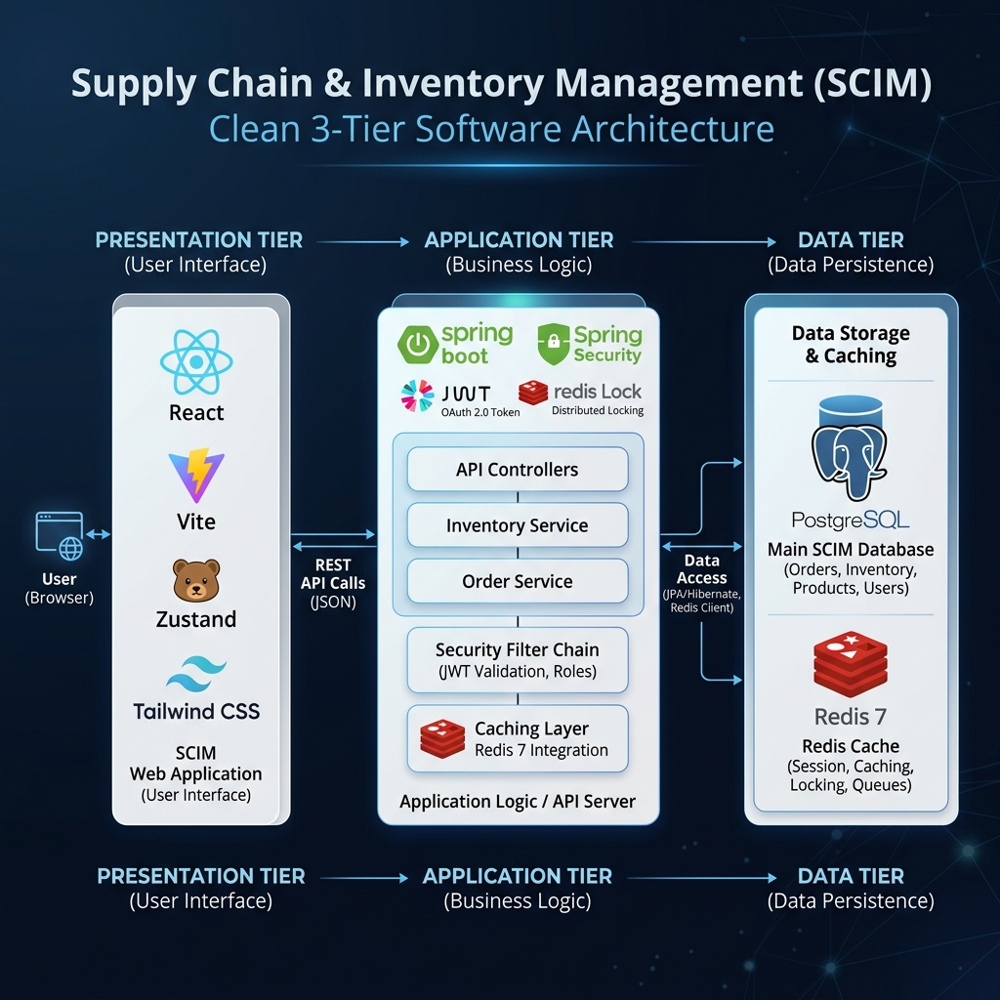

### 2.1.2. Xác định danh sách chức năng theo từng Phân hệ
Hệ thống SCIM tổ chức các yêu cầu chức năng thành 6 phân hệ nghiệp vụ cốt lõi:

1. **Phân hệ Xác thực & Phân quyền (RBAC):**
   - Đăng nhập, đăng xuất, tự động làm mới phiên làm việc (Refresh Token).
   - Quản trị danh sách người dùng (CRUD Users).
   - Thiết lập vai trò (CRUD Roles) và ánh xạ quyền hạn chi tiết (Permissions Mapping).
   - Xem/Cập nhật thông tin tài khoản cá nhân và thay đổi mật khẩu bảo mật.

2. **Phân hệ Danh mục Master Data:**
   - Quản lý danh mục nhà cung cấp (Suppliers).
   - Quản lý kho hàng (Warehouses) và vị trí chi tiết dạng cây (Locations) tương tác trên sơ đồ 2D trực quan.
   - Quản lý danh mục nhóm hàng (Categories), đơn vị tính quy đổi (UOMs), và sản phẩm (Products/SKUs) kèm thuộc tính động JSONB.

3. **Phân hệ Nghiệp vụ Nhập/Xuất kho & Lô hàng:**
   - Lập và duyệt phiếu nhập kho (Inbound Transactions) liên kết nhà cung cấp, ghi nhận số lô (Product Batches) và hạn sử dụng.
   - Lập và thực thi phiếu xuất kho (Outbound Transactions) tự động chỉ dẫn vị trí lấy hàng theo giải thuật FEFO/FIFO.
   - Luân chuyển hàng hóa nội bộ (Inter-warehouse transfer) giữa các kho trong cùng chi nhánh.
   - Tự động tính toán giá vốn tồn kho theo phương pháp trung bình có trọng số.

4. **Phân hệ QR Code & Kiểm kê Kho:**
   - Tạo mã QR Code cho lô hàng và vị trí kho bãi.
   - Thiết lập giao diện quét mã QR bằng camera di động thực hiện kiểm kho thực tế.
   - So sánh chênh lệch thừa/thiếu giữa số lượng kiểm đếm thực tế và sổ sách hệ thống thời gian thực.
   - Tự động sinh phiếu điều chỉnh kho (Stock Adjustment) đối với lượng hàng chênh lệch.

5. **Phân hệ Thông báo & Audit Log:**
   - Bắn thông báo trực quan khi có yêu cầu duyệt phiếu hoặc hàng tồn dưới định mức an toàn.
   - Cảnh báo tự động khi lô hàng trong kho sắp đến ngày hết hạn sử dụng.
   - Nhật ký kiểm toán (Audit Trail) ghi nhận vết thay đổi dữ liệu chi tiết (JSON Diff).

6. **Phân hệ Dashboard & Analytics Star Schema:**
   - Dashboard phân tích biểu diễn các biểu đồ xu hướng xuất nhập hàng (Recharts).
   - Báo cáo phân loại hàng tồn kho quan trọng ABC (Biểu đồ Pareto).
   - Cập nhật số đếm tồn kho thời gian thực lên màn hình quản trị.

### 2.1.3. Biểu đồ Use Case tổng quan và mô tả tương tác của các Tác nhân
Hệ thống SCIM xác định bốn nhóm tác nhân tương tác:
- **Admin (Hệ thống Admin):** Quản trị tài khoản, cấu hình tham số hệ thống và phân bổ quyền hạn vai trò chi tiết.
- **Manager (Quản lý kho):** Quản trị danh mục master data, kiểm soát hạn định tồn kho an toàn, phê duyệt các phiếu nhập/xuất/chuyển kho và phê duyệt phiên kiểm kê kho bãi.
- **Staff (Nhân viên kho):** Trực tiếp vận hành: lập phiếu nhập xuất, cất xếp hàng theo vị trí chỉ dẫn, thực thi lấy hàng, in nhãn QR Code và quét mã kiểm kê thực tế.
- **Viewer (Người xem báo cáo):** Được phép truy cập các màn hình Dashboard phân tích báo cáo và nhật ký hệ thống để giám sát mà không có quyền thay đổi dữ liệu.

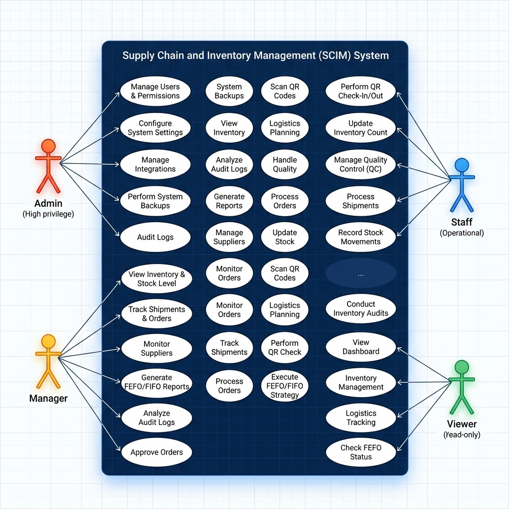

---

## 2.2. Phân tích chi tiết yêu cầu chức năng

### (1) Đăng nhập & Xác thực JWT/Refresh Token
Nhân viên bắt buộc phải thực hiện đăng nhập để hệ thống xác định danh tính và cấp quyền truy cập.

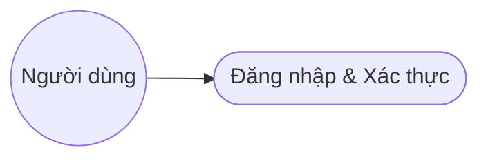
[Hình 2.3: Biểu đồ Use Case - Đăng nhập & Xác thực]

| Tên Use Case | Đăng nhập & Xác thực |
| :--- | :--- |
| **Tác nhân chính** | Tất cả người dùng (Admin, Manager, Staff, Viewer) |
| **Tiền điều kiện** | Tài khoản của người dùng ở trạng thái hoạt động (Active) trên cơ sở dữ liệu. |
| **Hậu điều kiện** | Hệ thống cấp phát Access Token (JWT) lưu trữ trên RAM và Refresh Token lưu ở Cookie bảo mật. |
| **Chuỗi sự kiện chính** | 1. Người dùng mở trang đăng nhập hệ thống SCIM.<br>2. Người dùng nhập Email và Mật khẩu.<br>3. Người dùng nhấn nút "Đăng nhập".<br>4. Giao diện Frontend gửi yêu cầu đăng nhập lên API Gateway phía Backend.<br>5. Backend đối chiếu mật khẩu đã mã hóa BCrypt với dữ liệu DB.<br>6. Backend kiểm tra trạng thái hoạt động của tài khoản người dùng.<br>7. Backend sinh cặp mã token (Access Token & Refresh Token) chứa thông tin tài khoản, danh sách quyền hạn và trả về client.<br>8. Frontend lưu Access Token vào Zustand store và điều hướng người dùng vào trang chủ. |
| **Luồng ngoại lệ** | - Sai mật khẩu hoặc email: Hệ thống báo lỗi "Tài khoản hoặc mật khẩu không chính xác" và yêu cầu nhập lại.<br>- Tài khoản đã bị ngừng hoạt động: Hệ thống báo lỗi "Tài khoản của bạn đã bị vô hiệu hóa". |

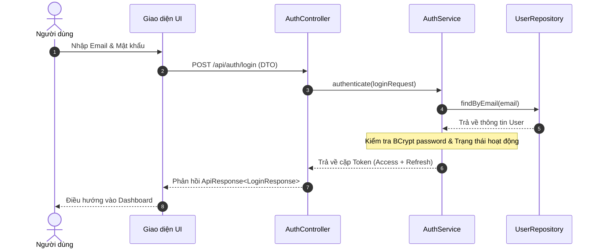
[Hình 2.4: Biểu đồ tuần tự - Đăng nhập & Xác thực]

---

### (2) Quản lý Người dùng & Phân quyền RBAC
Cho phép Admin tạo mới tài khoản nhân viên, phân vai trò và gán quyền chi tiết.

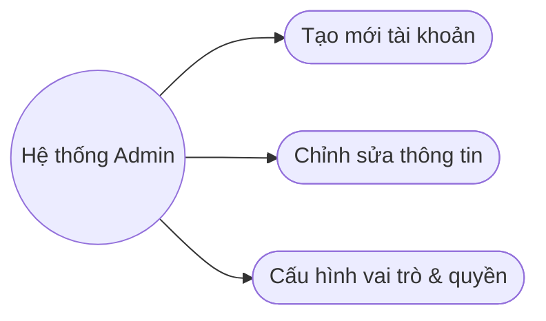
[Hình 2.5: Biểu đồ Use Case - Quản lý Người dùng & Phân quyền RBAC]

| Tên Use Case | Quản lý Người dùng & Phân quyền RBAC |
| :--- | :--- |
| **Tác nhân chính** | Hệ thống Admin (Admin) |
| **Tiền điều kiện** | Admin đã đăng nhập thành công vào hệ thống. |
| **Hậu điều kiện** | Người dùng mới được cấp quyền hoặc vai trò mới của nhân viên được kích hoạt có hiệu lực ngay lập tức. |
| **Chuỗi sự kiện chính** | 1. Admin truy cập mục Quản lý người dùng.<br>2. Hệ thống tải lên danh sách tài khoản hiện tại kèm theo vai trò và trạng thái.<br>3. Admin chọn một người dùng và nhấn nút chỉnh sửa, hoặc chọn tạo mới tài khoản.<br>4. Admin thiết lập thông tin liên hệ và chọn các hộp kiểm vai trò (Role) cho tài khoản.<br>5. Admin nhấn nút Lưu.<br>6. Frontend gửi dữ liệu yêu cầu cập nhật lên Backend.<br>7. Backend ghi nhận thay đổi vào cơ sở dữ liệu và thu hồi phiên làm việc cũ nếu vai trò thay đổi.<br>8. Hệ thống thông báo cập nhật thành công và làm mới bảng dữ liệu hiển thị. |
| **Luồng ngoại lệ** | - Trùng email khi tạo mới: Backend báo lỗi trùng lặp tài nguyên (409) và yêu cầu nhập email khác. |

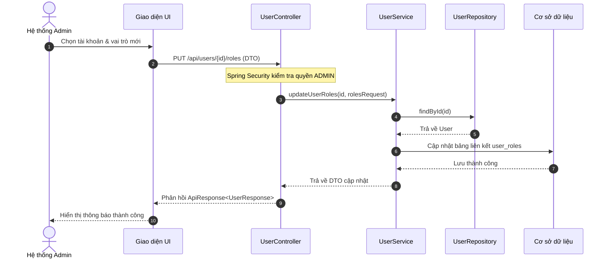
[Hình 2.6: Biểu đồ tuần tự - Quản lý Người dùng & Phân quyền RBAC]

---

### (3) Quản lý Nhà cung cấp (Suppliers)
Quản trị danh mục thông tin đối tác cung cấp hàng hóa đầu vào cho chuỗi cung ứng.

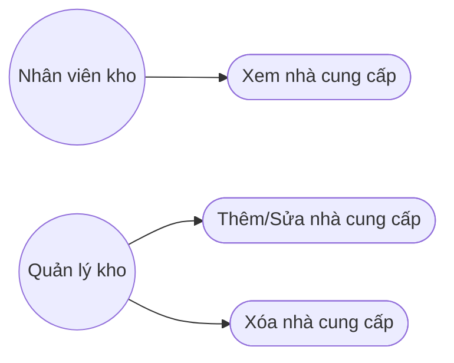
[Hình 2.7: Biểu đồ Use Case - Quản lý Nhà cung cấp]

| Tên Use Case | Quản lý Nhà cung cấp |
| :--- | :--- |
| **Tác nhân chính** | Quản lý kho (Manager), Nhân viên kho (Staff) |
| **Tiền điều kiện** | Người dùng có quyền truy cập phân hệ quản lý danh mục đối tác đầu vào. |
| **Hậu điều kiện** | Thông tin đối tác được cập nhật, dữ liệu mới được lưu trữ trong Redis Cache và PostgreSQL DB. |
| **Chuỗi sự kiện chính** | 1. Nhân viên truy cập trang Danh mục Nhà cung cấp.<br>2. Hệ thống hiển thị danh sách nhà cung cấp (hỗ trợ phân trang và tìm kiếm theo mã/tên/số điện thoại).<br>3. Nhân viên chọn thêm mới hoặc sửa đổi thông tin một nhà cung cấp cụ thể.<br>4. Nhân viên điền thông tin Mã số thuế, tên giao dịch, địa chỉ, người liên hệ chính.<br>5. Nhân viên nhấn nút Lưu biểu mẫu.<br>6. Hệ thống thực hiện kiểm tra định dạng dữ liệu (validation) tại client và gửi dữ liệu lên Backend.<br>7. Backend cập nhật thông tin nhà cung cấp vào cơ sở dữ liệu, đồng thời đồng bộ xóa khóa cache tương ứng trên Redis.<br>8. Giao diện tải lại danh sách nhà cung cấp đã cập nhật. |
| **Luồng ngoại lệ** | - Nhập thiếu mã nhà cung cấp hoặc sai định dạng email: Hệ thống hiển thị cảnh báo validation trực tiếp tại ô nhập liệu. |

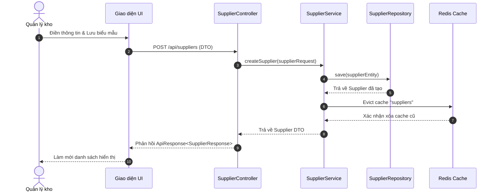
[Hình 2.8: Biểu đồ tuần tự - Quản lý Nhà cung cấp]

---

### (4) Quản lý Kho bãi & Vị trí dạng cây phân cấp (Warehouses & Locations)
Thiết lập và quản lý cấu trúc kho bãi thực tế thông qua hai chế độ xem: Dạng cây truyền thống và Sơ đồ tương tác trực quan 2D (Map View).

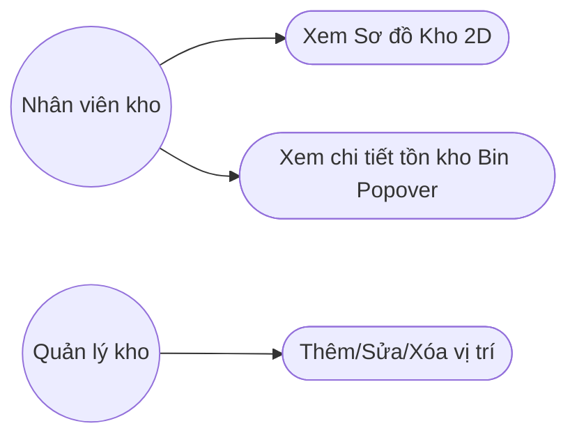
[Hình 2.9: Biểu đồ Use Case - Sơ đồ kho 2D & Kiểm kho Popover]

| Tên Use Case | Quản lý Kho bãi & Vị trí (Sơ đồ 2D & Kiểm kho Popover) |
| :--- | :--- |
| **Tác nhân chính** | Quản lý kho (Manager), Nhân viên kho (Staff) |
| **Tiền điều kiện** | Người dùng đã đăng nhập và được cấp quyền thay đổi danh mục cơ sở vật chất kho. |
| **Hậu điều kiện** | Vị trí kho bãi được cập nhật; Sơ đồ 2D phản ánh đúng cấu trúc thực tế; hỗ trợ tra cứu tồn kho thực tế của hộc chứa qua Popover. |
| **Chuỗi sự kiện chính** | 1. Nhân viên truy cập trang Quản lý Kho bãi & Sơ đồ Vị trí.<br>2. Hệ thống hiển thị danh sách các kho hàng ở cột bên trái.<br>3. Nhân viên chọn một kho hàng, mặc định hệ thống hiển thị chế độ **Sơ đồ (Map View)** trực quan 2D.<br>4. Nhân viên xem các thẻ Phân khu (Zones) ở hàng trên cùng chứa số lượng tóm tắt (số Dãy, Kệ, Hộc). Nhân viên chọn một Zone cụ thể.<br>5. Hệ thống hiển thị các **Dãy (Aisles)** song song bên dưới. Trong mỗi Dãy hiển thị danh sách các thẻ **Kệ (Shelves)**.<br>6. Trong mỗi Kệ, các **Hộc chứa (Bins)** được bố trí dạng lưới các ô vuông. Nhân viên nhấn vào một ô Bin bất kỳ.<br>7. Hệ thống mở một cửa sổ **Popover** tại vị trí Bin vừa click. Phía trong Popover tự động tải dữ liệu tồn kho thời gian thực, liệt kê danh sách sản phẩm, SKU, số lượng, số lô hàng và hạn sử dụng đang nằm trong hộc này.<br>8. Nhân viên có thể nhấn nút "Sửa" hoặc "Xóa" vị trí trực tiếp ngay trên Popover đó. |
| **Luồng ngoại lệ** | - Khi click vào Bin, hộc chứa đang hoàn toàn trống: Popover hiển thị thông báo "Hộc chứa trống (Không có sản phẩm)".<br>- Hết thời gian chờ kết nối (Timeout): Popover hiển thị lỗi tải dữ liệu tồn kho và đề xuất thử lại. |

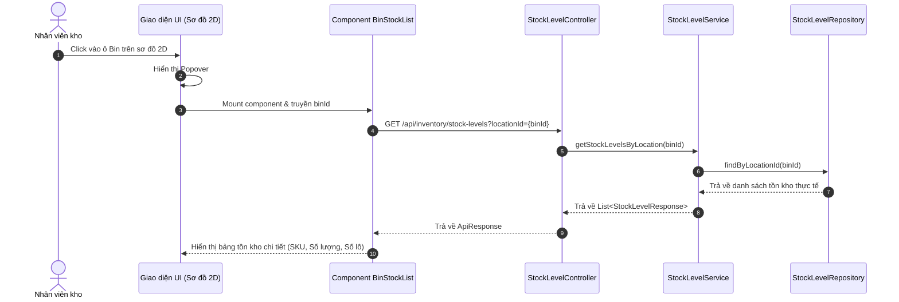
[Hình 2.10: Biểu đồ tuần tự - Sơ đồ kho 2D & Kiểm kho Popover]

---

### (5) Quản lý Danh mục Sản phẩm & Đơn vị tính quy đổi (SKUs)
Khai báo thông tin sản phẩm, mã SKU định danh, định mức tồn kho và các thuộc tính động JSONB.

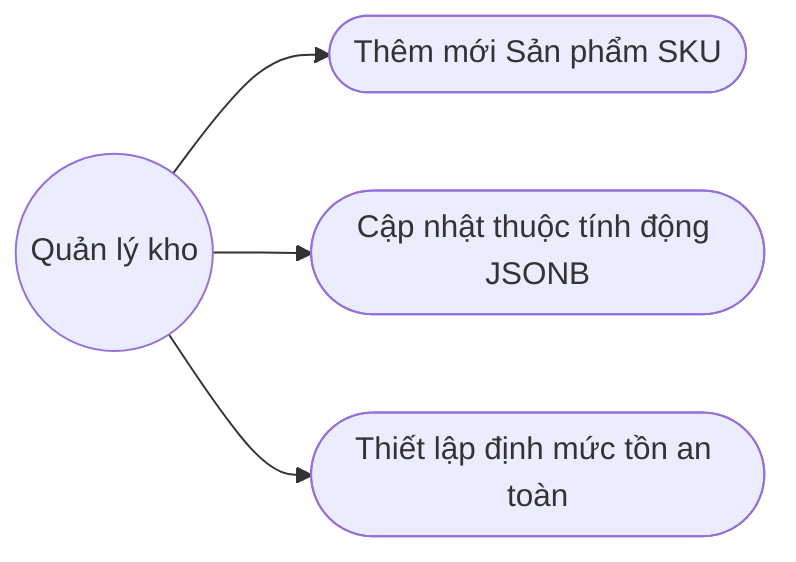
[Hình 2.11: Biểu đồ Use Case - Quản lý Sản phẩm]

| Tên Use Case | Quản lý Danh mục Sản phẩm & Đơn vị tính |
| :--- | :--- |
| **Tác nhân chính** | Quản lý kho (Manager) |
| **Tiền điều kiện** | Manager đã đăng nhập thành công và có quyền thay đổi danh mục hàng hóa. |
| **Hậu điều kiện** | Bản ghi sản phẩm được tạo mới hoặc cập nhật thông tin thành công trong hệ thống. |
| **Chuỗi sự kiện chính** | 1. Manager truy cập trang Danh mục sản phẩm.<br>2. Hệ thống hiển thị danh sách sản phẩm cùng các thông tin SKU, nhóm ngành hàng, tồn kho an toàn.<br>3. Manager nhấn nút Thêm sản phẩm mới.<br>4. Manager điền mã sản phẩm, mã SKU định danh, mã vạch (Barcode), chọn đơn vị tính (UOM) mặc định.<br>5. Manager thiết lập mức tồn kho tối thiểu (minimumStock) và tối đa (maximumStock) cho sản phẩm.<br>6. Manager điền các thuộc tính động (nhiệt độ bảo quản, chất liệu, kích thước...) dưới dạng danh sách cấu trúc động.<br>7. Manager nhấn nút Lưu.<br>8. Backend kiểm tra tính duy nhất của mã sản phẩm/SKU, lưu các thuộc tính động vào cột JSONB trong DB PostgreSQL và trả về thông tin sản phẩm đã tạo. |
| **Luồng ngoại lệ** | - Trùng mã SKU hoặc mã vạch: Hệ thống báo lỗi trùng mã và yêu cầu kiểm tra lại.<br>- Giá trị tồn kho tối thiểu lớn hơn tồn kho tối đa: Hệ thống báo lỗi logic cấu hình định mức tồn kho. |

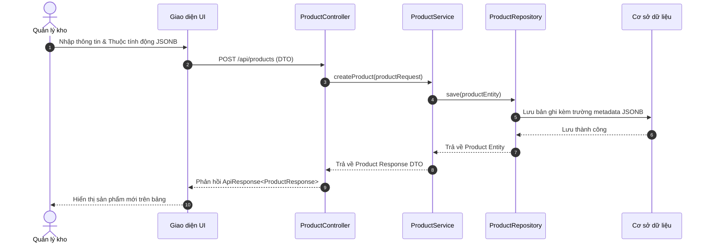
[Hình 2.12: Biểu đồ tuần tự - Quản lý Sản phẩm]

---

### (6) Quy trình Nhập kho Inbound & Quản lý Lô hàng (Product Batches)
Ghi nhận giao dịch nhập hàng từ đối tác vào các vị trí kho bãi chi tiết, quản lý theo lô hàng.

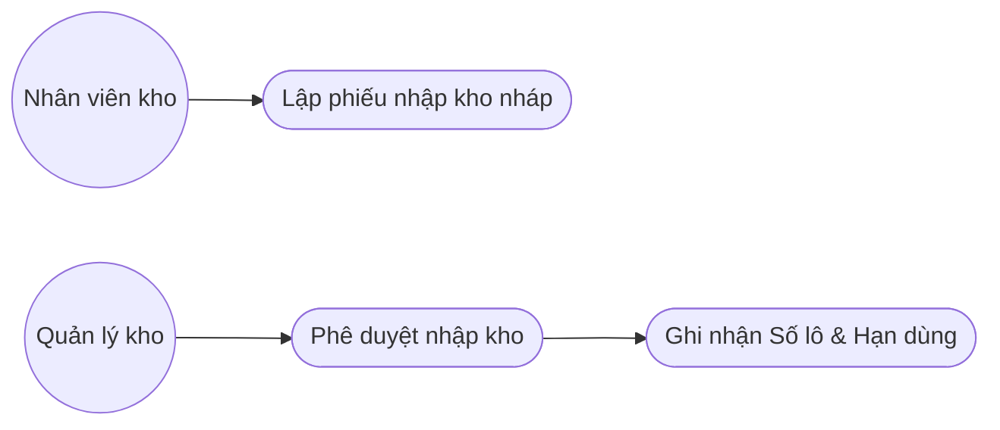
[Hình 2.13: Biểu đồ Use Case - Nhập kho Inbound]

| Tên Use Case | Quy trình Nhập kho Inbound & Quản lý Lô hàng |
| :--- | :--- |
| **Tác nhân chính** | Quản lý kho (Manager), Nhân viên kho (Staff) |
| **Tiền điều kiện** | Nhân viên kho đã đăng nhập hệ thống và có quyền thực thi giao dịch nhập kho. |
| **Hậu điều kiện** | Trạng thái phiếu chuyển từ DRAFT sang COMPLETED, số lượng tồn kho của các sản phẩm tăng lên tương ứng tại vị trí chỉ định. |
| **Chuỗi sự kiện chính** | 1. Nhân viên truy cập phân hệ Tạo phiếu nhập kho.<br>2. Nhân viên tạo mới phiếu, chọn nhà cung cấp, ngày nhập hàng thực tế.<br>3. Nhân viên thêm danh sách sản phẩm nhập kho, nhập số lượng, đơn giá mua tương ứng.<br>4. Với mỗi dòng sản phẩm, nhân viên chọn vị trí ô kệ chứa hàng (Bin) và nhập Số lô (Batch Number), ngày sản xuất, hạn sử dụng.<br>5. Nhân viên lưu phiếu ở trạng thái nháp (DRAFT) hoặc gửi yêu cầu duyệt (PENDING).<br>6. Quản lý kho kiểm tra thông tin phiếu nhập kho và nhấn nút "Phê duyệt duyệt và nhập kho" (APPROVED -> COMPLETED).<br>7. Backend thực hiện xử lý nghiệp vụ: ghi nhận thông tin lô hàng vào bảng ProductBatch, tăng số lượng tồn kho tương ứng của từng SKU tại vị trí chỉ định trong bảng StockLevel, cập nhật lịch sử biến động trong bảng StockMovement.<br>8. Hệ thống tự động tính toán lại giá trị vốn hàng tồn kho theo phương pháp trung bình có trọng số. |
| **Luồng ngoại lệ** | - Nhập thiếu hạn sử dụng cho sản phẩm yêu cầu quản lý lô: Hệ thống chặn phê duyệt và yêu cầu điền bổ sung. |

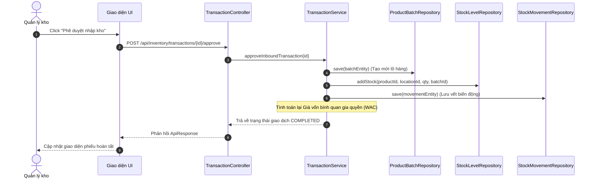
[Hình 2.14: Biểu đồ tuần tự - Nhập kho Inbound]

---

### (7) Quy trình Xuất kho Outbound & Đề xuất vị trí FEFO/FIFO
Tạo yêu cầu xuất hàng đi kèm giải thuật tự động tìm vị trí lấy hàng ưu tiên hạn dùng hoặc ngày nhập.

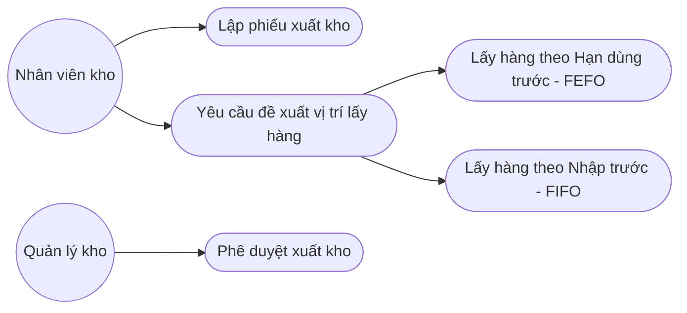
[Hình 2.15: Biểu đồ Use Case - Xuất kho Outbound]

| Tên Use Case | Quy trình Xuất kho Outbound & Đề xuất vị trí |
| :--- | :--- |
| **Tác nhân chính** | Quản lý kho (Manager), Nhân viên kho (Staff) |
| **Tiền điều kiện** | Nhân viên kho đã được cấp quyền xuất kho và số lượng tồn kho khả dụng của sản phẩm trong kho lớn hơn 0. |
| **Hậu điều kiện** | Hệ thống tạo chỉ dẫn lấy hàng (Picking list), giảm số lượng tồn kho thực tế tại các ô kệ chỉ định khi hoàn tất xuất kho. |
| **Chuỗi sự kiện chính** | 1. Nhân viên truy cập màn hình Tạo phiếu xuất kho.<br>2. Nhân viên chọn sản phẩm và nhập số lượng yêu cầu xuất hàng.<br>3. Nhân viên nhấn nút "Yêu cầu đề xuất vị trí".<br>4. Giao diện gửi yêu cầu lên Backend để phân tích dữ liệu tồn kho theo lô hàng.<br>5. Backend kích hoạt giải thuật đề xuất: quét các lô hàng hiện tại của SKU trong kho, nếu sản phẩm có hạn dùng hệ thống áp dụng FEFO (lô hạn dùng ngắn hơn xuất trước), ngược lại áp dụng FIFO (lô nhập trước xuất trước).<br>6. Backend trả về danh sách chỉ dẫn chi tiết: lấy từ ô kệ nào, số lượng bao nhiêu, thuộc lô hàng nào.<br>7. Nhân viên xác nhận danh sách chỉ dẫn lấy hàng, hệ thống khóa giữ hàng (Reserved Quantity) để tránh các đơn hàng khác tranh chấp.<br>8. Quản lý kho duyệt xuất kho, Backend trừ số lượng tồn kho thực tế, giải phóng số lượng giữ hàng, tạo bản ghi biến động tồn kho và cập nhật trạng thái phiếu xuất thành công. |
| **Luồng ngoại lệ** | - Tổng số lượng tồn kho khả dụng không đủ đáp ứng yêu cầu: Hệ thống báo lỗi "Số lượng tồn kho không đủ để thực hiện xuất kho". |

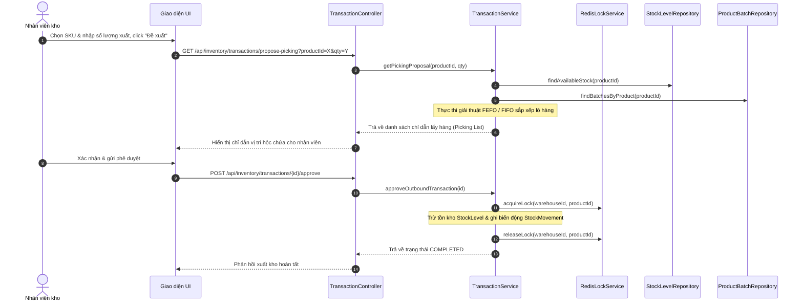
[Hình 2.16: Biểu đồ tuần tự - Xuất kho Outbound]

---

### (8) Quy trình Chuyển kho nội bộ (Inter-warehouse transfer)
Quy trình luân chuyển hàng hóa an toàn giữa các kho vật lý trong cùng hệ thống quản lý của doanh nghiệp.

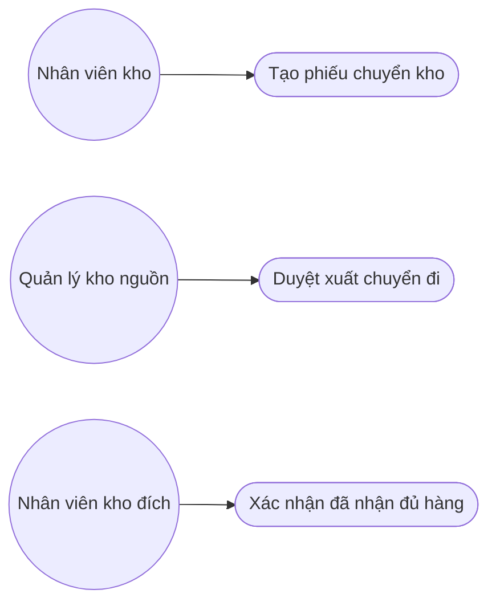
[Hình 2.17: Biểu đồ Use Case - Chuyển kho nội bộ]

| Tên Use Case | Quy trình Chuyển kho nội bộ |
| :--- | :--- |
| **Tác nhân chính** | Quản lý kho (Manager), Nhân viên kho (Staff) |
| **Tiền điều kiện** | Cả kho nguồn và kho đích đều được cấu hình hoạt động hợp lệ trên hệ thống SCIM. |
| **Hậu điều kiện** | Giảm số lượng tồn kho tại vị trí xuất của kho nguồn và tăng số lượng tồn kho tại vị trí nhập của kho đích sau khi hoàn tất. |
| **Chuỗi sự kiện chính** | 1. Nhân viên truy cập trang Tạo phiếu chuyển kho nội bộ.<br>2. Nhân viên chọn kho gửi hàng (Source Warehouse) và kho nhận hàng (Destination Warehouse).<br>3. Nhân viên thêm sản phẩm cần chuyển, chọn vị trí ô kệ nguồn muốn lấy hàng.<br>4. Nhân viên chọn vị trí ô kệ dự kiến xếp hàng tại kho đích.<br>5. Nhân viên điền số lượng cần luân chuyển hàng hóa và nhấn nút Lưu phiếu.<br>6. Quản lý kho tại kho gửi duyệt phiếu xuất chuyển đi (phiếu chuyển sang trạng thái chuyển tiếp PENDING). Backend giảm lượng tồn kho khả dụng tại kho nguồn.<br>7. Khi hàng đến nơi, nhân viên tại kho đích thực hiện kiểm đếm thực tế và nhấn "Xác nhận đã nhận đủ hàng" (COMPLETED).<br>8. Backend ghi nhận tăng số lượng tồn kho thực tế tại kho nhận và đóng phiếu giao dịch. |
| **Luồng ngoại lệ** | - Hàng hóa bị hỏng hóc hoặc thiếu hụt trong quá trình vận chuyển: Nhân viên kho nhận ghi nhận số lượng thực nhận khác số lượng gửi đi, hệ thống ghi nhận phần chênh lệch hao hụt vào tài khoản tổn thất và đóng phiếu. |

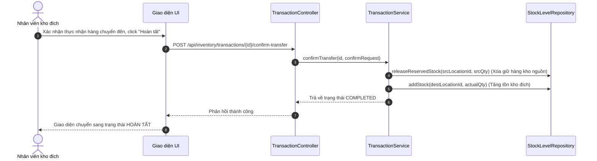
[Hình 2.18: Biểu đồ tuần tự - Chuyển kho nội bộ]

---

### (9) Tạo mã QR Code & Thực hiện Kiểm kê Kho (Stocktaking)
Quy trình sinh mã vạch thông minh QR định danh vị trí/lô hàng và quét camera thực tế để kiểm đếm tồn kho đối chiếu sổ sách.

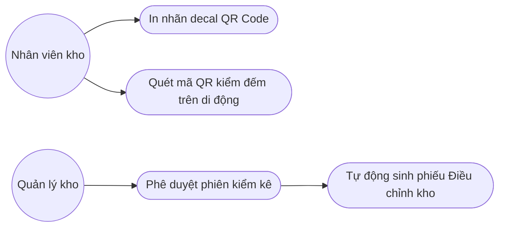
[Hình 2.19: Biểu đồ Use Case - Kiểm kê Kho]

| Tên Use Case | Tạo mã QR Code & Thực hiện Kiểm kê Kho |
| :--- | :--- |
| **Tác nhân chính** | Quản lý kho (Manager), Nhân viên kho (Staff) |
| **Tiền điều kiện** | Hệ thống đã định cấu hình sản phẩm và sơ đồ vị trí kho hàng. Thiết bị quét có camera hoạt động tốt. |
| **Hậu điều kiện** | Kết quả đối chiếu chênh lệch thực tế được ghi nhận chi tiết, tự động đề xuất phiếu điều chỉnh kho khi duyệt phiên. |
| **Chuỗi sự kiện chính** | 1. Nhân viên tạo mới phiên kiểm kê kho (Stocktake Session) trên giao diện hệ thống cho một khu vực kho cụ thể.<br>2. Nhân viên mở ứng dụng kiểm kê trên thiết bị di động, kích hoạt camera quét mã QR của vị trí kho hoặc nhãn lô sản phẩm.<br>3. Hệ thống tự động nhận diện thông tin sản phẩm và vị trí dựa trên chuỗi mã QR quét được.<br>4. Nhân viên nhập số lượng kiểm đếm thực tế đếm được tại vị trí đó.<br>5. Hệ thống hiển thị so sánh chênh lệch thừa/thiếu so với số lượng tồn kho lý thuyết trên hệ thống ngay thời gian thực.<br>6. Nhân viên nhấn nút Hoàn tất kiểm kê để gửi kết quả phiên lên quản lý.<br>7. Quản lý kho xem báo cáo chênh lệch của phiên kiểm kê và nhấn nút Phê duyệt phiên.<br>8. Backend tự động tạo ra một phiếu điều chỉnh tồn kho (Stock Adjustment) đối với những SKU có chênh lệch để đưa số lượng tồn kho hệ thống khớp chính xác với thực tế ngoài kho bãi. |
| **Luồng ngoại lệ** | - Camera không nhận diện được mã QR: Nhân viên chọn nhập mã số vị trí/SKU trực tiếp bằng bàn phím trên giao diện ứng dụng. |

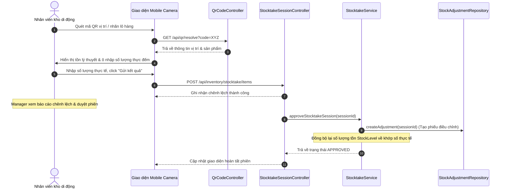
[Hình 2.20: Biểu đồ tuần tự - Kiểm kê Kho]

---

### (10) Nhật ký hệ thống Audit Log & Lưu vết biến động dữ liệu
Lưu vết toàn bộ thao tác thêm, sửa, xóa thông tin danh mục hoặc giao dịch kho của nhân viên, hỗ trợ đối chiếu JSON Diff dữ liệu trước và sau khi thay đổi.

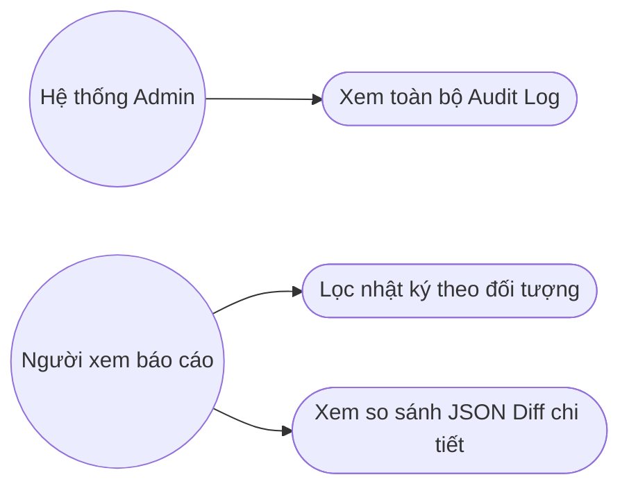
[Hình 2.21: Biểu đồ Use Case - Nhật ký hệ thống Audit Log]

| Tên Use Case | Nhật ký hệ thống Audit Log & Lưu vết biến động |
| :--- | :--- |
| **Tác nhân chính** | Hệ thống Admin (Admin), Người xem báo cáo (Viewer) |
| **Tiền điều kiện** | Người dùng đã đăng nhập thành công và có vai trò phù hợp để truy cập nhật ký bảo mật hệ thống. |
| **Hậu điều kiện** | Nhật ký các sự thay đổi dữ liệu được liệt kê chi tiết phục vụ tra cứu kiểm toán. |
| **Chuỗi sự kiện chính** | 1. Người dùng truy cập phân hệ Nhật ký hệ thống (Audit Log).<br>2. Hệ thống tải lên danh sách nhật ký ghi nhận (sắp xếp theo thời gian mới nhất giảm dần).<br>3. Người dùng lọc lịch sử theo tài khoản nhân viên, loại thực thể tác động (ví dụ: Product, Supplier), hoặc khoảng thời gian.<br>4. Người dùng chọn một bản ghi nhật ký cụ thể để xem chi tiết.<br>5. Hệ thống hiển thị cửa sổ so sánh (JSON Diff) chỉ ra các trường dữ liệu bị thay đổi, giá trị cũ (Old Value) và giá trị mới (New Value).<br>6. Người dùng thực hiện phân tích truy vết lịch sử khi phát hiện sai sót dữ liệu. |
| **Luồng ngoại lệ** | - Không có bản ghi phù hợp với bộ lọc: Hệ thống hiển thị bảng trống thông báo không tìm thấy kết quả. |

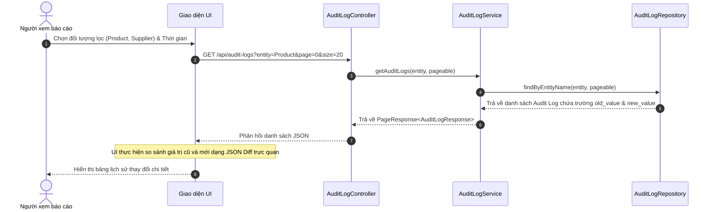
[Hình 2.22: Biểu đồ tuần tự - Nhật ký hệ thống Audit Log]

---

### (11) Báo cáo Dashboard & Phân tích Tồn kho theo mô hình Star Schema (Phân loại ABC)
Tổng hợp dữ liệu lớn từ các giao dịch thô sang mô hình kho dữ liệu phân tích thu nhỏ để hiển thị Dashboard và biểu đồ phân loại hàng tồn kho quan trọng.

```mermaid
graph LR
  Manager((Quản lý kho)) --> UC1([Xem KPIs & Biến động thời gian thực])
  Viewer((Người xem báo cáo)) --> UC2([Xem báo cáo phân tích ABC Pareto])
```
[Hình 2.23: Biểu đồ Use Case - Báo cáo Dashboard & Phân tích ABC]

| Tên Use Case | Báo cáo Dashboard & Phân tích ABC |
| :--- | :--- |
| **Tác nhân chính** | Quản lý kho (Manager), Người xem báo cáo (Viewer) |
| **Tiền điều kiện** | Hệ thống đã tích lũy dữ liệu giao dịch xuất nhập kho thực tế trong quá trình vận hành. |
| **Hậu điều kiện** | Các chỉ số KPI tổng hợp, danh sách cảnh báo tồn kho và biểu đồ phân loại Pareto ABC được hiển thị chính xác. |
| **Chuỗi sự kiện chính** | 1. Người dùng truy cập trang chủ Dashboard ứng dụng SCIM.<br>2. Frontend gửi yêu cầu tải dữ liệu tổng hợp phân tích lên AnalyticsController.<br>3. AnalyticsController gọi AnalyticsService để lấy thông tin tổng hợp.<br>4. AnalyticsService truy vấn số liệu từ kho dữ liệu phân tích (Star Schema) thông qua bảng FactInventoryMovements kết hợp các bảng Dimension.<br>5. AnalyticsService thực thi thuật toán phân loại ABC: Tính toán giá trị sử dụng lũy kế của từng SKU, xếp hạng từ cao đến thấp và phân chia thành Nhóm A (quan trọng nhất, chiếm 80% giá trị), Nhóm B (trung bình, chiếm 15%), Nhóm C (ít quan trọng, chiếm 5%).<br>6. AnalyticsService trả về kết quả cấu trúc dữ liệu biểu đồ.<br>7. Giao diện Frontend nhận dữ liệu và vẽ biểu đồ Pareto ABC trực quan bằng thư viện Recharts để nhà quản lý đưa ra quyết định mua hàng hợp lý. |
| **Luồng ngoại lệ** | - Hệ thống chưa có dữ liệu giao dịch: Dashboard hiển thị các biểu đồ trống và thông báo "Chưa có dữ liệu thống kê". |

```mermaid
sequenceDiagram
  autonumber
  actor Manager as Quản lý kho
  participant UI as Giao diện Dashboard (Recharts)
  participant Ctrl as AnalyticsController
  participant Service as AnalyticsService
  participant DB as PostgreSQL (Star Schema)

  Manager->>UI: Truy cập trang báo cáo Dashboard
  UI->>Ctrl: GET /api/analytics/abc-classification
  Ctrl->>Service: getAbcClassification()
  Service->>DB: Thực hiện truy vấn trên Fact & Dim tables
  DB-->>Service: Trả về giá trị tiêu thụ xuất kho của các sản phẩm
  Note over Service: Tính toán tỷ lệ lũy kế & phân hạng A (80%), B (15%), C (5%)
  Service-->>Ctrl: Trả về dữ liệu biểu đồ Pareto ABC
  Ctrl-->>UI: Trả về ApiResponse
  Note over UI: Vẽ biểu đồ Pareto ABC kết hợp đường lũy kế bằng Recharts
  UI-->>Manager: Hiển thị trực quan báo cáo phân loại hàng tồn kho
```
[Hình 2.24: Biểu đồ tuần tự - Báo cáo Dashboard & Phân tích ABC]

---

## 2.3. Yêu cầu phi chức năng

Hệ thống SCIM phải đáp ứng nghiêm ngặt các yêu cầu phi chức năng sau để đảm bảo vận hành ổn định trong môi trường doanh nghiệp thực tế:

1. **Hiệu năng và Tốc độ phản hồi (Performance & Response Time):**
   - Thời gian phản hồi cho các yêu cầu truy vấn danh mục cơ bản (nhà cung cấp, sản phẩm, vị trí) phải dưới 200 miligiây nhờ tối ưu hóa Redis Cache.
   - Thời gian tải các biểu đồ phân tích trên Dashboard tổng hợp dữ liệu lớn phải dưới 1.5 giây nhờ cơ chế lưu trữ dữ liệu riêng biệt trong Star Schema và tự động cập nhật Materialized Views.
2. **Kiểm soát giao dịch đồng thời (Concurrency Control):**
   - Đảm bảo tính nhất quán dữ liệu tồn kho tuyệt đối. Hệ thống không cho phép xuất kho vượt quá số lượng tồn khả dụng thực tế của ô kệ tại bất kỳ thời điểm nào.
   - Khi có nhiều yêu cầu xuất kho đồng thời cho cùng một SKU tại một vị trí, hệ thống phải xử lý tuần tự thông qua Redis Lock phân tán với thời gian chờ giải phóng khóa tối đa là 5 giây để tránh hiện tượng nghẽn luồng xử lý.
3. **Bảo mật và Phân quyền (Security & Authorization):**
   - Tất cả các yêu cầu kết nối API giữa client và server bắt buộc phải truyền qua giao thức mã hóa HTTPS.
   - Chuỗi ký tự Access Token cấp phát có thời hạn hiệu lực tối đa là 15 phút, được lưu hoàn toàn trên bộ nhớ đệm ứng dụng (Memory), không lưu trong LocalStorage để phòng ngừa các cuộc tấn công đánh cắp mã XSS.
   - Mật khẩu lưu trữ trong cơ sở dữ liệu phải được băm bằng thuật toán BCrypt với độ muối (work factor) là 12.
4. **Khả năng ghi nhật ký và giám sát (Auditability & Logs):**
   - Hệ thống phải đảm bảo ghi nhận 100% nhật ký các thao tác chỉnh sửa dữ liệu danh mục hoặc giao dịch kho của người dùng.
   - File nhật ký Logback được thiết lập cơ chế tự động xoay vòng (rolling file) hàng ngày và lưu trữ tối thiểu trong vòng 90 ngày phục vụ việc kiểm toán nội bộ doanh nghiệp.

---

## 2.4. Thiết kế Cơ sở dữ liệu & Trực quan hóa ERD

### 2.4.1. Danh sách các lớp thực thể & Thuộc tính chi tiết
Cơ sở dữ liệu của hệ thống SCIM bao gồm các bảng thực thể chính được thiết kế chuẩn hóa để tránh dư thừa dữ liệu:

1. **users (Quản lý người dùng):**
   - `id` (BIGINT, Primary Key): ID định danh tự tăng.
   - `email` (VARCHAR(150), Unique): Email tài khoản đăng nhập.
   - `password` (VARCHAR(255)): Mật khẩu đã mã hóa băm.
   - `full_name` (VARCHAR(150)): Họ và tên người dùng.
   - `phone` (VARCHAR(20)): Số điện thoại liên hệ.
   - `avatar_url` (VARCHAR(500)): Đường dẫn ảnh đại diện.
   - `is_active` (BOOLEAN): Trạng thái hoạt động tài khoản.
2. **roles (Vai trò người dùng):**
   - `id` (BIGINT, Primary Key): ID vai trò.
   - `name` (VARCHAR(50), Unique): Tên vai trò (Admin, Manager, Staff, Viewer...).
   - `description` (VARCHAR(250)): Mô tả chức năng vai trò.
   - `is_active` (BOOLEAN): Trạng thái hoạt động của vai trò.
3. **permissions (Quyền hạn hệ thống):**
   - `id` (BIGINT, Primary Key): ID quyền.
   - `name` (VARCHAR(100)): Tên quyền hạn hiển thị.
   - `path` (VARCHAR(250)): Đường dẫn URI API cần bảo vệ.
   - `method` (VARCHAR(10)): Phương thức HTTP (GET, POST, PUT, DELETE).
   - `api_group` (VARCHAR(50)): Nhóm API chức năng.
4. **user_roles (Bảng liên kết người dùng - vai trò):**
   - `user_id` (BIGINT, Foreign Key references users): ID tài khoản.
   - `role_id` (BIGINT, Foreign Key references roles): ID vai trò.
5. **role_permissions (Bảng liên kết vai trò - quyền hạn):**
   - `role_id` (BIGINT, Foreign Key references roles): ID vai trò.
   - `permission_id` (BIGINT, Foreign Key references permissions): ID quyền hạn.
6. **suppliers (Nhà cung cấp):**
   - `id` (BIGINT, Primary Key): ID đối tác.
   - `code` (VARCHAR(50), Unique): Mã nhà cung cấp.
   - `name` (VARCHAR(200)): Tên nhà cung cấp.
   - `contact_name` (VARCHAR(100)): Người liên hệ chính.
   - `email` (VARCHAR(100)): Email liên hệ giao dịch.
   - `phone` (VARCHAR(20)): Số điện thoại.
   - `tax_code` (VARCHAR(50)): Mã số thuế.
   - `address` (VARCHAR(500)): Địa chỉ văn phòng.
   - `is_active` (BOOLEAN): Trạng thái hoạt động.
7. **warehouses (Kho hàng vật lý):**
   - `id` (BIGINT, Primary Key): ID kho hàng.
   - `code` (VARCHAR(50), Unique): Mã kho hàng.
   - `name` (VARCHAR(200)): Tên kho hàng.
   - `address` (VARCHAR(500)): Địa chỉ kho.
   - `description` (VARCHAR(500)): Mô tả ghi chú.
   - `is_active` (BOOLEAN): Trạng thái hoạt động.
8. **locations (Vị trí ô kệ trong kho):**
   - `id` (BIGINT, Primary Key): ID vị trí.
   - `code` (VARCHAR(50), Unique): Mã vị trí ô kệ.
   - `name` (VARCHAR(200)): Tên mô tả vị trí.
   - `warehouse_id` (BIGINT, Foreign Key references warehouses): Liên kết kho chứa vị trí này.
   - `parent_id` (BIGINT, Foreign Key references locations): Liên kết vị trí cha trong sơ đồ cây phân cấp.
   - `type` (VARCHAR(50)): Loại vị trí (ZONE, AISLE, SHELF, RACK, BIN).
   - `description` (VARCHAR(500)): Ghi chú mô tả.
   - `is_active` (BOOLEAN): Trạng thái hoạt động.
9. **categories (Danh mục ngành hàng):**
   - `id` (BIGINT, Primary Key): ID nhóm ngành hàng.
   - `code` (VARCHAR(50), Unique): Mã nhóm ngành hàng.
   - `name` (VARCHAR(200)): Tên nhóm.
   - `parent_id` (BIGINT, Foreign Key references categories): Phân cấp nhóm cha.
10. **units_of_measure (Đơn vị tính):**
    - `id` (BIGINT, Primary Key): ID đơn vị tính.
    - `code` (VARCHAR(50), Unique): Mã viết tắt đơn vị.
    - `name` (VARCHAR(100)): Tên đơn vị (Cái, Thùng, Kg, Hộp).
11. **products (Sản phẩm SKUs):**
    - `id` (BIGINT, Primary Key): ID sản phẩm.
    - `code` (VARCHAR(50), Unique): Mã sản phẩm nội bộ.
    - `name` (VARCHAR(250)): Tên sản phẩm.
    - `sku` (VARCHAR(100), Unique): Mã SKU định danh toàn hệ thống.
    - `barcode` (VARCHAR(100)): Mã vạch sản phẩm.
    - `category_id` (BIGINT, Foreign Key references categories): Nhóm ngành hàng liên kết.
    - `uom_id` (BIGINT, Foreign Key references units_of_measure): Đơn vị tính mặc định.
    - `minimum_stock` (NUMERIC(19,4)): Định mức tồn tối thiểu.
    - `maximum_stock` (NUMERIC(19,4)): Định mức tồn tối đa.
    - `price` (NUMERIC(19,4)): Đơn giá tham chiếu sản phẩm.
    - `properties` (JSONB): Thuộc tính động của sản phẩm.
    - `is_active` (BOOLEAN): Trạng thái hoạt động.
12. **inventory_transactions (Phiếu giao dịch kho):**
    - `id` (BIGINT, Primary Key): ID phiếu giao dịch.
    - `code` (VARCHAR(50), Unique): Số hiệu phiếu giao dịch.
    - `type` (VARCHAR(50)): Loại giao dịch (INBOUND, OUTBOUND, TRANSFER).
    - `status` (VARCHAR(50)): Trạng thái phê duyệt (DRAFT, PENDING, APPROVED, COMPLETED, CANCELLED).
    - `source_warehouse_id` (BIGINT, Foreign Key references warehouses): Kho gửi hàng (nếu có).
    - `destination_warehouse_id` (BIGINT, Foreign Key references warehouses): Kho nhận hàng (nếu có).
    - `supplier_id` (BIGINT, Foreign Key references suppliers): Nhà cung cấp liên kết (đối với phiếu nhập).
    - `total_amount` (NUMERIC(19,4)): Tổng giá trị giá trị giao dịch phiếu.
    - `transaction_date` (TIMESTAMP): Ngày thực hiện giao dịch thực tế.
    - `note` (VARCHAR(500)): Ghi chú phiếu.
13. **product_batches (Quản lý lô sản phẩm):**
    - `id` (BIGINT, Primary Key): ID lô hàng.
    - `product_id` (BIGINT, Foreign Key references products): Sản phẩm liên kết.
    - `batch_number` (VARCHAR(100)): Số hiệu lô hàng sản phẩm.
    - `production_date` (DATE): Ngày sản xuất.
    - `expiry_date` (DATE): Hạn sử dụng lô hàng.
14. **transaction_items (Chi tiết sản phẩm trên phiếu giao dịch):**
    - `id` (BIGINT, Primary Key): ID chi tiết dòng phiếu.
    - `transaction_id` (BIGINT, Foreign Key references inventory_transactions): Liên kết phiếu giao dịch chính.
    - `product_id` (BIGINT, Foreign Key references products): Sản phẩm giao dịch.
    - `quantity` (NUMERIC(19,4)): Số lượng giao dịch.
    - `price` (NUMERIC(19,4)): Đơn giá giao dịch thực tế dòng sản phẩm.
    - `source_location_id` (BIGINT, Foreign Key references locations): Ô kệ lấy hàng đi.
    - `destination_location_id` (BIGINT, Foreign Key references locations): Ô kệ xếp hàng vào.
    - `batch_number` (VARCHAR(100)): Lô hàng liên kết dòng sản phẩm.
    - `production_date` (DATE): Ngày sản xuất lô dòng sản phẩm.
    - `expiry_date` (DATE): Hạn sử dụng dòng lô sản phẩm.
15. **stock_levels (Tồn kho thực tế chi tiết):**
    - `id` (BIGINT, Primary Key): ID bản ghi tồn kho.
    - `product_id` (BIGINT, Foreign Key references products): Sản phẩm liên kết.
    - `warehouse_id` (BIGINT, Foreign Key references warehouses): Kho hàng chứa sản phẩm.
    - `location_id` (BIGINT, Foreign Key references locations): Vị trí ô kệ chứa sản phẩm.
    - `batch_id` (BIGINT, Foreign Key references product_batches): Lô hàng liên kết của sản phẩm tại vị trí này.
    - `quantity` (NUMERIC(19,4)): Số lượng tồn kho thực tế hiện tại.
    - `reserved_quantity` (NUMERIC(19,4)): Số lượng đang bị giữ hàng cho các giao dịch chờ xuất.
16. **stock_movements (Nhật ký biến động tồn kho chi tiết):**
    - `id` (BIGINT, Primary Key): ID bản ghi biến động.
    - `product_id` (BIGINT, Foreign Key references products): Sản phẩm biến động.
    - `warehouse_id` (BIGINT, Foreign Key references warehouses): Kho hàng biến động.
    - `location_id` (BIGINT, Foreign Key references locations): Vị trí ô kệ biến động.
    - `batch_id` (BIGINT, Foreign Key references product_batches): Lô hàng biến động.
    - `transaction_id` (BIGINT, Foreign Key references inventory_transactions): Phiếu giao dịch liên kết trực tiếp gây ra biến động.
    - `type` (VARCHAR(50)): Loại biến động (INBOUND, OUTBOUND, TRANSFER_OUT, TRANSFER_IN, ADJUSTMENT).
    - `quantity` (NUMERIC(19,4)): Số lượng thay đổi.
    - `balance_before` (NUMERIC(19,4)): Số lượng tồn kho trước khi thay đổi.
    - `balance_after` (NUMERIC(19,4)): Số lượng tồn kho sau khi thay đổi.
17. **stocktake_sessions (Phiên kiểm kê kho bãi):**
    - `id` (BIGINT, Primary Key): ID phiên kiểm kê.
    - `code` (VARCHAR(50), Unique): Số hiệu phiên kiểm kê.
    - `warehouse_id` (BIGINT, Foreign Key references warehouses): Kho hàng kiểm kê.
    - `status` (VARCHAR(50)): Trạng thái phiên (DRAFT, PENDING, APPROVED, COMPLETED).
    - `note` (VARCHAR(500)): Mô tả nội dung kiểm kê.
18. **stocktake_items (Chi tiết kết quả kiểm kê từng sản phẩm):**
    - `id` (BIGINT, Primary Key): ID chi tiết kiểm kê dòng.
    - `session_id` (BIGINT, Foreign Key references stocktake_sessions): Liên kết phiên chính.
    - `product_id` (BIGINT, Foreign Key references products): Sản phẩm kiểm kê.
    - `location_id` (BIGINT, Foreign Key references locations): Vị trí ô kệ sản phẩm.
    - `batch_number` (VARCHAR(100)): Số lô sản phẩm kiểm kê.
    - `system_quantity` (NUMERIC(19,4)): Số lượng tồn kho lý thuyết trên hệ thống.
    - `actual_quantity` (NUMERIC(19,4)): Số lượng tồn kho kiểm đếm thực tế ngoài kho.
    - `difference` (NUMERIC(19,4)): Số lượng chênh lệch thừa/thiếu.
19. **stock_adjustments (Phiếu điều chỉnh tồn kho):**
    - `id` (BIGINT, Primary Key): ID phiếu điều chỉnh.
    - `code` (VARCHAR(50), Unique): Số hiệu phiếu.
    - `session_id` (BIGINT, Foreign Key references stocktake_sessions): Liên kết phiên kiểm kê gốc gây ra điều chỉnh.
    - `status` (VARCHAR(50)): Trạng thái duyệt (DRAFT, APPROVED, COMPLETED).
20. **audit_logs (Nhật ký kiểm toán dữ liệu):**
    - `id` (BIGINT, Primary Key): ID nhật ký.
    - `entity_name` (VARCHAR(100)): Tên bảng thực thể bị thay đổi.
    - `entity_id` (BIGINT): ID bản ghi bị thay đổi.
    - `action` (VARCHAR(50)): Hành động thay đổi (CREATE, UPDATE, DELETE).
    - `old_value` (TEXT): Dữ liệu cũ dạng chuỗi đối tượng.
    - `new_value` (TEXT): Dữ liệu mới dạng chuỗi đối tượng.
    - `created_by` (VARCHAR(100)): Người thực hiện thay đổi.
    - `created_at` (TIMESTAMP): Thời gian ghi nhận sự thay đổi.

### 2.4.2. Mô tả mối quan hệ giữa các bảng
Các bảng thực thể liên kết chặt chẽ với nhau thông qua hệ thống khóa ngoại:
- Quản trị bảo mật: Bảng liên kết `user_roles` nối `users` và `roles` theo quan hệ nhiều-nhiều. Bảng `role_permissions` nối `roles` và `permissions` tương tự.
- Sơ đồ vị trí: Bảng `locations` chứa khóa ngoại `warehouse_id` trỏ đến `warehouses` và `parent_id` tự trỏ đến chính nó để xây dựng cấu trúc sơ đồ cây nhiều cấp.
- Thông tin sản phẩm: Bảng `products` liên kết khóa ngoại với `categories` (danh mục hàng) và `units_of_measure` (đơn vị tính).
- Giao dịch xuất nhập: Bảng `transaction_items` chứa chi tiết sản phẩm thuộc về một `inventory_transactions` (phiếu chính). Mỗi dòng chi tiết liên kết sản phẩm, vị trí ô kệ xuất phát (`source_location_id`) và ô kệ đích (`destination_location_id`) để quản trị vị trí chính xác.
- Mức tồn kho: Bảng `stock_levels` lưu trữ số lượng tồn thực tế của một sản phẩm, thuộc một lô hàng cụ thể (`batch_id`) tại một vị trí ô kệ xác định (`location_id`). Mọi hoạt động tăng giảm ở đây đều tự động sinh bản ghi chi tiết vào bảng nhật ký `stock_movements`.
- Kiểm kê: Phiên kiểm kê `stocktake_sessions` liên kết các dòng kết quả `stocktake_items`. Khi duyệt, hệ thống tự sinh `stock_adjustments` liên kết với phiên gốc để đưa dữ liệu tồn kho về đúng giá trị thực đếm.

### 2.4.3. Sơ đồ quan hệ thực thể (ERD)
Sơ đồ ERD toàn hệ thống trực quan hóa mối liên kết và các ràng buộc dữ liệu toàn vẹn giữa 20 bảng thực thể.


---

## 2.5. Kết luận Chương 2

Chương 2 đã thực hiện phân tích yêu cầu hệ thống một cách khoa học và toàn diện. Kiến trúc 3 tầng nâng cao phân tách rõ ràng nhiệm vụ hiển thị (ReactSPA), nghiệp vụ (Spring Boot) và dữ liệu (PostgreSQL/Redis). Sơ đồ Use Case tổng quan phối hợp với kịch bản Use Case và sơ đồ trình tự cho 11 nghiệp vụ chủ đạo—đặc biệt là tính năng Sơ đồ Kho 2D và Popover tra cứu tồn kho hộc chứa thông minh vừa phát triển—đã làm rõ cách thức xử lý thông điệp trong hệ thống. Thiết kế cơ sở dữ liệu chuẩn hóa với 20 bảng thực thể và ERD hoàn chỉnh là cơ sở vững chắc nhất để tiến hành triển khai viết mã nguồn hệ thống trong Chương 3.
