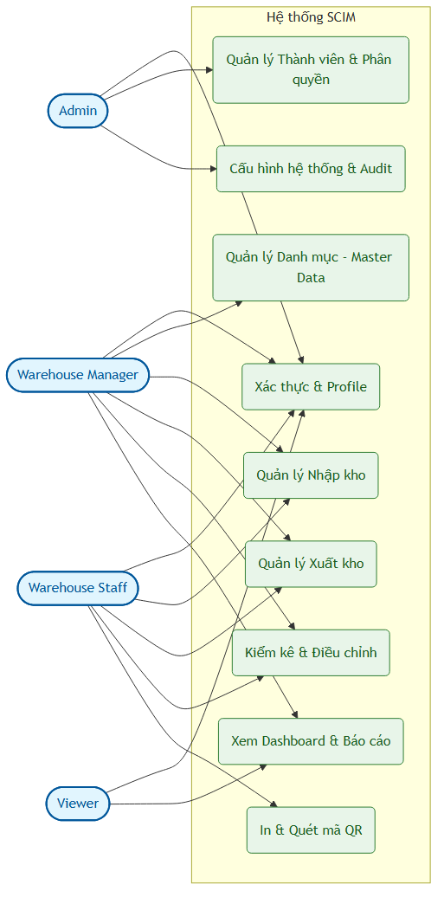
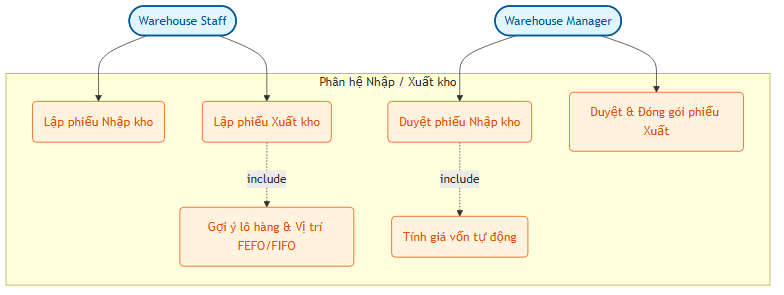
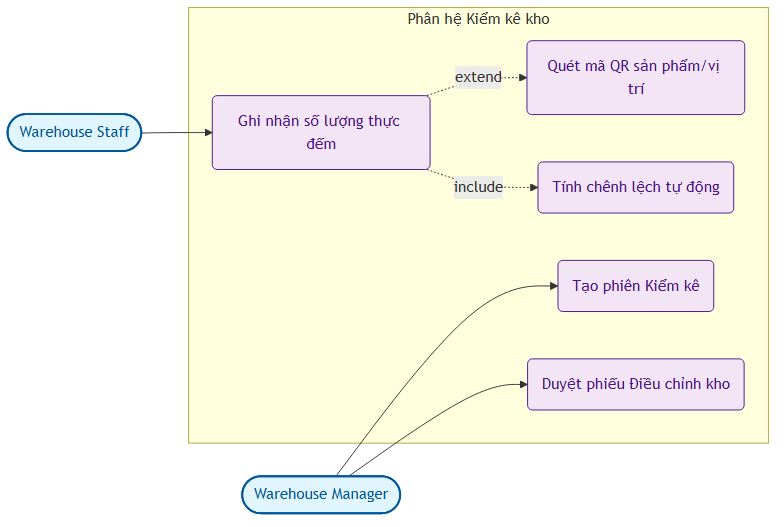

# CHƯƠNG 2 (PHẦN 1): PHÂN TÍCH YÊU CẦU CHỨC NĂNG & PHI CHỨC NĂNG

## 2.1 Xác định các tác nhân (Actors) của hệ thống

Hệ thống SCIM được thiết kế để phục vụ nhiều phòng ban và đối tác tham gia vào chuỗi cung ứng của doanh nghiệp. Các tác nhân chính bao gồm:

1. **Admin (Quản trị hệ thống):**
   - Người chịu trách nhiệm vận hành kỹ thuật toàn bộ hệ thống.
   - Quản lý danh sách người dùng, thiết lập mật khẩu, phân chia vai trò (Roles) và cấu hình các quyền hạn động (Permissions) trên hệ thống.
   - Quản lý cấu hình tham số hệ thống chung (System Settings), giám sát nhật ký thay đổi dữ liệu (Audit Trail) để xử lý các sự cố dữ liệu.
2. **Warehouse Manager (Quản lý kho):**
   - Người chịu trách nhiệm cao nhất về hoạt động của một hoặc nhiều kho hàng.
   - Quản lý sơ đồ vị trí kho hàng (Warehouses & Locations).
   - Phê duyệt hoặc từ chối các phiếu nhập kho (Inbound), xuất kho (Outbound), điều chuyển nội bộ (Transfer) và điều chỉnh tồn kho (Stock Adjustment) sau khi kiểm kê.
   - Theo dõi dashboard phân tích, biểu đồ ABC, dự báo thời gian hết hàng để lên kế hoạch đặt hàng hoặc xả hàng tồn.
3. **Warehouse Staff (Nhân viên kho):**
   - Người thực thi trực tiếp các tác vụ vật lý tại kho hàng.
   - Lập các phiếu yêu cầu nhập kho, xuất kho (dạng dự thảo - Draft).
   - Quét mã QR code để nhận diện nhanh lô sản phẩm, thực hiện nhặt hàng (picking) theo gợi ý FEFO/FIFO của hệ thống.
   - Thực hiện kiểm đếm thực tế và cập nhật số lượng trong các phiên kiểm kê (Stocktaking Sessions).
4. **Viewer (Người xem báo cáo):**
   - Thường là các cấp quản lý cấp cao (Ban Giám đốc) hoặc phòng Tài chính - Kế toán.
   - Chỉ có quyền truy cập đọc (Read-only) để giám sát tồn kho, xem báo cáo biến động (Stock card), kiểm tra giá trị vốn tồn kho mà không có quyền tạo mới hay sửa đổi dữ liệu tác nghiệp.

---

## 2.2 Phân rã yêu cầu chức năng (Functional Requirements)

Yêu cầu chức năng của hệ thống SCIM được phân chia thành 8 phân hệ cốt lõi:

| Phân hệ | Yêu cầu chức năng |
| :--- | :--- |
| **1. Xác thực & Phân quyền (RBAC)** | - Đăng nhập bằng tên tài khoản/mật khẩu. - Quản lý phiên bằng Access Token (15 phút) và Refresh Token (7 ngày). - CRUD người dùng, reset mật khẩu. - Phân quyền động dựa trên quyền hạn (Permissions) gán cho vai trò (Roles). - Tự động ẩn/hiện chức năng trên giao diện dựa trên quyền của tài khoản. |
| **2. Quản lý Danh mục (Master Data)** | - CRUD Nhà cung cấp (Tên, địa chỉ, MST, thông tin liên lạc). - CRUD Kho hàng & cấu trúc vị trí phân tầng (Warehouse -> Khu -> Dãy -> Kệ). - CRUD Đơn vị tính (UOM) và Danh mục sản phẩm (Category). - CRUD Sản phẩm (Mã SKU, tên, định mức tồn kho tối thiểu/tối đa, hỗ trợ lưu thuộc tính JSONB cho sản phẩm đặc thù). |
| **3. Nghiệp vụ Nhập kho (Inbound)** | - Tạo phiếu yêu cầu nhập kho (chọn Nhà cung cấp, Sản phẩm, nhập Lô hàng, Hạn sử dụng, Số lượng, Đơn giá). - Chuyển trạng thái phiếu: Dự thảo (Draft) -> Chờ duyệt (Pending) -> Đã duyệt (Approved) -> Hoàn thành (Completed). - Tự động cập nhật số lượng tồn kho theo lô hàng và vị trí khi phiếu hoàn thành. - Tự động tính toán giá vốn trung bình gia quyền (Weighted Average Cost - WAC) cho từng sản phẩm. |
| **4. Nghiệp vụ Xuất kho (Outbound)** | - Tạo yêu cầu xuất kho (chọn khách hàng/mục đích, danh sách sản phẩm, số lượng cần xuất). - Hệ thống tự động đề xuất lô hàng và vị trí lấy hàng tối ưu theo chiến lược FEFO (hạn dùng trước xuất trước) hoặc FIFO. - Khóa đồng thời (Redis Distributed Lock) để bảo vệ số dư tồn kho, ngăn chặn tình trạng xuất âm kho khi nhiều yêu cầu xử lý cùng lúc. - Đóng gói phiếu xuất và cập nhật trừ tồn kho thực tế. |
| **5. Kiểm kê & Điều chỉnh (Stocktaking)** | - Tạo phiên kiểm kê kho hàng (chọn khu vực kho hoặc danh mục sản phẩm kiểm kê). - Ghi nhận số lượng thực tế đếm được (nhập tay hoặc quét mã QR vị trí/lô hàng). - Tự động tính toán chênh lệch (Thừa/Thiếu) giữa số lượng sổ sách hệ thống và thực tế. - Tạo và duyệt phiếu điều chỉnh kho (`StockAdjustment`) để đồng bộ lại số dư tồn kho vật lý. |
| **6. Quản lý Nhãn & QR Code** | - Sinh mã QR Code tự động cho từng Lô sản phẩm (`ProductBatch`) và vị trí kho (`Location`). - Hỗ trợ thiết lập trang in nhãn decal hàng loạt. - Tích hợp chức năng quét mã QR qua Camera của điện thoại/tablet để tra cứu thông tin nhanh trên giao diện Web. |
| **7. Nhật ký & Tiện ích hệ thống** | - Gửi thông báo tự động (Notifications) khi tồn kho dưới định mức an toàn, lô hàng sắp hết hạn, hoặc có phiếu cần duyệt. - Nhật ký thay đổi dữ liệu (Audit Trail): Ghi nhận chi tiết lịch sử sửa đổi dữ liệu, lưu giá trị cũ và giá trị mới dạng JSON Diff để so sánh trực quan. - Cài đặt hệ thống (System Settings): Cấu hình tiền tệ, múi giờ, định dạng ngày tháng, chiến lược xuất kho mặc định (FEFO/FIFO). |
| **8. Dashboard & Báo cáo Phân tích** | - Màn hình Dashboard tổng quan: Tổng giá trị kho, số lượng SKU, chuông cảnh báo hàng cận hạn. - Biểu đồ phân tích Pareto ABC (phân loại hàng tồn nhóm A, B, C theo giá trị). - Báo cáo hàng tồn kho lâu ngày không có biến động (30/60/90 ngày). - Dự báo số ngày còn lại trước khi hết hàng (Days of Inventory Outstanding - DIO) dựa trên tốc độ tiêu thụ. |

---

## 2.3 Biểu đồ Use Case hệ thống

Dưới đây là các biểu đồ Use Case mô tả mối quan hệ giữa các tác nhân và các chức năng nghiệp vụ của hệ thống được vẽ bằng Mermaid.js.

### 2.3.1 Biểu đồ Use Case tổng thể hệ thống

Biểu đồ này biểu diễn sự tương tác của 4 tác nhân chính với các phân hệ lớn của hệ thống SCIM:

---

### 2.3.2 Biểu đồ Use Case phân hệ Nhập/Xuất kho

Biểu đồ chi tiết thể hiện luồng hoạt động lập phiếu, duyệt phiếu và xuất kho tối ưu:

---

### 2.3.3 Biểu đồ Use Case phân hệ Kiểm kê kho hàng

Biểu đồ mô tả hoạt động đếm kiểm vật lý và hiệu chỉnh số liệu kho hàng:

---

## 2.4 Kịch bản Use Case (Use Case Scenarios) cho các nghiệp vụ cốt lõi

### 2.4.1 Kịch bản Use Case: Duyệt phiếu nhập kho & Tính giá vốn (Inbound Approval)

| Thành phần | Chi tiết kịch bản |
| :--- | :--- |
| **Tên Use Case** | Duyệt phiếu nhập kho và tính toán giá vốn (Inbound Approval & WAC Calculation) |
| **Tác nhân chính** | Warehouse Manager |
| **Mục tiêu** | Phê duyệt phiếu nhập kho đang ở trạng thái chờ duyệt, hệ thống tự động tăng tồn kho vật lý theo lô/vị trí và tính toán lại giá vốn trung bình gia quyền (WAC) của sản phẩm. |
| **Tiền điều kiện** | - Nhân viên kho đã tạo phiếu nhập kho ở trạng thái `PENDING` (Chờ duyệt). - Người dùng đăng nhập với quyền `Warehouse Manager` trở lên. |
| **Luồng sự kiện chính (Basic Flow)** | 1. Quản lý kho truy cập danh sách phiếu nhập kho, chọn phiếu nhập có trạng thái `PENDING`. 2. Xem xét thông tin chi tiết: Nhà cung cấp, danh mục hàng, đơn giá, số lượng, số lô, hạn sử dụng và vị trí lưu trữ đề xuất. 3. Quản lý kho nhấn nút **"Duyệt Phiếu"**. 4. Hệ thống kiểm tra tính hợp lệ của dữ liệu (kiểm tra trùng lô, ngày hạn sử dụng có hợp lệ hay không). 5. Hệ thống cập nhật trạng thái phiếu nhập sang `COMPLETED`. 6. Hệ thống cộng số dư tồn kho chi tiết (`StockLevel`) tương ứng với sản phẩm, lô hàng và vị trí lưu kho. 7. Hệ thống tự động kích hoạt bộ tính toán giá vốn: Lấy tổng trị giá tồn kho cũ + trị giá lô nhập mới chia cho tổng số lượng tồn kho cũ + số lượng nhập mới để ra giá vốn mới. 8. Hệ thống lưu lại giá vốn mới vào bảng Sản phẩm (`Product`), ghi nhận lịch sử biến động (`StockMovement`). 9. Giao diện hiển thị thông báo duyệt thành công. |
| **Luồng sự kiện rẽ nhánh (Alternative Flow)** | - **Nhà quản lý từ chối duyệt:** Tại bước 3, Quản lý kho nhấn nút **"Từ chối"** và nhập lý do. Hệ thống chuyển trạng thái phiếu nhập về `DRAFT` để nhân viên chỉnh sửa lại thông tin. - **Lỗi lô hàng hết hạn:** Tại bước 4, nếu hạn sử dụng lô hàng nhập nhỏ hơn ngày hiện tại, hệ thống báo lỗi ngăn cản phê duyệt. |

---

### 2.4.2 Kịch bản Use Case: Xuất kho gợi ý FEFO & Tránh xuất âm (Outbound FEFO)

| Thành phần | Chi tiết kịch bản |
| :--- | :--- |
| **Tên Use Case** | Lập phiếu xuất kho gợi ý vị trí lấy hàng (FEFO Outbound Picking) |
| **Tác nhân chính** | Warehouse Staff |
| **Mục tiêu** | Tạo phiếu xuất kho cho khách hàng, hệ thống tự động tìm và gợi ý danh sách vị trí lưu kho của các lô hàng sắp hết hạn trước (FEFO) và áp dụng khóa đồng thời tránh lỗi xuất âm kho. |
| **Tiền điều kiện** | - Nhân viên kho đăng nhập vào hệ thống. - Có đủ lượng tồn kho trên sổ sách cho sản phẩm yêu cầu. |
| **Luồng sự kiện chính (Basic Flow)** | 1. Nhân viên kho vào màn hình Xuất kho, nhấn **"Tạo phiếu xuất"**. 2. Chọn thông tin khách hàng, chọn các sản phẩm và nhập số lượng yêu cầu xuất. 3. Nhân viên nhấn nút **"Gợi ý vị trí lấy hàng"**. 4. Hệ thống truy vấn bảng tồn kho chi tiết (`StockLevel` join `ProductBatch`), sắp xếp các lô hàng của sản phẩm đó có hạn sử dụng tăng dần (lô hạn dùng gần nhất xếp đầu tiên - FEFO). 5. Hệ thống tự động phân bổ số lượng cần xuất vào các lô và vị trí tương ứng cho đến khi đủ số lượng yêu cầu. Giao diện trả về bảng chỉ dẫn vị trí lấy hàng (Picking List: Khu - Dãy - Kệ, số lượng cần lấy ở mỗi ô kệ). 6. Nhân viên kho thực tế đi lấy hàng theo bảng chỉ dẫn, quét mã QR vị trí/lô hàng để xác nhận lấy đúng hàng. 7. Nhấn nút **"Hoàn thành xuất kho"**. 8. Hệ thống kích hoạt khóa phân tán Redis trên sản phẩm để đảm bảo không có luồng xuất kho nào khác làm thay đổi tồn kho tại thời điểm này. 9. Hệ thống trừ tồn kho thực tế ở bảng `StockLevel`, ghi nhận lịch sử biến động `StockMovement` với loại `OUTBOUND`, chuyển phiếu xuất sang trạng thái `COMPLETED` và giải phóng khóa Redis. |
| **Luồng sự kiện rẽ nhánh (Alternative Flow)** | - **Tồn kho không đủ:** Tại bước 4, nếu tổng lượng tồn của tất cả các lô hàng nhỏ hơn số lượng yêu cầu xuất, hệ thống báo lỗi không đủ hàng tồn kho và gợi ý giảm số lượng xuất. - **Xung đột luồng đồng thời (Xuất âm):** Tại bước 8, nếu có luồng khác đã thực hiện trừ tồn trước và số lượng khả dụng không còn đủ, hệ thống sẽ rollback transaction, giải phóng khóa và trả về thông báo: "Lô hàng tại vị trí X đã bị người dùng khác xuất trước đó, vui lòng tải lại trang và thực hiện lại." |

---

### 2.4.3 Kịch bản Use Case: Kiểm kê kho hàng & Tự động điều chỉnh (Stocktaking)

| Thành phần | Chi tiết kịch bản |
| :--- | :--- |
| **Tên Use Case** | Thực hiện kiểm kê kho hàng và điều chỉnh (Stocktaking & Adjustment) |
| **Tác nhân chính** | Warehouse Staff (Kiểm đếm), Warehouse Manager (Khởi tạo và Phê duyệt) |
| **Mục tiêu** | Thực hiện kiểm đếm số lượng hàng hóa thực tế tại một khu vực kho, so khớp số liệu hệ thống và tự động tạo phiếu điều chỉnh để cân bằng kho. |
| **Tiền điều kiện** | - Quản lý kho đã tạo một phiên kiểm kê mới ở trạng thái `IN_PROGRESS`. |
| **Luồng sự kiện chính (Basic Flow)** | 1. Nhân viên kho mở ứng dụng trên thiết bị di động/máy tính bảng, truy cập vào phiên kiểm kê đang diễn ra. 2. Nhân viên quét mã QR trên ô kệ để xác định vị trí, sau đó quét mã QR trên sản phẩm/lô hàng để định danh sản phẩm. 3. Hệ thống trả về thông tin sản phẩm và vị trí tương ứng. Nhân viên nhập số lượng đếm được thực tế và nhấn **"Ghi nhận"**. 4. Hệ thống ghi lại thông tin đếm vào bảng `StocktakeItem`, tự động tính toán chênh lệch: `Chênh lệch = Số lượng thực tế - Số lượng sổ sách`. hiển thị màu sắc cảnh báo (màu đỏ nếu thiếu, màu xanh nếu thừa). 5. Sau khi quét và đếm toàn bộ khu vực, Nhân viên nhấn **"Gửi báo cáo kiểm kê"**. 6. Quản lý kho truy cập vào phiên kiểm kê đã gửi, xem xét báo cáo tổng hợp chênh lệch. 7. Quản lý kho nhấn nút **"Duyệt và Điều chỉnh Kho"**. 8. Hệ thống tự động tạo một phiếu điều chỉnh kho (`StockAdjustment`) ở trạng thái `APPROVED`. 9. Hệ thống tự động cập nhật số lượng tại bảng `StockLevel` cộng thêm lượng chênh lệch (nếu thừa) hoặc trừ đi lượng chênh lệch (nếu thiếu), đồng thời ghi nhận lịch sử biến động `StockMovement` với loại `ADJUSTMENT` để làm vết. 10. Phiên kiểm kê chuyển sang trạng thái `COMPLETED`. |
| **Luồng sự kiện rẽ nhánh (Alternative Flow)** | - **Hủy phiên kiểm kê:** Quản lý kho có thể hủy phiên kiểm kê bất cứ lúc nào trước khi duyệt điều chỉnh. Hệ thống chuyển trạng thái phiên sang `CANCELLED` và giữ nguyên số lượng tồn kho cũ. |

---

## 2.5 Yêu cầu phi chức năng (Non-Functional Requirements)

Bên cạnh các yêu cầu nghiệp vụ, hệ thống SCIM phải đảm bảo các tiêu chuẩn kỹ thuật sau để đảm bảo vận hành ổn định trong môi trường doanh nghiệp thực tế:

1. **Hiệu năng và Tốc độ phản hồi (Performance & Response Time):**
   - Các API truy vấn danh mục cơ bản (Sản phẩm, Nhà cung cấp, Vị trí kho) phải phản hồi dưới **50ms** nhờ cơ chế Redis caching.
   - Các thao tác cập nhật giao dịch (Nhập kho, Xuất kho, Kiểm kê) phải xử lý hoàn thành dưới **500ms** trong điều kiện tải bình thường.
   - Hỗ trợ tải trang dashboard phân tích phức tạp chứa biểu đồ trong vòng dưới **2 giây**.
2. **Khả năng chịu tải và Mở rộng (Scalability):**
   - Hệ thống có khả năng chịu tải đồng thời tối thiểu **100 người dùng tác nghiệp** liên tục mà không xảy ra tình trạng nghẽn kết nối cơ sở dữ liệu nhờ cấu hình connection pool HikariCP tối ưu.
   - Thiết kế mã nguồn Spring Boot độc lập trạng thái (Stateless Service) giúp dễ dàng deploy ứng dụng dưới dạng Container (Docker/Kubernetes) để scale ngang khi cần thiết.
3. **An toàn bảo mật thông tin (Security & Privacy):**
   - Mọi kết nối truyền tải thông tin giữa Client và Server phải được mã hóa qua giao thức HTTPS (trong môi trường Production).
   - Mật khẩu người dùng bắt buộc được băm bằng thuật toán **BCrypt** độ an toàn cao trước khi lưu vào database.
   - Sử dụng cơ chế phân quyền dựa trên quyền hạn (RBAC) chặt chẽ đến từng phương thức API thông qua `@PreAuthorize` ở backend, ngăn chặn hành vi leo thang đặc quyền.
   - Token xác thực JWT phải được cấu hình thời gian hết hạn ngắn (15 phút) và lưu trữ an toàn phía Frontend.
4. **Độ tin cậy và Khôi phục dữ liệu (Reliability & Recovery):**
   - Cơ sở dữ liệu PostgreSQL phải được thiết lập cơ chế sao lưu tự động (backup) hàng ngày.
   - Áp dụng các ràng buộc toàn vẹn cơ sở dữ liệu (Foreign Keys, Unique Constraints) và cơ chế Transaction `@Transactional` để đảm bảo dữ liệu không bị sai lệch hoặc mồ côi khi xảy ra sự cố đột ngột trong quá trình ghi.
5. **Tính khả dụng và Tương thích (Usability & Compatibility):**
   - Giao diện người dùng phải thân thiện, tối giản, tuân thủ các nguyên tắc thiết kế hiện đại của Ant Design.
   - Ứng dụng Web đáp ứng (Responsive Web Design) hoạt động tốt trên cả màn hình máy tính để bàn (xử lý quản trị) và thiết bị di động (nhân viên quét mã QR tại hiện trường kho).
   - Tương thích tốt với các trình duyệt phổ biến hiện nay: Google Chrome, Mozilla Firefox, Microsoft Edge, Safari.
