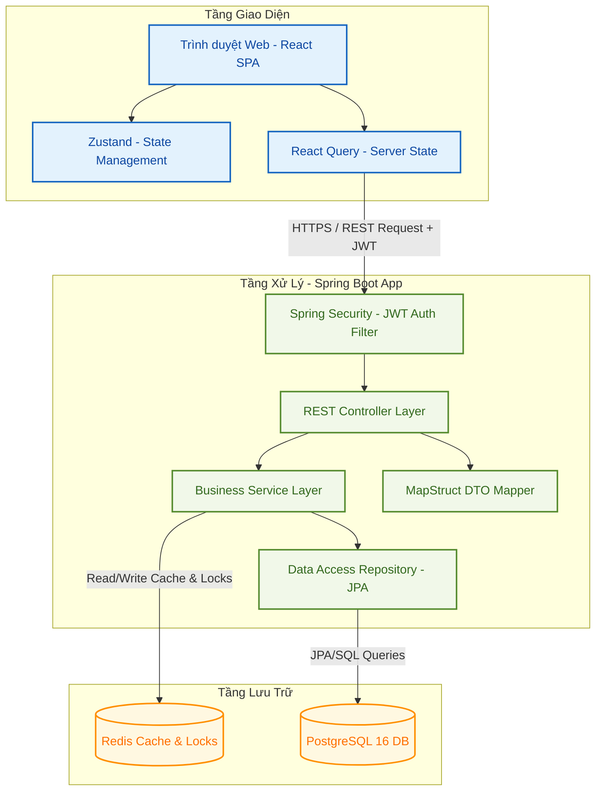
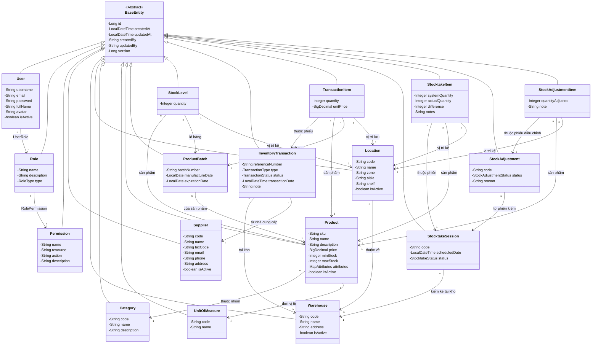
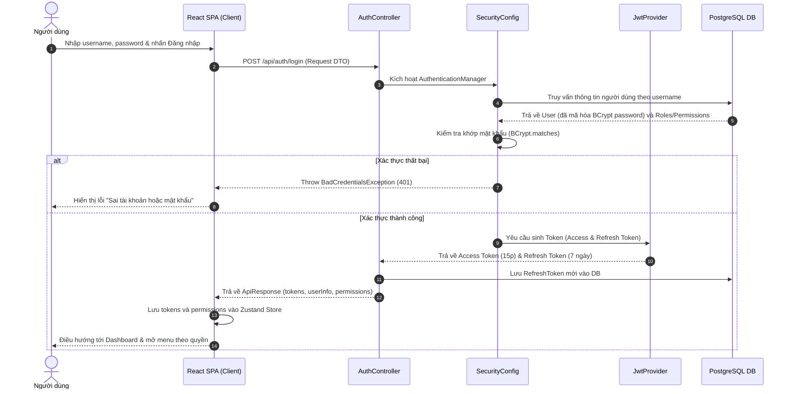
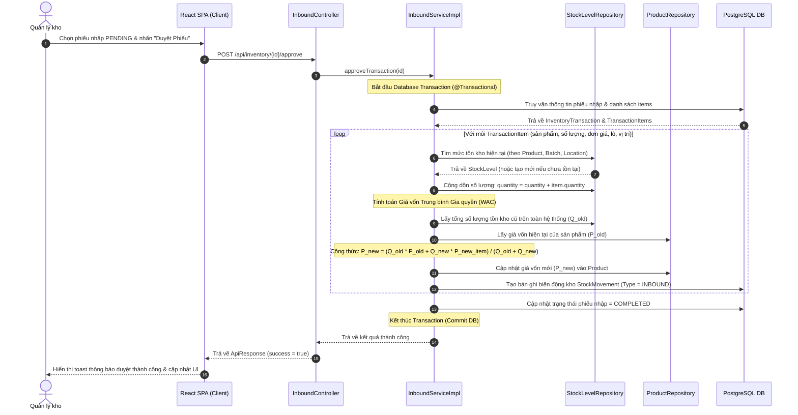
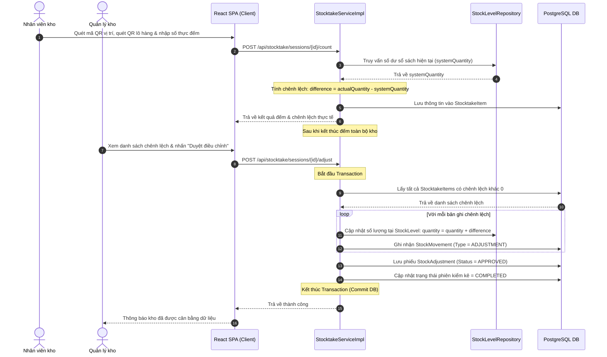
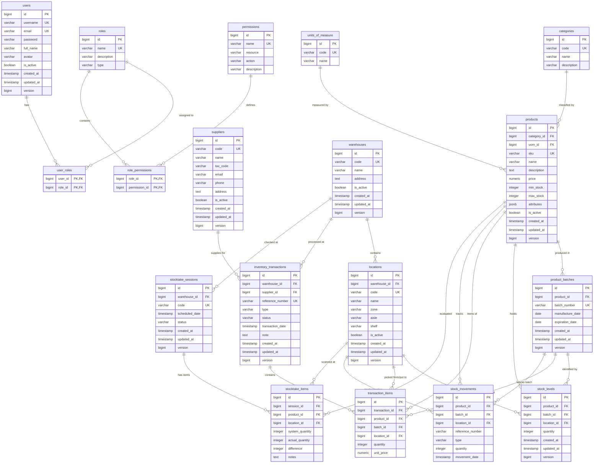

# CHƯƠNG 2 (PHẦN 2): THIẾT KẾ HỆ THỐNG

## 2.2.1 Thiết kế Kiến trúc hệ thống (System Architecture)

Hệ thống SCIM được xây dựng theo kiến trúc phân tách rõ rệt giữa Frontend và Backend (Decoupled Client-Server Architecture), giao tiếp thông qua giao thức RESTful APIs không trạng thái (Stateless REST APIs). Sơ đồ kiến trúc tổng thể hoạt động như sau:

---

## 2.2.2 Biểu đồ lớp (Class Diagram) cho các thực thể cốt lõi

Dưới đây là sơ đồ lớp thực thể cốt lõi (Domain Class Diagram) thể hiện các lớp dữ liệu và mối quan hệ giữa chúng trong hệ thống SCIM. Tất cả các thực thể chính đều kế thừa từ lớp `BaseEntity` để tự động thừa hưởng các trường kiểm toán (`createdAt`, `updatedAt`, `createdBy`, `updatedBy`) và trường `@Version` phục vụ khóa lạc quan (Optimistic Locking).

---

## 2.2.3 Biểu đồ tuần tự (Sequence Diagram) cho các nghiệp vụ chính

### 1. Xác thực & Đăng nhập hệ thống (JWT Auth)

Biểu đồ mô tả quy trình đăng nhập, nhận JWT Access Token và Refresh Token, đồng thời tải danh sách quyền hạn phục vụ RBAC:

---

### 2. Nghiệp vụ Nhập kho & Tính giá vốn trung bình gia quyền (WAC)

Biểu đồ mô tả chi tiết quy trình duyệt phiếu nhập kho và tính toán giá vốn WAC tức thời tại Backend:

---

### 3. Nghiệp vụ Xuất kho FEFO Picking & Khóa đồng thời (Redis Lock)

Biểu đồ mô tả quy trình đề xuất vị trí xuất kho theo hạn sử dụng và cơ chế khóa phân tán tránh lỗi xuất âm:

```mermaid
sequenceDiagram
    autonumber
    actor Staff as Nhân viên kho
    participant React as React SPA (Client)
    participant OutCtrl as OutboundController
    participant OutServ as OutboundServiceImpl
    participant Redis as Redis Server
    participant StockLevelRepo as StockLevelRepository
    participant DB as PostgreSQL DB

    Staff->>React: Chọn sản phẩm, số lượng cần xuất & nhấn "Xuất kho"
    React->>OutCtrl: POST /api/inventory/outbound (Request DTO)
    OutCtrl->>OutServ: processOutbound(request)
    
    OutServ->>Redis: Acquire lock on Product ID (SETNX key "lock:product:id" EX 10)
    alt Không lấy được khóa (Có luồng khác đang xử lý)
        Redis-->>OutServ: Lock failed
        OutServ-->>OutCtrl: Throw BusinessException ("Sản phẩm đang được xử lý bởi giao dịch khác")
        OutCtrl-->>React: Trả về ApiResponse (400 Bad Request)
        React-->>Staff: Hiển thị cảnh báo lỗi đồng thời
    else Lấy được khóa thành công
        Redis-->>OutServ: Lock acquired
        Note over OutServ: Bắt đầu Transaction
        
        OutServ->>StockLevelRepo: Tìm tồn kho chi tiết, sắp xếp tăng dần theo ExpirationDate (FEFO)
        StockLevelRepo-->>OutServ: Trả về danh sách StockLevels (Lô, vị trí, số lượng)
        
        Note over OutServ: Giải thuật Picking FEFO
        alt Tổng tồn kho khả dụng < Số lượng yêu cầu xuất
            OutServ->>Redis: Release lock
            OutServ-->>OutCtrl: Throw InsufficientStockException ("Tồn kho không đủ")
            OutCtrl-->>React: Trả về ApiResponse (422 Unprocessible Entity)
            React-->>Staff: Báo lỗi không đủ hàng tồn
        else Tồn kho đủ đáp ứng
            loop Cho đến khi đủ số lượng xuất
                Note over OutServ: Trừ dần số lượng xuất vào từng lô hàng sắp hết hạn trước
                OutServ->>StockLevelRepo: Cập nhật StockLevel (Trừ tồn kho)
                OutServ->>DB: Tạo bản ghi biến động StockMovement (Type = OUTBOUND)
            end
            OutServ->>DB: Lưu phiếu xuất trạng thái COMPLETED
            Note over OutServ: Kết thúc Transaction (Commit DB)
            OutServ->>Redis: Release lock (DEL "lock:product:id")
            OutServ-->>OutCtrl: Trả về kết quả thành công
            OutCtrl-->>React: Trả về ApiResponse (success = true)
            React-->>Staff: Hiển thị bảng chỉ dẫn Picking List & In Phiếu
        end
    end
```

---

### 4. Nghiệp vụ Kiểm kê & Tự động điều chỉnh kho

Biểu đồ mô tả quy trình thực hiện đếm kiểm, đối chiếu số liệu và hiệu chỉnh tồn kho vật lý:

---

## 2.2.4 Thiết kế Cơ sở dữ liệu (ERD)

Dưới đây là Sơ đồ quan hệ thực thể (ERD) ở mức vật lý, mô tả chi tiết cấu trúc các bảng và mối liên kết khóa ngoại.

---

## 2.2.5 Từ điển dữ liệu (Data Dictionary) cho các bảng chính

### 1. Bảng `products` (Danh mục sản phẩm)
Lưu thông tin định nghĩa sản phẩm SKU, giá bán, định mức an toàn và các thuộc tính động.

| Tên cột | Kiểu dữ liệu | Ràng buộc | Mô tả |
| :--- | :--- | :--- | :--- |
| `id` | bigint | PRIMARY KEY | Khóa chính tự tăng |
| `category_id` | bigint | FOREIGN KEY | Liên kết với bảng `categories` |
| `uom_id` | bigint | FOREIGN KEY | Đơn vị tính, liên kết bảng `units_of_measure` |
| `sku` | varchar(50) | UNIQUE, NOT NULL | Mã định danh sản phẩm duy nhất (Stock Keeping Unit) |
| `name` | varchar(255) | NOT NULL | Tên sản phẩm |
| `description` | text | NULL | Mô tả chi tiết sản phẩm |
| `price` | numeric(15,2)| DEFAULT 0.00 | Giá vốn trung bình gia quyền (WAC) hiện tại |
| `min_stock` | integer | DEFAULT 0 | Định mức tồn kho tối thiểu (cảnh báo tồn thấp) |
| `max_stock` | integer | DEFAULT 1000 | Định mức tồn kho tối đa |
| `attributes` | jsonb | NULL | Lưu trữ thuộc tính động (Màu sắc, kích thước, xuất xứ...) |
| `is_active` | boolean | DEFAULT TRUE | Trạng thái sử dụng (hoạt động/ngừng) |
| `version` | bigint | NOT NULL | Số phiên bản phục vụ khóa lạc quan (Optimistic Lock) |

### 2. Bảng `stock_levels` (Tồn kho chi tiết)
Bảng cốt lõi ghi nhận số lượng tồn thực tế của từng sản phẩm, theo từng lô hàng cụ thể và đặt tại vị trí ngăn kệ chính xác.

| Tên cột | Kiểu dữ liệu | Ràng buộc | Mô tả |
| :--- | :--- | :--- | :--- |
| `id` | bigint | PRIMARY KEY | Khóa chính tự tăng |
| `product_id` | bigint | FK, NOT NULL | Sản phẩm nào, liên kết `products` (Index) |
| `batch_id` | bigint | FK, NOT NULL | Thuộc lô sản xuất nào, liên kết `product_batches` (Index) |
| `location_id` | bigint | FK, NOT NULL | Lưu trữ tại vị trí nào, liên kết `locations` (Index) |
| `quantity` | integer | NOT NULL | Số lượng tồn kho thực tế hiện tại |
| `version` | bigint | NOT NULL | Số phiên bản phục vụ khóa lạc quan (Optimistic Lock) |

### 3. Bảng `inventory_transactions` (Phiếu nhập xuất kho)
Lưu thông tin phần đầu (Header) của các giao dịch nhập kho, xuất kho hoặc điều chuyển.

| Tên cột | Kiểu dữ liệu | Ràng buộc | Mô tả |
| :--- | :--- | :--- | :--- |
| `id` | bigint | PRIMARY KEY | Khóa chính tự tăng |
| `reference_number`| varchar(50) | UNIQUE, NOT NULL | Số chứng từ tự sinh (VD: GRN-20260712-001, GIN-...) |
| `type` | varchar(20) | NOT NULL | Loại giao dịch: `INBOUND` (Nhập), `OUTBOUND` (Xuất) |
| `status` | varchar(20) | NOT NULL | Trạng thái: `DRAFT`, `PENDING`, `APPROVED`, `COMPLETED` |
| `warehouse_id` | bigint | FK, NOT NULL | Kho hàng xử lý, liên kết `warehouses` |
| `supplier_id` | bigint | FK, NULL | Nhà cung cấp cung cấp (chỉ dùng cho Inbound) |
| `transaction_date`| timestamp | NOT NULL | Ngày thực hiện giao dịch |
| `note` | text | NULL | Ghi chú từ người lập phiếu |
| `version` | bigint | NOT NULL | Số phiên bản phục vụ khóa lạc quan (Optimistic Lock) |
