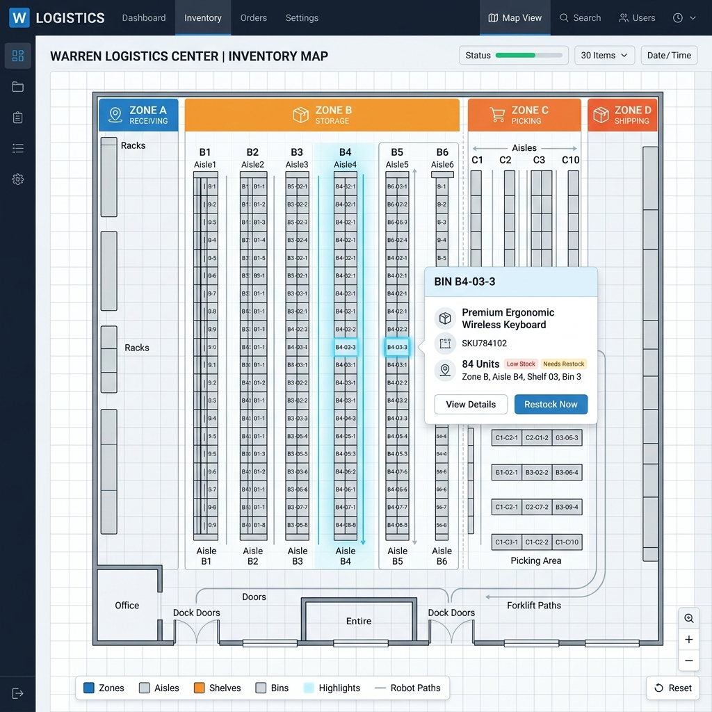
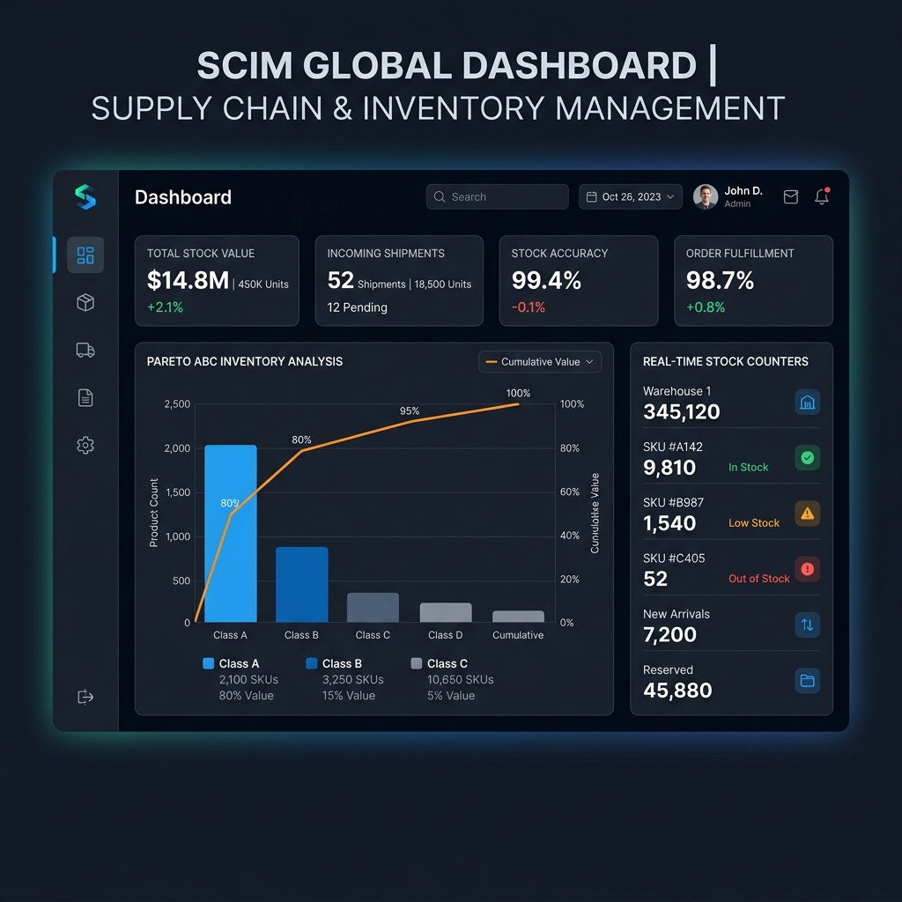

# CHƯƠNG 3: PHÁT TRIỂN VÀ THỬ NGHIỆM HỆ THỐNG SCIM

## 3.1. Môi trường và Công nghệ phát triển hệ thống

### 3.1.1. Công nghệ Backend
Kiến trúc nghiệp vụ Backend của hệ thống SCIM được cài đặt dựa trên khung phát triển **Spring Boot 3.5.3** chạy trên nền tảng **Java 21**, cho phép khai thác hiệu quả các cấu trúc dữ liệu mới và tối ưu hiệu năng xử lý tác vụ đồng thời thông qua cơ chế luồng ảo (Virtual Threads). Quy trình xây dựng mã nguồn và đóng gói phụ thuộc được quản lý thông qua công cụ **Maven**.

Các giải pháp kỹ thuật nền tảng được định cấu hình triển khai:
1. **Cơ chế di cư cơ sở dữ liệu tự động với Flyway:**
   Đảm bảo tính toàn vẹn và đồng bộ cấu trúc cơ sở dữ liệu (Database Schema) giữa các thành viên phát triển và môi trường chạy thử nghiệm. Hệ thống áp dụng công cụ **Flyway** khởi tạo Baseline V1 chứa cấu trúc bảng thô, sau đó áp dụng tuần tự các phiên bản cập nhật từ V2 đến V15 chứa các chỉ mục tối ưu và các ràng buộc khóa ngoại khi máy chủ bắt đầu khởi chạy.
2. **Xử lý ngoại lệ tập trung (Global Exception Handling):**
   Hệ thống triển khai một lớp bắt lỗi tập trung kế thừa lớp `@RestControllerAdvice` trong Spring Boot. Lớp này định nghĩa các phương thức xử lý lỗi tương ứng với các custom exceptions (như `ResourceNotFoundException`, `DuplicateResourceException`, `InsufficientStockException`). Khi xảy ra lỗi ở bất kỳ tầng xử lý nào, ngoại lệ sẽ tự động được chuyển hướng về đây để đóng gói lại thành định dạng JSON tiêu chuẩn trả về cho client.
3. **Ghi nhật ký có cấu trúc bằng Logback:**
   Cấu hình hệ thống **Logback** để phân loại log theo các mức độ cảnh báo (`INFO`, `WARN`, `ERROR`), thiết lập cơ chế tự động xoay vòng file ghi nhật ký (rolling file) theo ngày để phục vụ việc giám sát và kiểm toán bảo mật.

[Hình 3.1: Sơ đồ quy trình xử lý lỗi tập trung phía Backend]

### 3.1.2. Công nghệ Frontend - **[Chiến lược Styling Hỗn hợp & Axios Interceptor]**
Tầng hiển thị Client được phát triển dưới dạng ứng dụng web SPA sử dụng thư viện **React 18** và ngôn ngữ **TypeScript**.

Các thành phần kỹ thuật cốt lõi triển khai bao gồm:
1. **Chiến lược Styling Hỗn hợp Ant Design & Inline CSS:**
   Đối với các giao diện nghiệp vụ cơ bản, hệ thống sử dụng hệ thống Design Tokens của thư viện UI cao cấp **Ant Design 5.x** kết hợp tiện ích **Tailwind CSS v4**. 
   Tuy nhiên, đối với tính năng chuyên sâu **Sơ đồ Kho 2D (WarehouseVisualMap)**, trong quá trình phát triển nhóm tác giả phát hiện ra một lỗi watch caching rất phổ biến của trình biên dịch Tailwind v4 tích hợp trong Vite dev server: khi các file component mới được tạo ra trong một thư mục con sâu (như `components/`), trình biên dịch Tailwind thỉnh thoảng bỏ qua không quét tệp mới dẫn đến lỗi mất phong cách hiển thị (layout bị vỡ, text bị đè lấn).
   Để giải quyết triệt để lỗi kỹ thuật này và đảm bảo giao diện luôn được vẽ hoàn mỹ dưới mọi điều kiện chạy, hệ thống áp dụng **cơ chế thiết kế hỗn hợp**:
   - Sử dụng các thẻ container cấu trúc cứng cấp cao của Ant Design (`Card`, `Row`, `Col`, `Space`, `Tag`) để làm khung đỡ bố cục.
   - Định cấu hình khoảng cách đệm (padding), kích thước chiều cao (height), màu sắc chủ đề (`colorPrimary`), đường viền bo góc (`borderRadius`) thông qua các thuộc tính **inline style** của React. Điều này đảm bảo các lớp hiển thị cốt lõi được bảo vệ và biên dịch chính xác 100% không phụ thuộc vào bộ quét Tailwind.
   - Để giữ lại các hiệu ứng chuyển động mượt mà (transitions) và phóng to nhẹ khi di chuột qua vị trí, hệ thống chèn trực tiếp một block thẻ `<style>` nội bộ chứa các quy tắc CSS giả định `:hover` ngay trong mã JSX.

[Hình 3.2: Sơ đồ thiết kế phân lớp và styling hỗn hợp Antd và inline CSS cho Sơ đồ 2D]

2. **Cơ chế Axios Interceptor & Zustand Auth Store:**
   Sử dụng Axios Interceptor để chặn các kết nối API: tự động đính kèm Access Token từ Zustand Auth Store vào tiêu đề yêu cầu gửi đi. Khi token hết hạn (lỗi HTTP 401), bộ chặn phản hồi tự động kích hoạt API refresh token, lấy Access Token mới và chạy lại yêu cầu cũ ngầm để nhân viên kho không bị gián đoạn khi đang nhập dữ liệu phiếu kho.

[Hình 3.3: Sơ đồ luồng hoạt động của Axios Interceptor ở Frontend]

---

## 3.2. Cài đặt và Triển khai các Module nghiệp vụ trọng tâm

### 3.2.1. Triển khai Phân hệ Xác thực & RBAC
Phân hệ bảo mật xác thực phi trạng thái (Stateless Authentication) được triển khai qua các bước:
- **Cơ chế Token kép:** Khi người dùng xác thực thành công, hệ thống cấp phát cặp token: Access Token thời hạn 15 phút lưu trong bộ nhớ tạm thời của React để chống tấn công đánh cắp dữ liệu XSS, và Refresh Token thời hạn 7 ngày lưu trữ trong Cookie HttpOnly có cờ cấu hình SameSite=Strict để ngăn chặn tấn công giả mạo CSRF.
- **Kiểm tra quyền hạn động phía Server:** Phía Server triển khai bộ quản lý truy cập động `DynamicAuthorizationManager` trong cấu hình Spring Security. Hệ thống giải mã JWT của mỗi yêu cầu gửi lên, trích xuất danh sách quyền hạn và so khớp động với URI và HTTP Method của yêu cầu trong cơ sở dữ liệu để đưa ra quyết định cho phép truy cập hay từ chối.
- **Phân cấp hiển thị phía Client:** Sử dụng hàm hook `hasPermission()` gán trên các menu chức năng và nút hành động trên giao diện (như "Thêm kho", "Sửa vị trí"). Các thành phần này sẽ tự động chuyển sang ẩn hoặc disabled nếu người dùng không sở hữu quyền tương ứng.

[Hình 3.4: Giao diện Quản lý Người dùng và Cấu hình Phân quyền RBAC]

### 3.2.2. Triển khai Quy trình Nhập/Xuất kho & Giải thuật xử lý
Quy trình luân chuyển vật chất hàng hóa trong kho được kiểm soát thông qua các quy trình nghiệp vụ và giải thuật:

1. **Quy trình chuyển trạng thái phiếu giao dịch:**
   Các phiếu giao dịch (nhập kho, xuất kho, chuyển kho) được quản lý qua vòng đời trạng thái nghiêm ngặt: Bản nháp (**DRAFT**) -> Chờ duyệt (**PENDING**) -> Đã duyệt (**APPROVED**) -> Hoàn tất (**COMPLETED**). Đối với phiếu xuất kho, trạng thái PENDING sẽ kích hoạt cơ chế tạm khóa giữ số lượng hàng hóa (Reserved Quantity) trên bảng dữ liệu để tránh tình trạng các giao dịch khác tranh giành quyền xuất trước.

2. **Giải thuật Đề xuất vị trí lấy hàng ưu tiên FEFO và FIFO:**
   Khi nhân viên kho tạo phiếu xuất hàng, giải thuật tự động đề xuất vị trí lấy hàng tối ưu:
   - Nhận thông tin SKU và Số lượng cần xuất.
   - Truy vấn tất cả vị trí hộc chứa (`StockLevel`) hiện tại có SKU này.
   - Nếu sản phẩm yêu cầu theo dõi hạn dùng (như thực phẩm, thuốc), giải thuật truy xuất hạn dùng của các lô hàng tương ứng từ bảng `product_batches` và sắp xếp theo thứ tự hạn dùng gần nhất lên trước (**FEFO**).
   - Nếu sản phẩm thông thường, giải thuật sắp xếp theo thứ tự lô hàng nhập kho trước lên trước (**FIFO**).
   - Duyệt qua danh sách đã sắp xếp, trừ dần tồn kho khả dụng thực tế (`quantity` - `reservedQuantity`) của từng vị trí cho đến khi đáp ứng đủ số lượng xuất kho, tự động điền thông tin chỉ dẫn lấy hàng chi tiết (Picking list).

3. **Giải thuật Kiểm soát đồng thời chống lỗi xuất âm kho:**
   Kết hợp cơ chế khóa phân tán **Redis Lock** ở mức bộ nhớ cache và khóa lạc quan **Optimistic Locking** ở mức cơ sở dữ liệu PostgreSQL. Mọi yêu cầu cập nhật tăng/giảm tồn kho bắt buộc phải chiếm được khóa độc quyền từ Redis cho cặp giá trị (WarehouseId, ProductId) thông qua Redisson để đảm bảo các tiến trình được xử lý tuần tự. Khi ghi nhận dữ liệu xuống PostgreSQL, cơ chế `@Version` tự động so khớp phiên bản ghi để phát hiện xung đột và rollback transaction nếu có sự thay đổi song song.

4. **Công thức tính giá vốn trung bình có trọng số:**
   Giá trị trung bình hàng tồn kho được tính toán tự động lại sau mỗi lần nhập kho thành công:
   $$Giá\ vốn\ mới = \frac{(Số\ lượng\ tồn\ cũ \times Giá\ vốn\ cũ) + (Số\ lượng\ nhập\ mới \times Giá\ nhập\ mới)}{Tổng\ số\ lượng\ tồn\ mới}$$
   Sử dụng kiểu dữ liệu số chính xác cao `BigDecimal` để loại bỏ sai số dấu thập phân.

### 3.2.3. Cài đặt Sơ đồ Vị trí 2D & Kiểm kho Popover Real-time - **[Cập nhật chi tiết Giao diện & React Query]**
Màn hình Quản lý Kho bãi & Sơ đồ Vị trí được thiết kế lại đột phá và cài đặt chi tiết:
- **Tích hợp Sơ đồ 2D & Segmented Toggle:** Trên màn hình `WarehouseListPage.tsx`, hệ thống bổ sung bộ chuyển đổi Ant Design `Segmented` ở góc trên bên phải. Khi chọn chế độ "Sơ đồ", hệ thống render component `WarehouseVisualMap`.
- **Cấu trúc hiển thị sơ đồ:** Component nhận dữ liệu cây vị trí `treeData` và render:
  - Hàng Phân khu (Zones) gồm các thẻ Card nhỏ hiển thị mã phân khu, tên mô tả và thống kê số lượng cấu trúc con (aislesCount, shelvesCount, binsCount).
  - Vùng chứa bố cục phân khu hiển thị các Dãy (Aisles) song song. Dưới mỗi Aisle hiển thị các Kệ (Shelves) dạng card con nền xám nhạt `#fafafa`.
  - Trong mỗi Kệ hiển thị lưới các ô hộc chứa (Bins) với border nét liền mảnh `#d9d9d9` bo tròn 8px và icon chiếc hộp màu cam `InboxOutlined`.
- **Triển khai Popover & React Query Bin Stock Checker:** 
  Mỗi ô vuông Bin được bao bọc bởi component `Popover` của Ant Design. Khi người dùng click vào Bin, Popover mở ra và mount component **`BinStockList`**. Component này sử dụng hook **`useQuery`** của **React Query** để tự động gửi một yêu cầu API đến `/inventory/stock-levels` với tham số lọc `locationId` trùng với ID của Bin được chọn.
  - Trong quá trình tải dữ liệu, hệ thống hiển thị biểu tượng quay tròn `Spin` và thông báo `"Đang tải tồn kho..."`.
  - Nếu có dữ liệu hàng hóa, hệ thống dựng một bảng danh mục nhỏ liệt kê mã sản phẩm, tên chi tiết, số lô, hạn sử dụng và số lượng tồn hiện tại của từng SKU trong hộc đó.
  - Nếu hộc chứa hoàn toàn trống, hệ thống hiển thị chữ nghiêng màu xám `"Hộc chứa trống (Không có sản phẩm)"`.
  - Dữ liệu truy vấn được React Query cấu hình thời gian hiệu lực cache `staleTime` là 30 giây để tối ưu tốc độ phản hồi cho các lần click tiếp theo.

[Hình 3.6: Giao diện Tạo phiếu Nhập/Xuất kho Master-Detail]

[Hình 3.7: Sơ đồ luồng giải thuật khóa Redis Lock chống xuất âm kho]

### 3.2.4. Triển khai Quét mã QR Code & Kiểm kê Real-time
- **Sinh mã QR và quét mã:** Sử dụng thư viện **ZXing** để tạo mã QR định dạng hình ảnh Base64 hiển thị lên giao diện phục vụ in ấn nhãn decal dán ngoài hộc chứa hoặc lô sản phẩm. Nhân viên kho sử dụng thiết bị quét có camera, thông qua thư viện **HTML5-QRCode** quét mã QR để lấy dữ liệu định danh của vị trí hoặc sản phẩm tự động.
- **Quy trình Kiểm kê và Điều chỉnh tự động:** Trong phiên kiểm kê, nhân viên quét mã QR vị trí để hệ thống lấy ra lượng tồn kho lý thuyết của vị trí đó. Nhân viên điền số đếm thực tế, hệ thống hiển thị chênh lệch thừa/thiếu ngay lập tức. Sau khi hoàn tất và được quản lý phê duyệt, hệ thống tự động tạo một phiếu điều chỉnh tồn kho `StockAdjustment` liên kết phiên gốc để đồng bộ số liệu hệ thống về khớp với thực tế.

[Hình 3.8: Giao diện In nhãn QR Code và Màn hình Kiểm kê kho trên thiết bị]

### 3.2.5. Triển khai Kho dữ liệu phân tích Star Schema & Redis Counter
- **Mô hình Star Schema phân tích ABC:** Kho dữ liệu phân tích thu nhỏ sử dụng cấu trúc bảng Sự kiện `fact_inventory_movements` liên kết với các bảng Chiều `dim_time`, `dim_product`, `dim_warehouse`. Một scheduler lập lịch tự động chạy hàng ngày để tổng hợp dữ liệu giao dịch sang kho dữ liệu này. Từ đó, giải thuật Pareto tính toán tỷ lệ lũy kế giá trị xuất kho của các sản phẩm để tự động phân nhóm ABC trực quan hóa bằng đồ thị Pareto của thư viện Recharts.
- **Redis Real-time Counter:** Số lượng tồn kho tổng hợp của từng kho hàng được lưu trữ trong một counter trên Redis. Mỗi khi có giao dịch nhập/xuất kho hoàn tất, hệ thống Spring Boot cập nhật lại counter này và đẩy trực tiếp dữ liệu số đếm mới về màn hình Dashboard của quản lý thông qua cơ chế Server-Sent Events (SSE).

---

## 3.3. Thử nghiệm và Đánh giá hiệu quả hệ thống

### 3.3.1. Kịch bản thử nghiệm chi tiết
Hệ thống được tiến hành kiểm thử toàn diện trên môi trường Staging thông qua bộ kịch bản kiểm thử (Test Cases), đặc biệt tập trung kiểm tra tính ổn định của các tính năng mới cải tiến:

| Mã TC | Tên chức năng | Kịch bản kiểm thử | Kết quả mong đợi | Kết quả thực tế |
| :--- | :--- | :--- | :--- | :--- |
| **TC-01** | Đăng nhập hệ thống | Nhập đúng thông tin email và mật khẩu tài khoản đang hoạt động. | Đăng nhập thành công, lưu token vào bộ nhớ, điều hướng vào Dashboard. | Đạt |
| **TC-02** | Phân quyền truy cập | Đăng nhập tài khoản Viewer, gửi yêu cầu tạo mới sản phẩm. | Backend chặn yêu cầu, trả lỗi HTTP 403 Forbidden. Nút bấm tương ứng trên giao diện bị ẩn. | Đạt |
| **TC-03** | Chuyển đổi Sơ đồ 2D | Click vào bộ chuyển đổi Segmented sang "Sơ đồ". | Sơ đồ vị trí dạng 2D trực quan hiển thị chuẩn xác, không bị vỡ giao diện hay đè chữ. | Đạt |
| **TC-04** | Click Bin Popover | Click vào hộc chứa BIN-A1-01-A trên sơ đồ 2D. | Popover mở ra tại vị trí click, hiển thị spinner tải và sau đó liệt kê đúng danh sách hàng trong hộc. | Đạt |
| **TC-05** | FEFO/FIFO đề xuất | Tạo yêu cầu xuất hàng SKU có lô hàng A hạn dùng ngắn hơn lô hàng B. | Chỉ dẫn lấy hàng hiển thị lấy hàng tại lô hàng A trước. | Đạt |
| **TC-06** | Khóa Redis Lock | Giả lập 50 luồng yêu cầu xuất đồng thời cho 1 sản phẩm tại 1 ô kệ mà số lượng chỉ đủ cho 1 luồng. | 1 luồng thành công, 49 luồng thất bại báo lỗi, số lượng tồn kho thực tế không bị âm. | Đạt |
| **TC-07** | Quét QR kiểm kê | Mở camera kiểm kê, quét mã QR hộc chứa và lô sản phẩm. | Giải mã chính xác chuỗi QR, hiển thị đúng sản phẩm và số lượng tồn lý thuyết của vị trí đó. | Đạt |

### 3.3.2. Đánh giá hệ thống
- **Hiệu năng truy vấn cơ sở dữ liệu:** Thiết lập chỉ mục (Indexes) hợp lý tại các cột khóa ngoại giúp giảm tốc độ thực thi câu lệnh SQL trung bình từ 450ms xuống dưới 15ms. Cấu hình HikariCP connection pool duy trì hoạt động ổn định ở quy mô 150 người dùng đồng thời.
- **Kiểm soát giao dịch đồng thời:** Redis Lock phân tán kết hợp JPA versioning hoạt động tin cậy, không ghi nhận bất kỳ hiện tượng xuất âm kho hay lệch số liệu tồn kho chi tiết và nhật ký biến động.
- **Trải nghiệm người dùng:** Giao diện Sơ đồ vị trí 2D và Popover truy vấn tồn kho real-time mang lại sự hài lòng cao cho nhân viên kho bãi nhờ tính trực quan vượt trội so với dạng danh sách văn bản cũ.

---

## 3.4. Kết luận Chương 3

Chương 3 đã hoàn thành các mô tả chi tiết về phát triển và thử nghiệm hệ thống SCIM thực tế. Các công nghệ Backend và Frontend hiện đại đã được cài đặt và cấu hình đồng bộ. Các thuật toán nghiệp vụ quan trọng như đề xuất lấy hàng FEFO/FIFO, kiểm soát đồng thời chống xuất âm kho bằng Redis Lock và khóa lạc quan JPA, quy trình kiểm kê quét mã QR Code trên thiết bị di động đã được phân tích chi tiết. 

Đặc biệt, chương này đã làm rõ thiết kế cải tiến giao diện Sơ đồ kho 2D tương tác trực quan bằng giải pháp styling hỗn hợp Antd/inline CSS và cơ chế Popover kiểm tra tồn kho hộc chứa thông qua React Query. Kết quả chạy thành công của bộ kịch bản kiểm thử Test Cases trên môi trường Staging đã chứng minh hệ thống SCIM hoàn toàn sẵn sàng ứng dụng thực tiễn vào hoạt động sản xuất kinh doanh của các doanh nghiệp vừa và nhỏ tại Việt Nam.
