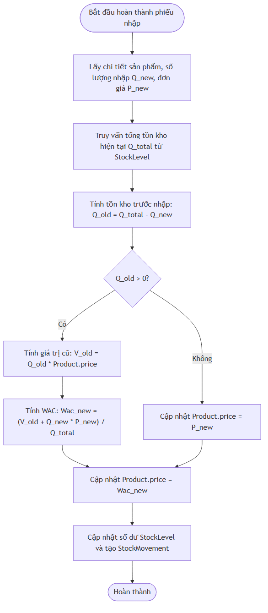
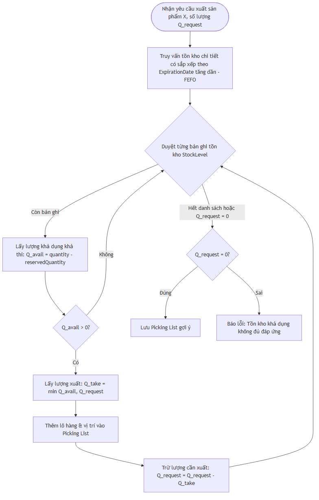

# CHƯƠNG 3 (PHẦN 2): XÂY DỰNG CÁC MODULE CHỨC NĂNG & GIAO DIỆN

## 3.2.1 Phân hệ Đăng nhập & Quản trị người dùng (RBAC)

Phân hệ này đảm bảo an ninh cho hệ thống, kiểm soát truy cập thông qua mô hình phân quyền dựa trên vai trò (Role-Based Access Control - RBAC).

### 1. Cơ chế hoạt động của JWT & Security
Hệ thống sử dụng **Spring Security** kết hợp với bộ lọc JWT tự cấu hình (`JwtAuthenticationFilter`). Khi người dùng đăng nhập thành công, hệ thống sinh ra một cặp Access Token (lưu trong memory của Client) và Refresh Token (lưu trong PostgreSQL DB và Cookie).
- Mọi request gửi lên Backend đều phải đính kèm Header: `Authorization: Bearer <Access_Token>`.
- Phân quyền mức API được cấu hình trực tiếp trên các Controller bằng annotation `@PreAuthorize("hasAuthority('resource:action')")`.

### 2. Mô tả giao diện & Hướng dẫn chụp ảnh
- **Giao diện Đăng nhập (Login screen):** Thiết kế tối giản, hiện đại với form căn giữa, hiệu ứng kính mờ (glassmorphism), gồm trường Tên đăng nhập, Mật khẩu và nút Đăng nhập. Có kiểm tra validate Client-side.
  
  > [!TIP]
  > **Placeholder Hình ảnh:** Chụp màn hình đăng nhập lúc điền form.
  > ``

- **Giao diện Quản lý Thành viên (User Management):** Bảng hiển thị danh sách người dùng (Avatar, Username, Email, Họ tên, Trạng thái hoạt động, Vai trò). Hỗ trợ nút Thêm mới mở Modal Form, và nút Khóa/Mở khóa tài khoản.
  
  > [!TIP]
  > **Placeholder Hình ảnh:** Chụp danh sách người dùng trong hệ thống.
  > ``

- **Giao diện Quản lý Vai trò & Phân quyền (Roles & Permissions):** Màn hình hiển thị danh sách các vai trò (Admin, Manager, Staff, Viewer). Khi click vào một vai trò, hệ thống hiển thị sơ đồ checkbox phân quyền chi tiết (đọc, ghi, xóa, duyệt) cho từng tài nguyên (Sản phẩm, Kho bãi, Nhập xuất, Kiểm kê).
  
  > [!TIP]
  > **Placeholder Hình ảnh:** Chụp màn hình phân quyền checkbox của một Role.
  > ``

---

## 3.2.2 Phân hệ Quản lý Danh mục (Master Data)

Phân hệ danh mục là nền tảng quản lý toàn bộ dữ liệu cấu trúc phục vụ các giao dịch kho hàng.

### 1. Sơ đồ cây Vị trí kho (Warehouse & Locations Tree)
Hệ thống quản lý kho theo mô hình phân cấp. Một Kho hàng (`Warehouse`) chia làm nhiều Khu vực (`Zone`), mỗi khu vực chia thành các Dãy kệ (`Aisle`), mỗi dãy gồm nhiều Ô/Kệ (`Shelf`). 
Phía Frontend sử dụng component `Tree` của Ant Design để hiển thị cấu trúc kho dưới dạng sơ đồ hình cây trực quan, cho phép người quản lý click vào từng ô kệ để kiểm tra nhanh các mặt hàng đang lưu trữ tại đó.

Trường `attributes` kiểu dữ liệu `jsonb` trong thực thể `Product` của Java được ánh xạ thông qua thư viện hỗ trợ xử lý JSON (như Hypersistence Optimizer). Cấu trúc dữ liệu này được thể hiện dưới dạng một bản đồ thuộc tính (Map với các cặp Key-Value) giúp hệ thống tự động lưu trữ và truy vấn các trường động của sản phẩm mà không cần thực hiện các câu lệnh DDL thay đổi cấu trúc bảng vật lý.

### 3. Mô tả giao diện & Hướng dẫn chụp ảnh
- **Giao diện Danh sách Sản phẩm (Products List):** Bảng hiển thị thông tin sản phẩm (Mã SKU, tên sản phẩm, Đơn vị tính, Nhóm sản phẩm, Giá vốn trung bình, Định mức tồn kho). Tích hợp tabs lọc nhanh sản phẩm dưới định mức tồn an toàn và nút Import Excel hàng loạt.
  
  > [!TIP]
  > **Placeholder Hình ảnh:** Chụp danh sách sản phẩm với các cột SKU, Tên, Đơn giá.
  > ``

- **Giao diện Quản lý Cấu trúc Kho hàng (Warehouse Layout):** Bên trái là sơ đồ cây vị trí (Dãy A -> Kệ A1 -> Ô 01), bên phải là form thêm/sửa vị trí chi tiết và danh sách tồn kho hiện hữu tại vị trí được chọn.
  
  > [!TIP]
  > **Placeholder Hình ảnh:** Chụp màn hình cây cấu trúc vị trí kho hàng.
  > ``

---

## 3.2.3 Phân hệ Nhập/Xuất kho & Tính giá vốn (Core Operations)

Đây là phân hệ nghiệp vụ cốt lõi của hệ thống SCIM với các thuật toán xử lý luồng dữ liệu phức tạp.

### 1. Thuật toán tính Giá vốn trung bình gia quyền (Weighted Average Cost - WAC)
Khi một phiếu nhập kho có trạng thái `APPROVED` được chuyển sang trạng thái hoàn thành (`COMPLETED`), hệ thống sẽ thực thi tính toán lại giá vốn của sản phẩm ngay tại thời điểm đó để phục vụ định giá tồn kho chính xác.

#### Công thức toán học:
$$\text{Giá vốn mới} = \frac{(\text{Tồn kho hiện tại trước nhập} \times \text{Giá vốn hiện hành}) + (\text{Số lượng nhập mới} \times \text{Đơn giá nhập mới})}{\text{Tổng tồn kho sau khi nhập}}$$

#### Sơ đồ luồng tính toán:

#### Giải thuật chi tiết tại Backend:
Giao dịch nghiệp vụ tính toán giá vốn trung bình gia quyền (WAC) được kích hoạt tự động và thực thi thông qua các bước xử lý dữ liệu sau:
1. **Truy vấn tổng tồn kho mới:** Hệ thống truy vấn tổng số lượng tồn kho hiện hữu của sản phẩm trên tất cả các kho và vị trí sau khi đã cộng thêm số lượng của lô hàng mới nhập ($Q_{total}$).
2. **Xác định số dư trước nhập:** Lấy tổng số lượng tồn kho mới trừ đi số lượng mới nhập để xác định số lượng tồn kho cũ trước thời điểm nhập ($Q_{old} = Q_{total} - Q_{new}$).
3. **Tính toán giá vốn mới theo trường hợp:**
   - **Trường hợp đã có hàng tồn kho cũ ($Q_{old} > 0$):** Hệ thống nhân số lượng cũ với giá vốn hiện hành của sản phẩm để tính tổng giá trị tồn kho cũ ($V_{old} = Q_{old} \times P_{old}$). Sau đó, cộng với giá trị của lô hàng mới nhập ($V_{new} = Q_{new} \times P_{new\_item}$) để ra tổng giá trị kho mới. Giá vốn mới ($P_{new}$) được xác định bằng cách chia tổng giá trị mới cho tổng tồn kho mới ($Q_{total}$), kết quả làm tròn đến 4 chữ số thập phân (`RoundingMode.HALF_UP`).
   - **Trường hợp chưa có hàng tồn hoặc tồn kho cũ bằng 0 ($Q_{old} \le 0$):** Hệ thống lấy ngay đơn giá nhập của lô hàng mới làm giá vốn mới của sản phẩm ($P_{new} = P_{new\_item}$).
4. **Cập nhật dữ liệu:** Lưu lại giá trị giá vốn mới vào bảng dữ liệu Sản phẩm (`Product`), đồng thời tạo bản ghi vết biến động kho (`StockMovement`) loại `INBOUND` để phục vụ đối soát lịch sử.

---

### 2. Thuật toán gợi ý vị trí lấy hàng ưu tiên theo FEFO (First Expired, First Out)
Khi xuất kho, thay vì để nhân viên tự tìm kiếm hàng hóa gây lãng phí thời gian và có nguy cơ xuất sai lô hàng cũ, hệ thống tự động sinh bảng hướng dẫn nhặt hàng (Picking List) ưu tiên các lô hàng có hạn sử dụng gần nhất.

#### Sơ đồ luồng xử lý Picking FEFO:

#### Giải thuật Truy vấn Dữ liệu FEFO:
Nghiệp vụ gợi ý vị trí nhặt hàng FEFO được thiết lập thông qua một truy vấn hướng đối tượng (JPQL) kết nối giữa bảng tồn kho chi tiết (`StockLevel`) và bảng lô sản phẩm (`ProductBatch`):
1. **Tiêu chí lọc:** Lọc các bản ghi tồn kho thuộc mã sản phẩm (`productId`) và nằm trong kho hàng chỉ định (`warehouseId`).
2. **Kiểm tra số dư khả dụng:** Chỉ lấy các vị trí có tồn kho khả dụng lớn hơn 0 (tính bằng số lượng tồn kho `quantity` trừ đi số lượng đã được đặt trước `reservedQuantity`).
3. **Tiêu chí sắp xếp:** Các bản ghi được sắp xếp theo thứ tự hạn sử dụng của lô hàng tăng dần (hạn dùng gần nhất xếp đầu tiên - `ORDER BY b.expiryDate ASC`). Trong trường hợp các lô hàng trùng hạn sử dụng, hệ thống ưu tiên xuất lô hàng được nhập vào kho trước (`s.createdAt ASC`). Giao diện nhặt hàng sẽ duyệt qua danh sách kết quả này để phân bổ lượng xuất tương ứng.

---

#### Quy trình kỹ thuật xử lý đồng thời tại Backend:
Để bảo vệ số dư tồn kho không bị âm khi có nhiều giao dịch xuất kho diễn ra đồng thời, Backend SCIM áp dụng quy trình khóa phân tán sử dụng Redis:
1. **Trích xuất và sắp xếp mã sản phẩm:** Hệ thống lấy ra danh sách các mã ID sản phẩm từ các mặt hàng trong phiếu xuất kho, tiến hành loại bỏ các ID trùng lặp, sau đó sắp xếp danh sách ID theo thứ tự tăng dần. Bước sắp xếp này là cực kỳ quan trọng để đảm bảo thứ tự khóa nhất quán, ngăn ngừa lỗi Deadlock giữa các luồng chạy song song.
2. **Thiết lập khóa phân tán:** Duyệt qua từng ID sản phẩm trong danh sách đã sắp xếp, thực hiện ghi một khóa tượng trưng vào Redis bằng lệnh `SETNX` (Set if Not Exists) với key có định dạng `lock:product:<id>` và thời gian hết hạn tự động (TTL) là 15 giây.
3. **Xử lý tranh chấp khóa:**
   - Nếu bất kỳ sản phẩm nào trong phiếu không thể lấy được khóa (do một luồng giao dịch khác đang giữ khóa xử lý sản phẩm đó), hệ thống sẽ lập tức dừng quy trình, rollback mọi thay đổi và trả về ngoại lệ báo lỗi hệ thống bận để người dùng thực hiện lại.
   - Nếu tất cả các sản phẩm trong phiếu được khóa thành công, hệ thống sẽ tiến hành trừ tồn kho thực tế trong DB và ghi nhật ký biến động.
4. **Giải phóng khóa:** Khối xử lý được bọc trong cấu trúc `try-finally`. Dù giao dịch thành công hay gặp lỗi ngoại lệ, khối `finally` luôn được đảm bảo thực thi để duyệt qua danh sách các keys đã khóa và gọi lệnh xóa (`delete`) giải phóng khóa trên Redis, đưa sản phẩm về trạng thái sẵn sàng cho các giao dịch tiếp theo.

---

### 4. Mô tả giao diện & Hướng dẫn chụp ảnh
- **Giao diện Tạo phiếu Nhập kho (Inbound Form):** Form Master-Detail. Phần Master cho phép chọn nhà cung cấp, kho nhập, số tham chiếu, ngày nhập. Phần Detail là bảng động cho phép thêm dòng, chọn sản phẩm, nhập số lượng, đơn giá, số lô và hạn sử dụng tương ứng.
  
  > [!TIP]
  > **Placeholder Hình ảnh:** Chụp màn hình tạo phiếu nhập kho với 2-3 sản phẩm.
  > ``

- **Giao diện Chi tiết phiếu xuất và Bảng chỉ dẫn nhặt hàng (Picking List):** Trang chi tiết của phiếu xuất kho ở trạng thái hoàn thành. Hiển thị thông tin tổng quan và bảng chỉ dẫn vị trí chính xác (Khu vực, Kệ, Ô, Số lô, Số lượng cần lấy) giúp thủ kho nhặt hàng nhanh chóng.
  
  > [!TIP]
  > **Placeholder Hình ảnh:** Chụp màn hình bảng chỉ dẫn vị trí lấy hàng (Picking List).
  > ``

---

## 3.2.4 Phân hệ Kiểm kê & Điều chỉnh kho (Stocktaking)

Đảm bảo tính chính xác của số liệu thực tế ngoài kho và số liệu trên sổ sách phần mềm.

### 1. Cơ chế đối chiếu chênh lệch
Hệ thống cho phép tạo các phiên kiểm kê định kỳ. Khi phiên kiểm kê ở trạng thái `IN_PROGRESS`, thủ kho thực hiện đếm thực tế. Hệ thống tự động so khớp và tính chênh lệch:
$$\text{Chênh lệch} = \text{Số lượng thực tế} - \text{Số lượng sổ sách}$$
Sau khi kiểm kê hoàn tất, quản lý duyệt báo cáo chênh lệch, hệ thống tự động sinh phiếu điều chỉnh kho (`StockAdjustment`) và cập nhật lại số dư tồn kho chi tiết để khớp với thực tế.

### 2. Giao diện thực tế & Hướng dẫn chụp ảnh
- **Giao diện Phiên kiểm kê đang thực hiện (Stocktaking Session):** Màn hình hiển thị danh sách các sản phẩm thuộc phạm vi kiểm kê. Cột "Số lượng sổ sách" bị ẩn hoặc hiển thị tùy cấu hình, cột "Số lượng thực tế" cho phép nhân viên điền trực tiếp. Tích hợp nút quét mã QR vị trí kệ.
  
  > [!TIP]
  > **Placeholder Hình ảnh:** Chụp màn hình bảng nhập số liệu thực tế kiểm kê.
  > ``

- **Giao diện Báo cáo đối chiếu chênh lệch (Variance Report):** Màn hình hiển thị danh sách các sản phẩm kiểm kê có chênh lệch, hiển thị rõ số lượng thừa (màu xanh) hoặc thiếu (màu đỏ) kèm theo nút "Duyệt điều chỉnh kho".
  
  > [!TIP]
  > **Placeholder Hình ảnh:** Chụp biểu mẫu đối chiếu chênh lệch thừa thiếu sau kiểm kê.
  > ``

---

## 3.2.5 Phân hệ QR Code & Tiện ích hệ thống

### 1. In và quét mã QR Code
Hệ thống tích hợp sinh mã QR Code cho Lô hàng (`ProductBatch`) dựa trên thông tin: `sku|batchNumber|expiryDate` và cho vị trí kệ (`Location`) dựa trên mã vị trí.
- Phía Frontend sử dụng camera của thiết bị thông qua thư viện `html5-qrcode` để quét trực tiếp mã QR, tự động trích xuất thông tin định vị hoặc định danh để phục vụ nhập, xuất và kiểm kê nhanh dưới 1 giây.

### 2. Nhật ký hệ thống (Audit Trail)
Để tăng tính minh bạch, mọi thay đổi dữ liệu của các thực thể chính (nhập/xuất, danh mục) đều được ghi nhận lại trong bảng `audit_logs` dưới dạng so sánh dữ liệu cũ (old value) và dữ liệu mới (new value) dạng JSON. Giao diện cho phép so sánh trực quan sự khác biệt (JSON Diff) để tìm ra người sửa đổi và thời gian sửa đổi.

### 3. Giao diện thực tế & Hướng dẫn chụp ảnh
- **Giao diện In nhãn mã QR (QR Print Layout):** Trang định dạng in decal hàng loạt, hiển thị các nhãn mã QR xếp lưới (grid) chứa mã vạch hai chiều, mã SKU và tên sản phẩm sẵn sàng in ấn ra máy in nhãn chuyên dụng.
  
  > [!TIP]
  > **Placeholder Hình ảnh:** Chụp màn hình lưới mã QR sẵn sàng in.
  > ``

- **Giao diện Tra cứu Nhật ký thay đổi (Audit logs):** Bảng ghi nhật ký thay đổi với các cột: Người thực hiện, Hành động (Thêm/Sửa/Xóa/Duyệt), Tên bảng, Thời gian. Click vào xem chi tiết sẽ hiển thị khung so sánh JSON Diff trước và sau khi sửa đổi.
  
  > [!TIP]
  > **Placeholder Hình ảnh:** Chụp màn hình xem chi tiết lịch sử sửa đổi dạng so sánh JSON.
  > ``

---

## 3.2.6 Phân hệ Dashboard & Báo cáo Phân tích (Analytics)

Cung cấp thông tin trực quan hỗ trợ ra quyết định cho nhà quản lý.

### 1. Cấu trúc Star Schema & Materialized Views phục vụ báo cáo
Để tối ưu hóa hiệu năng, hệ thống không truy vấn trực tiếp trên các bảng tác nghiệp (Inbound, Outbound) để vẽ biểu đồ vì sẽ gây chậm hệ thống khi dữ liệu lớn. Thay vào đó, hệ thống thiết kế các Materialized Views phục vụ thống kê phân tích được làm mới định kỳ (mỗi 1 giờ hoặc chạy ngầm ban đêm):
- `mv_inventory_kpis`: Thống kê nhanh giá trị tồn kho, số lượng SKU, số lô hàng cận hạn.
- `mv_product_consumption_rate`: Tính tốc độ tiêu thụ trung bình hàng ngày để dự báo ngày hết hàng.
- `mv_pareto_abc`: Thống kê giá trị lũy kế để phục vụ phân loại hàng tồn kho ABC.

### 2. Giao diện thực tế & Hướng dẫn chụp ảnh
- **Giao diện Dashboard tổng quan:** Màn hình chính của hệ thống hiển thị 4 thẻ KPIs lớn (Tổng giá trị tồn kho, Số lượng SKU hoạt động, Lô hàng cận hạn cảnh báo, Số phiếu chờ duyệt). Phía dưới là biểu đồ đường xu hướng nhập xuất kho theo tháng và biểu đồ tròn phân loại hàng tồn kho ABC.
  
  > [!TIP]
  > **Placeholder Hình ảnh:** Chụp màn hình Dashboard chính của hệ thống.
  > ``

- **Giao diện Báo cáo phân loại ABC (Pareto ABC Chart):** Biểu đồ kết hợp cột và đường (Pareto chart) thể hiện nhóm hàng A (đóng góp 80% giá trị tồn kho nhưng chiếm 20% số lượng SKU), nhóm B (15% giá trị), và nhóm C (5% giá trị) để nhà quản lý đề ra chiến lược quản lý tồn kho tương ứng.
  
  > [!TIP]
  > **Placeholder Hình ảnh:** Chụp màn hình biểu đồ Pareto phân loại ABC.
  > ``
